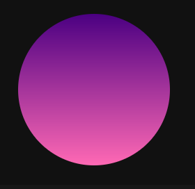

# 
Formas con CSS

En muchas situaciones puede ser interesante crear formas geométricas o formas orgánicas para representar ciertos elementos, y que se adapten a nuestro gusto. Hacerlo con código nos permite que sea sencillo adaptarse a situaciones cuando hagamos modificaciones y evitamos diseños más rígidos creados con imágenes.

## Cuadrado
Probablemente, la forma más sencilla que ya estaremos acostumbrados a crear es un cuadrado. Sin embargo, aprovechemos para organizar bien el código y observar como podemos hacer que nuestro código sea más legible y fácil de comprender y modificar:

css:

html:

vista:

En este caso, utilizamos las variables CSS --size para el tamaño del cuadrado, que es el mismo de ancho que de alto, y --gradient para guardar el gradiente de colores.

## Rectángulo
En el caso de querer generar un rectángulo, la diferencia es que no utilizamos el mismo tamaño de ancho y de alto, sino que utilizaremos la variable --w para el width (ancho) y --h para el height (alto):

css:

html:

vista:

Como en el anterior, también tenemos la variable --gradient para el degradado del elemento.

## Círculo
Volvamos al ejercicio del cuadrado donde usamos el mismo tamaño para ancho y alto. Ahora, utilizamos la propiedad border-radius para redondear las esquinas del elemento. Si lo hacemos utilizando PERCENT, al 50% conseguiremos el valor máximo para redondear, independientemente del tamaño que tenga el elemento:

css:

html:

vista:

Si además cambiamos el tamaño de ancho con un alto diferente, tendríamos un óvalo o círculo ovalado.

## Semicírculo
Ahora, si al círculo anterior, le hacemos algunas modificaciones en el border-radius podemos conseguir un semicírculo. La idea es tener también la varible --half-size que es la mitad de --size.

Además de esto, observa que border-radius utiliza el formato de x e y, es decir, border-radius: x x x x / y y y y. Los valores colocados a la izquierda del slash / son los valores de redondeo de esquinas en x, mientras que los valores a la derecha del slash / son los valores de redondeo de esquinas en y:

css:

html:

vista:

Obviamente, modificando la posición de estos valores, podríamos conseguir semicírculos en diferentes posiciones.

## Triángulo
Este ejemplo resulta más interesante y complejo. Esta es una forma antigua de crear un triángulo con CSS. Se aprovecha de que los navegadores, si creas un border con diferentes colores los une formando una unión triangular. Esto, unido a que le reducimos el tamaño a 0, hace que se forme una especie de triángulo:

css:

html:

vista:

Sólo restaría cambiar los bordes que no interesan a transparent y ya lo tendríamos. La limitación de este método es que estamos obligados a utilizar sólo un color, ya que es un color de borde.

A continuación tenemos otra forma de generar un triángulo, que puede ser interesante en otras situaciones. En este nuevo ejemplo, creamos una forma con la función polygon(), en forma de triángulo con 3 puntos clave, y la recortamos con clip-path:

css:

html:

vista:

Lo bueno de este método es que si que permite utilizar imágenes o gradientes de fondo.

## Bocadillo (Message globe)
Veamos ahora como hacer un globo de texto, un mensaje o bocadillo, de los que se utilizan en comics para que los personajes muestren un diálogo. Esto sería tan fácil como crear un cuadrado (también se podría redondear con border-radius si se desea) y añadirle un triángulo que haga de dirección.

El globo de texto va a ser el elemento con clase .message y el triángulo de flecha va a ser el ::after del .message. Observa el siguiente fragmento de código:

css:

html:

vista:

En este caso, utilizamos un position: absolute y lo bajamos con bottom para que la flecha aparezca por debajo del elemento.

## Hoja (Leaf)
La siguiente forma simula la hoja de un árbol, donde simplemente utilizamos border-radius alternando el redondeo para que afecte sólo a dos esquinas. De esta forma, y junto a un gradiente de colores verdes, le dan el aspecto de hoja de árbol:

css:

html:

vista:

## Gota (Tear))
En esta nueva forma, conseguimos una gota dibujando un rectángulo que tiene las esquinas inferiores redondeadas. Luego, aplicamos un recorte con clip-path que recorta en forma triangular por la parte superior, y mantiene todo por la parte inferior:

css:

html:

vista:

Otra forma de dibujar la gota podría ser un rectángulo recortado, que tenga un ::after o ::before circular, que haga de la parte de la gota.

## Corazón (Heart)
En este caso, creamos un corazón, que estará compuesto por tres elementos: el elemento con clase .heart y dos elementos más, el ::after y el ::before. Con el primero, crearemos un cuadrado rotado, para el "cuerpo" del corazón, y con el ::after y el ::before crearemos dos círculos que superpondremos sobre el cuadrado rotado, consiguiendo el corazón:

css:

html:

vista:

Hemos utilizado las variables --x e --y para simplificar código y generalizar.

## Huevo (Egg)
En este caso, jugamos con border-radius para conseguir la forma perfecta para crear un huevo. El truco está en conseguir el tamaño perfecto que coincida con la forma de los redondeos de las esquinas:

css:

html:

vista:

## Luna (Moon)
Por último, vamos a crear una luna en un eclipse. En este ejemplo, observa que hemos creado las variables --size donde le damos un tamaño a la luna. Luego, en su interior, aplicamos una máscara con mask-image que será un gradiente radial en forma circular, que aplicaremos en el círculo para restar su interior y quedarnos con el borde de la luna.

Con los sliders de las variables --x e --y, podemos modificar la posición del gradiente utilizado en la máscara y comprobar como quedaría:

css:

js:

html:

vista:

Como ves, todo se basa en descomponer la forma que deseas en formas geométricas básicas. Si quieres crear una forma concreta, lo mejor es que hagas esa tarea de separación y luego las unas. En algunos casos puede ser más complejo porque pueden añadirse ciertas limitaciones, como que sólo permite utilizar colores planos o similares.

