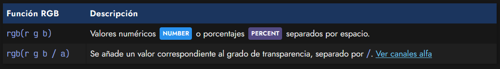
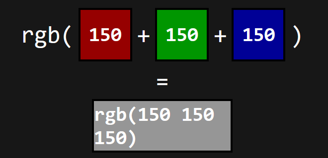
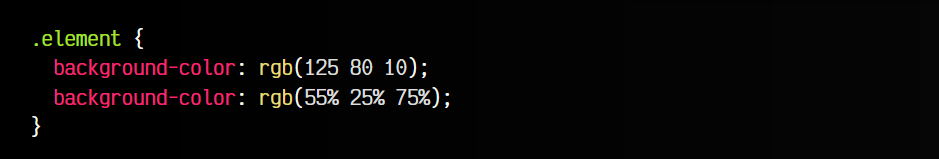
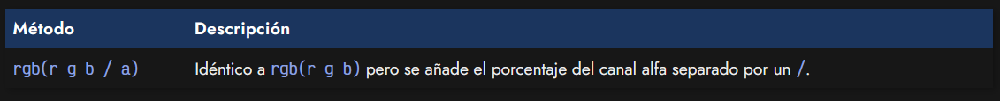
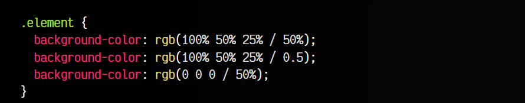
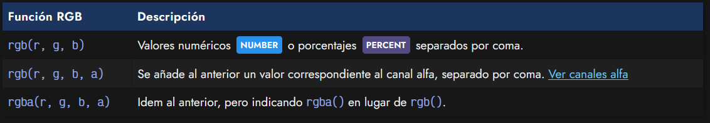
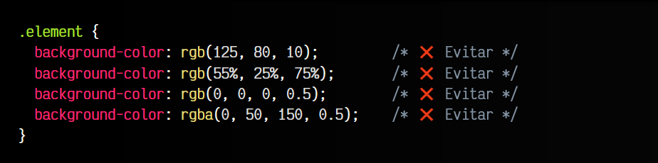

# 
La función RGB()

## ¿Qué es RGB?.
Las siglas RGB significan Rojo (red), verde (green) y azul (blue) y es un modelo para representar colores basados en la combinación de estos tres colores primarios. La idea es sencilla: dependiendo de la cantidad de cada color, obtendrás otro color diferente. Veamos algunos ejemplos:

   - Si tienes el canal de rojo al máximo, y el verde y azul al mínimo, obtendrás el color rojo.
   - Si tienes el canal rojo y verde al máximo, y el azul al mínimo, obtendrás el amarillo.
   - Si tienes todos los canales al máximo, obtendrás el blanco.
   - Si tienes todos los canales al mínimo, obtendrás el negro.

## La función rgb().
La forma de indicar colores en CSS mediante el modelo RGB es utilizar la función rgb(). Para ello, tenemos que conocer la sintaxis, que no es más que lo siguiente:

Los valores anteriormente indicados como r, g y b significan rojo, verde y azul, respectivamente, y hacen referencia a la cantidad de color que poseen estos canales para generar otro color. Para especificarlo se puede hacer de dos formas:

 -  NUMBER Como números, desde el 0 al 255, siendo el primero el más oscuro y el segundo el más claro.
 -  PERCENT Como porcentajes, desde el 0% al 100%, siendo el primero el más oscuro y el segundo el más claro.

Como se puede ver en la siguiente imagen, donde utilizamos el formato de NUMBER, si utilizamos una cantidad rgb(0 0 0) de cada canal, obtenemos el color negro (todos los canales están en su valor menos intenso). En cambio, si utilizamos una cantidad rgb(255 0 0), obtendremos el color rojo (solo el canal rojo está en el más intenso). De esta forma, mezclando las cantidades de cada canal, se puede obtener prácticamente cualquier color:

Veamos un fragmento de código CSS donde utilicemos la función rgb() con sus respectivos parámetros en cada canal. La utilizaremos con una propiedad como color o background-color:

El desarrollador puede elegir si prefiere utilizar la nomenclatura con NUMBER o si prefiere utilizar la nomenclatura con PERCENT. Una de las ventajas de utilizar los porcentajes, es que el valor máximo es 100% y puede resultar más sencillo de calcular que usar valores numéricos con valor máximo en 255.

## Canal alfa o transparencia.
Como se comentó en el capítulo anterior, es posible que queramos que los colores tengan un grado de transparencia y no sean totalmente opacos. Para eso, se suele utilizar el denominado canal alfa. Utilizando la función rgb() se puede indicar el canal alfa simplemente separando con un slash /:

De la misma forma que los canales r, g y b, el canal alfa puede ser indicado de dos formas:

 -   Con un valor NUMBER, donde el valor mínimo es 0, el valor máximo es 1 y se pueden usar decimales.
 -   Con un valor PERCENT, donde el valor mínimo es 0% y el valor máximo es 100%.

Veamos algunos ejemplos:

Ten en cuenta que aunque también puedes utilizar la antigua función rgba(), se recomienda utilizar rgb().

## Notación antigua (legacy)DEPRECATED .
Quizás, si llevas algún tiempo con CSS habrás encontrado que la sintaxis que menciono en los apartados anteriores (sintaxis moderna) es diferente a la que ya conocías. Antiguamente, se utilizaban otras sintaxis como las que se pueden ver en la siguiente tabla.

Aunque hoy en día sigue siendo posible utilizarlas, se consideran «sintaxis legacy», es decir, una sintaxis que debería evitarse a favor de la sintaxis moderna que se explicó más arriba.

Estas sintaxis a evitar son las siguientes:

La sintaxis legacy solía ser molesta, ya que si por error omitíamos las comas o la a de rgba(), el navegador no procesaba el código y no mostraba el color:

Nuevamente, la función rgba(), aunque antiguamente era necesaria para indicar un canal alfa, ya no lo es.