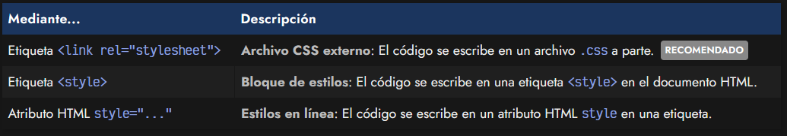
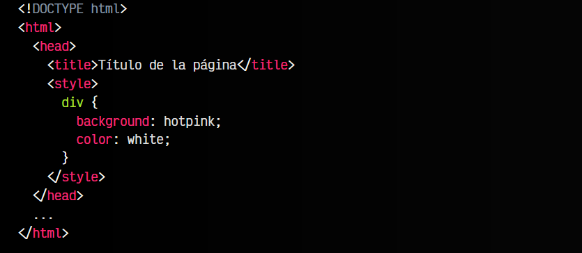
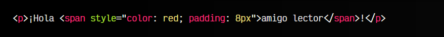

# 
¿Qué es CSS?

Ya tenemos claro que nuestros documentos web van a tener código HTML por un lado y código CSS por otro. Pero aún no sabemos como se relacionan entre sí o como se aplican. Antes de comenzar a trabajar con CSS hay que conocer las diferentes formas que existen para incluir estilos en nuestros documentos HTML.

## Formas de enlazar CSS.
En principio, tenemos tres formas diferentes de hacerlo, siendo la primera la más común y la última la menos habitual:

Veamos las ventajas e inconvenientes de cada una de ellas detalladamente:

## Archivo CSS externo.
En la cabecera de nuestro documento HTML, más concretamente en el bloque head, podemos incluir una etiqueta link con la que establecemos una relación entre el documento HTML actual y el archivo .css que indicamos en el atributo href.

Veamos el código de nuestro index.html:

De esta forma, los navegadores sabrán que deben aplicar los estilos que se encuentren en el archivo index.css que está junto al documento index.html actual. Se aconseja escribir esta línea lo antes posible (sobre todo, antes de los scripts), obligando así al navegador a aplicar los estilos cuanto antes y eliminar la falsa percepción visual de que la página está en blanco y no ha sido cargada por completo.

   - Esta es la manera recomendada de utilizar estilos CSS en nuestros documentos web.

   - Antiguamente se utiliza un atributo type="text/css" que ya no es necesario en HTML5. Se puede indicar para mantener retrocompatibilidad con navegadores muy antiguos, pero actualmente se puede omitir de forma segura.

## Bloque de estilos.
Otra de las formas que existen para incluir estilos CSS en nuestra página es la de añadirlos directamente en el documento HTML, a través de una etiqueta "style" que contendrá el código CSS:

Este sistema puede servirnos en ciertos casos particulares, pero hay que darle prioridad al método anterior (CSS externo), ya que incluyendo el código CSS en el interior del archivo HTML arruinamos la posibilidad de tener el código CSS en un documento a parte, pudiendo reutilizarlo y enlazarlo desde otros documentos HTML mediante la etiqueta link.

   - Aunque no es obligatorio, es muy común que las etiquetas style se encuentren en la cabecera head del documento HTML, ya que antiguamente era la única forma de hacerlo.

## Estilos en línea.
Por último, la tercera forma de aplicar estilos en un documento HTML es el conocido como estilos en línea. Se trata de hacerlo directamente, a través del atributo style de la propia etiqueta donde queramos aplicar el estilo, colocando ahí las propiedades CSS (que pueden separarse por ;):

De la misma forma que en el método anterior, con la etiqueta <style>, se recomienda no utilizar este método salvo en casos muy específicos y justificados, ya que los estilos se asocian a la etiqueta HTML en cuestión y no pueden reutilizarse. Es por eso, que se suele considerar una mala práctica por muchos diseñadores cuando la sobreutilizas (sin una razón de peso).

Sin embargo, es una excelente forma de inyectar o incluir variables CSS en una etiqueta y sus etiquetas hijas.

  Consejo: Si quieres comenzar a hacer pruebas rápidas con HTML, CSS y Javascript puedes utilizar [CodePen](https://pen.new/), una plataforma web que te permite crear contenido HTML, CSS y Javascript, previsualizando en tiempo real.

