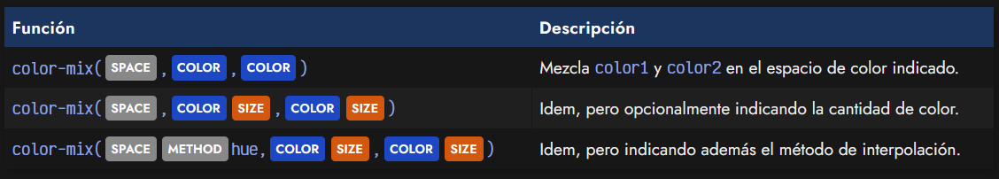
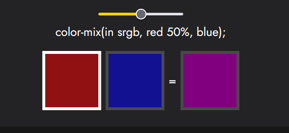
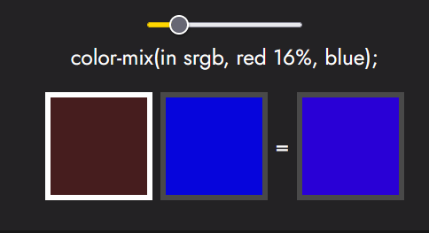
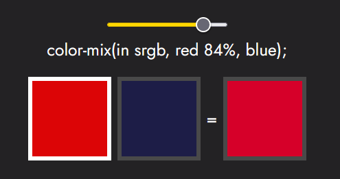
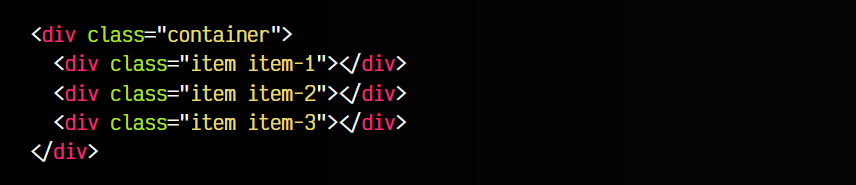
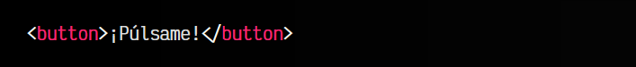
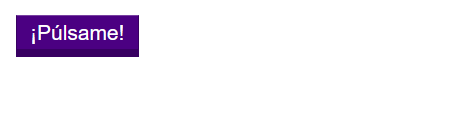

# 
La función color-mix()

Durante mucho tiempo, CSS no ha tenido ninguna forma cómoda de mezclar colores o conseguir tonalidades diferentes de un color. Sin embargo, hoy en día tenemos a nuestra disposición mecanismos como la función color-mix() o los colores relativos, que nos hacen esta tarea mucho más cómoda, y sin tener que recurrir a Sass u otras herramientas.

La función color-mix() nos permite mezclar una cierta cantidad de dos colores determinados en un espacio de color concreto.

No te preocupes si aún no sabes lo que es un [espacio de color](https://lenguajecss.com/css/colores/espacios-color/), lo explicaremos más adelante. De momento utilizaremos el espacio de color básico srgb. Este espacio de color puede ser srgb, srgb-linear, [lab o oklab](https://lenguajecss.com/css/colores/funcion-lab/), xyz, xyz-d50, xyz-d65, o polares como [hsl](https://lenguajecss.com/css/colores/funcion-hsl/), hhttps://lenguajecss.com/css/colores/funcion-hwb/wb o [lch o oklch](https://lenguajecss.com/css/colores/funcion-lch/).

La función color-mix() es muy versátil y se puede utilizar de varias formas:

Veamos un pequeño ejemplo básico, utilizándola para mezclar rojo y azul:

css:

html:

vista:

Al no indicar las cantidades de cada color explícitamente, estamos indicando de forma implícita que usaremos el 50% del color 1, y el 50% del color 2.

## Definir cantidad de colores.
Sin embargo, podemos utilizar la función color-mix() e indicar opcionalmente el porcentaje de cantidad de color que queremos usar a la derecha del color. Por ejemplo, observa este fragmento de código:

En este ejemplo interactivo hemos hecho varias cosas diferentes:

   - 1️⃣ Mezclamos red y blue en el espacio de color srgb.
   - 2️⃣ Los colores tienen una cantidad diferente (puedes variarla).
   - 3️⃣ Los colores pueden ser definidos con hexadecimal u otros esquemas.

Ten en cuenta que las cantidades siempre deben sumar 100%. No es necesario incluir ambos porcentajes. Si se omite uno de ellos, se completará respecto al otro.

## Método de interpolacións.
En el caso de usar espacios de colores polares ([hsl](https://lenguajecss.com/css/colores/funcion-hsl/), [hwb](https://lenguajecss.com/css/colores/funcion-hwb/) o [lch o oklch](https://lenguajecss.com/css/colores/funcion-lch/)), se puede indicar un método de interpolación:

css:

html:

vista:

Observa que tras indicar el espacio de color hemos indicado la palabra clave longer. Podemos utilizar increasing y longer o decreasing y shorter, siempre seguidas de la palabra clave hue. Esto permite especificar como los valores de la rueda de color serán interpolados.

El soporte de la función color-mix() es muy buena en navegadores actuales:

## Aclarar u oscurecer coloress.
Un caso de uso típico y muy interesante de la función color-mix() es hacer variaciones de color más claras o oscuras que dependan de otro color utilizando variables CSS.

css:

html:

vista:

Todo el color de este botón, depende directamente de la variable CSS --color, por lo que si la cambiamos, afectará al resto de colores. Esto lo hace mucho más mantenible y sencillo de cambiar.

