# 
Colores relativos

Quizás en alguna ocasión, te hayas planteado la opción de obtener variaciones de colores, es decir, un color diferente en base a otro de los que ya estás utilizando: un color algo más claro o más oscuro de otro color específico concreto. Tonalidades ligeramente más rojas, más verdes o más azules, por ejemplo.

Esto es lo que se conoce como Colores relativos, ya que es una forma de establecer un color en relación a otro color diferente.

## Colores derivados con from .
Mediante la palabra clave from, en el interior de una función de color, como la función rgb(), podemos establecer un color de origen para realizar una cierta modificación y crear un nuevo color relativo o derivado:

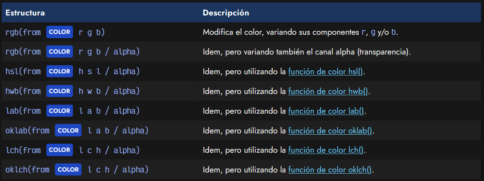

Como se puede ver en la tabla, no estamos limitados a usar siempre la función rgb(), a pesar de que los ejemplos sólo utilicemos dicha función. Eso sí, recuerda cambiar las iniciales de los canales.

Veamos un ejemplo real donde utilicemos la sintaxis from. En el siguiente fragmento de código CSS tomamos el color #a8201a (una tonalidad concreta de rojo). Sin embargo, en este caso, no estamos haciendo nada, ya que escribimos r g b literalmente, obteniendo el mismo color original:

CSS:
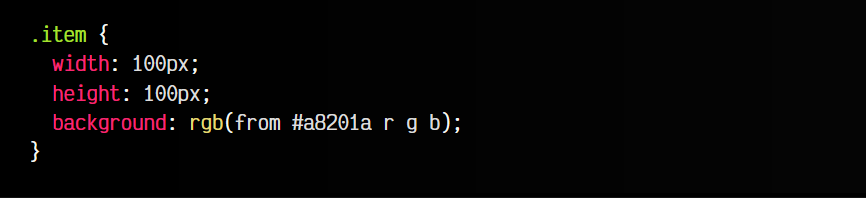

HTML:
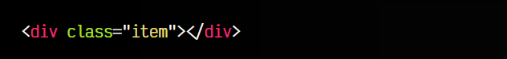

VISTA:

El navegador lee el color indicado tras la palabra clave from y lo separa en los componentes r, g y b, de forma que si luego los indicamos, podemos hacer variaciones o modificaciones. Observa este ejemplo:

CSS:
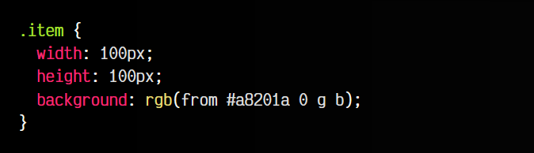

HTML:
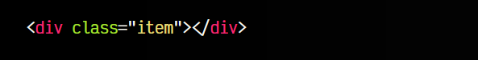

VISTA:

En este caso estamos anulando el canal r (rojo) con un 0, mientras que el canal g y b se mantiene igual. Esto crearía el color relativo #00201a desde el original #a8201a.

Recuerda que la palabra clave from sólo se puede utilizar con la sintaxis de color moderna. Mediante sintaxis legacy como rgb(r, g, b) o rgba(r, g, b, alpha) no funcionará.

## Variaciones de canales .
Observa el siguiente fragmento de código CSS. En él, vamos a utilizar la función calc() para modificar valores del color RGB obtenido con from y modificarlo a nuestro criterio. En ambos casos, partimos del color de la variable --color, que es #ff0000, un rojo puro, como se puede ver en el primer cuadrado. El canal rojo está al máximo (ff), y los canales verde y azul al mínimo (00).

CSS:
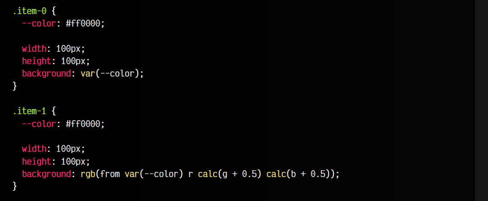
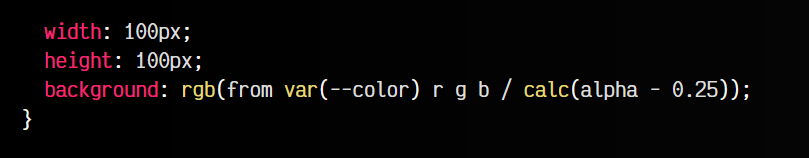

HTML:
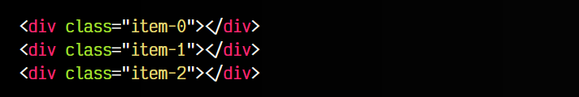

VISTA:
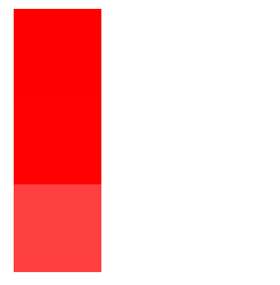

Internamente, los valores r, g y b, CSS los trata como un valor numérico del 0 al 1. Como el rojo está al máximo y el verde y azul al mínimo, los valores obtenidos por CSS son r=1, g=0 y b=0. En el segundo cuadrado, le sumamos un poco a g y b, por lo que tenemos un color algo más claro.

De la misma forma, en el segundo ejemplo, estamos variando la transparencia del canal alfa. Por defecto, ese valor está entre 0 (transparente) y 1 (opaco). En nuestro caso, el color es opaco, por lo que alpha vale 1. Al quitarle 0.25, lo hacemos un poco transparente.

Otra forma de crear variaciones a partir de otros colores es utilizar la función color-mix(), la cuál nos permite mezclar dos colores (con cantidades particulares) y obtener el color resultante.

## Colores relativos (legacy).
En el caso de no poder utilizar colores relativos mediante from (queremos dar soporte a un navegador que no es compatible), hay formas de crear colores relativos, pero no son demasiado prácticas. Por ejemplo, mediante el uso de variables de CSS y funciones de color como rgb() podríamos realizar lo siguiente:

CSS:
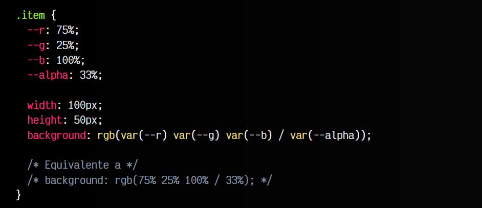

HTML:
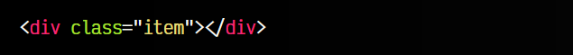

VISTA:

Creando 3 variables --r, --g y --b, donde cada una guarda la cantidad de color de los canales RGB y usándolo en el interior de una [función rgb() de sintaxis moderna](https://lenguajecss.com/css/colores/funcion-rgb/) se podría conseguir algo similar a lo anterior.

Hasta aquí, nada raro. Incluso podríamos crear unas clases alternativas que modifiquen el valor de las variables --r, --g y --b, o la variable --alpha, y tengamos una suerte de Tailwind, UnoCSS u otras librerías CSS basadas en la filosofía de clases de utilidad:

CSS:
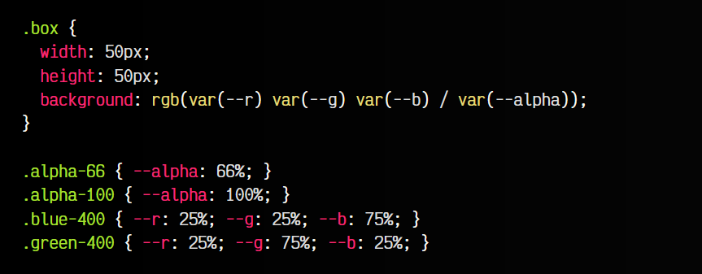

HTML:
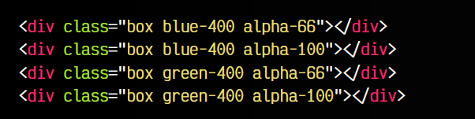

VISTA:

Sin embargo, esto no es muy práctico y no puede utilizarse con esquemas de color como hexadecimal, por ejemplo.