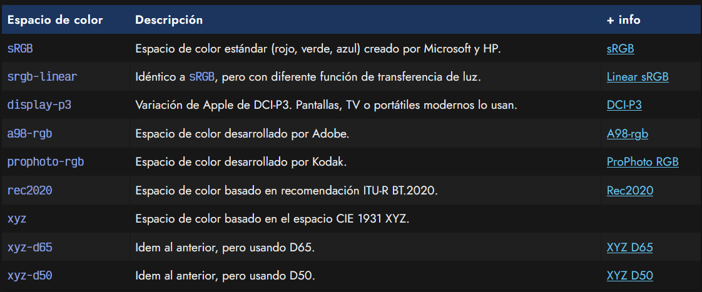
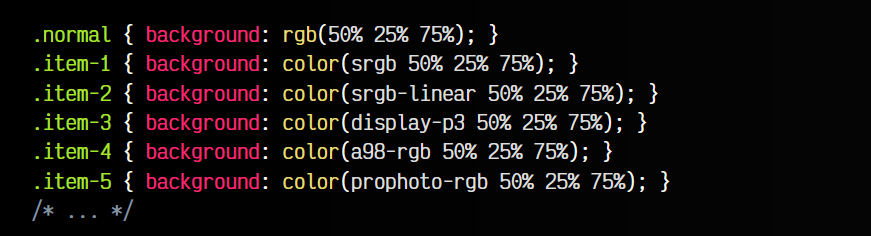
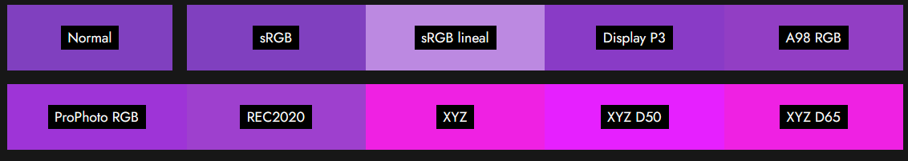

# 
Espacios de color

Cuando estamos trabajando con colores, lo hacemos en un espacio de color determinado. El espacio de color más tradicional en web es sRGB. Este espacio de color fue creado por Microsoft y HP para poder tener un ámbito en el que están definidos todos los colores que podemos utilizar. Por un lado tenemos los modelos de colores y por otro los espacios de color.

   - 1️⃣ Un modelo de color es una forma de describir un color. Ej: RGB (mediante rojo, verde y azul) o CMYK (mediante cyan, magenta, amarillo y negro).

   - 2️⃣ Un espacio de color es un conjunto de colores para mostrar o reproducir en un medio. Ej: sRGB es un conjunto de colores con diferentes valores RGB.

## Espacios de color.
En CSS, podemos trabajar con diferentes espacios de color predefinidos. A continuación muestro la lista completa de espacios de color soportados en web:

Cuando trabajamos en un espacio de color predefinido, es muy frecuente que al ver una obra en otro monitor o medio que utilice otro espacio de color, los colores no sean exactamente iguales y se vean de forma diferente.

## La función color().
Por lo general, cuando trabajamos sin especificar el color, el navegador trabaja en srgb. Si necesitamos indicar un color mediante un espacio de color diferente, podemos utilizar la función color() de CSS, mediante la cuál le pasamos como primer parámetro el espacio de color, y luego, separado con espacios los valores de cada uno de los componentes.

Opcionalmente, se le puede indicar al final un / seguido de un valor de canal alpha. Observa el siguiente fragmento de código:

A todos ellos se indica los valores 50% 25% 75%, pero cada uno en un espacio de color diferente. Observa más abajo los colores resultantes en tu navegador:

