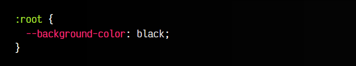
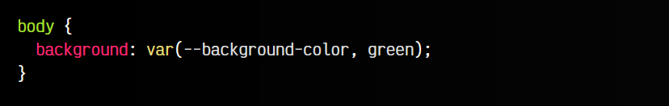
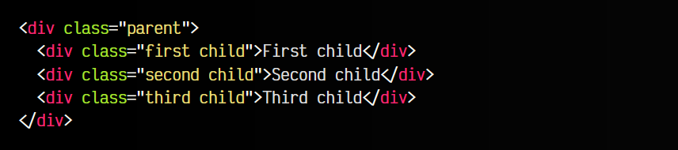
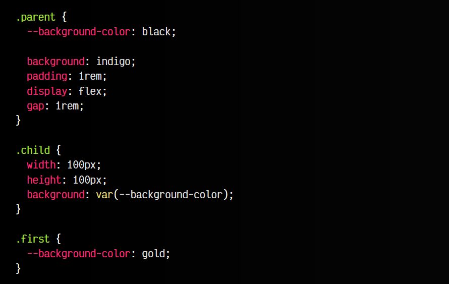
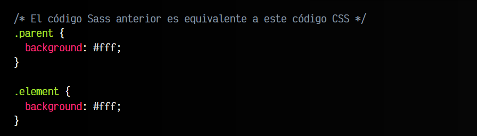

# 
Variables CSS

Quizás lo desconozcas, ya que es una característica que no estaba presente en las primeras versiones de CSS, pero existe una forma nativa de guardar valores a través de «variables CSS». Estas variables CSS no existían hace años, y de hecho, fue una de las razones por las que se popularizaron preprocesadores como LESS o Sass, que sí las incorporaban.

CSS Custom Properties - Variables CSS

Sin embargo, las frecuentemente denominadas variables CSS realmente no son variables, sino que solemos denominarlas así por su parecido con la programación y porque es más fácil comprender rápidamente lo que son, pero tienen sus diferencias. La forma oficial de llamarlas es custom properties (propiedades personalizadas).

## CSS Custom Properties.
Las CSS Custom Properties (conocidas como variables CSS) son un mecanismo de CSS que permite dar un valor personalizado a las propiedades CSS. El objetivo principal es evitar escribir múltiples veces un mismo valor, y en su lugar, ponerle un nombre más lógico, semántico y fácil de recordar, que hará referencia al valor real. De esta forma será mucho más legible y más fácil de mantener.

También recuerda que no se trata de usar variables CSS en cualquier situación, sino sólo para aquellos valores sensibles a ser reutilizados, modificados o donde queramos dar semántica extra mediante estas custom properties.

## Definir o crear variables CSS.
Para crear una custom property haremos uso de los dos guiones -- como prefijo al nombre que vamos a utilizar. En este caso, hemos creado una variable CSS llamada --background-color, al que le hemos asignado el valor black, que es un color:

Observa que en este caso, hemos establecido la variable dentro del selector con pseudoclase :root. Esta pseudoclase :root hace referencia al elemento raíz del documento, es decir, al elemento <html>. La diferencia entre utilizar html o :root como selector es que este último tiene algo más de [especificidad CSS](https://lenguajecss.com/css/cascada-css/especificidad-css/). Mientras el selector html tiene (0,0,1), :root tendría (0,1,0).

De esta forma estamos estableciendo lo que se suele conocer como una variable global, es decir, una variable que está disponible para utilizar en cualquier parte del documento. Más adelante veremos que no es la única forma.

Las custom properties se suelen agrupar en las primeras líneas de un bloque CSS, separándolas por una línea en blanco de las demás propiedades. Esto facilita la lectura del código.

## Utilizar una variable CSS.
A la hora de utilizar una custom property, hay que utilizar la función var(), indicando el nombre de la variable. Observa este sencillo ejemplo:

css:

vista:

En este caso estamos aplicando a la propiedad background el valor que contiene la variable --background-color en el elemento <body>. Observa que aunque la variable fue definida en :root, o sea en la etiqueta <html>, existe en todos sus elementos hijos, por lo que también existe en <body> y se puede utilizar.

## Fallback en variables CSS.
Además, en muchas situaciones es recomendable que la función var() tenga dos parámetros. El primer parámetro es la variable en cuestión, pero el segundo parámetro opcional es el valor por defecto, que se utilizará en el caso de que esa variable no esté definida:

css:

vista:

En este caso, la variable --background-color no está definida, por lo que el elemento body tendrá el color de fondo verde, ya que es el fallback indicado.

Ten en cuenta que en lugar de green podríamos indicar otra variable CSS diferente mediante la función var(). De esta forma, estaríamos definiendo una variable a partir de otra, algo que podría ser útil si tenemos una lista de variables CSS predefinidas, como hace [Open Props](https://open-props.style/).

## Ámbito de las custom properties.
El ejemplo anterior es muy sencillo, y en él hemos definido una variable de forma global, disponible para todo el documento. Sin embargo, es importante saber que las variables CSS tienen ámbito o «scope», por lo que se pueden definir en un ámbito local.

Observa el código HTML del siguiente ejemplo, donde tenemos tres elementos con clase child:

html:

css:

vista:

   - 1️⃣ En la clase .parent definimos una variable --background-color a black. Para ese elemento y todos sus hijos, existe esa variable. Fuera de .parent, no existe.
   - 2️⃣ En la clase .child usamos la variable, por lo tanto pintaremos los 3 elementos.
   - 3️⃣ En la clase .first redefinimos la variable con el color gold.

Como resultado, tenemos tres cuadrados, uno gold y dos black. Esto ocurre así porque en .first redeclaramos la variable, asignándole un nuevo valor que sólo existe en ese elemento con clase .first.

Esto nos permite mucha flexibilidad y potencia a la hora de utilizar custom properties en CSS, ya que son tremendamente útiles y versátiles, permitiéndonos utilizar incluso la cascada de CSS a nuestro favor:

html:

css:

vista:

Como se puede ver en este ejemplo, hemos utilizado la clase .love-type para definir la variable, y hemos reutilizado la variable a lo largo del componente .card, utilizándolo en varias partes de la misma.

## Diferencia con Sass.
Es importante mencionar que las variables CSS no funcionan exactamente igual que las variables Sass (o en general, las variables de preprocesadores). Sass, al igual que muchos otros preprocesadores de CSS, no trabajan directamente en el navegador, sino en una «fase» previa (fase de preprocesamiento).

Es el caso de las variables de Sass, dichas variables son leídas por Sass y convertidas a CSS «plano» (sin variables) antes de ser leído por el navegador:

scss:

css:

Es por eso que no deben tomarse las custom properties como equivalente de las variables SCSS, que aunque son muy parecidas, tienen matices diferentes.

Existen formas de modificar variables CSS desde Javascript, mediante el método setProperty(). Echa un vistazo al artículo Estilos CSS: [El objeto style](https://lenguajejs.com/dom/css/styles/).

