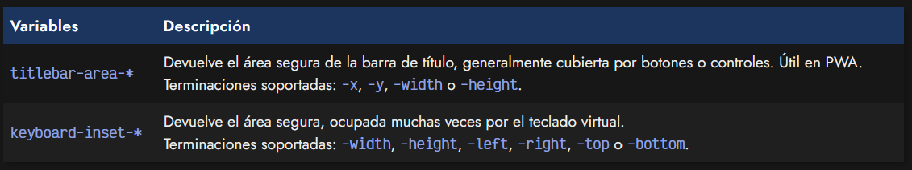

# 
Variables de entorno CSS

En el contexto de programación, existe un concepto llamado Variables de entorno. Se trata de una variable especial que guarda información del entorno en el que se está ejecutando la aplicación.

De forma análoga, en el contexto de la programación web frontend, hablamos de variables de entorno cuando nos referimos a variables de entorno que nos devuelve el navegador con información que tiene relación con el navegador o sistema donde estamos visualizando la web, y que son concretas de ese dispositivo, modelo o versión.

Algunos ejemplos de estas variables de entorno podrían ser las que guardan el tamaño del notch (muesca superior del móvil que tapa parte de la pantalla) o el tamaño del teclado virtual, por ejemplo.

## La función env().
Para acceder a este tipo de variables, utilizaremos la función env(), que funciona de forma muy similar a la función var() de CSS, sólo que en este caso, los nombres no llevan el prefijo -- y no los puedes definir personalmente, sino que vienen determinados por el agente de usuario (navegador) o sistema.

De la misma forma que la función var() se puede utilizar un segundo parámetro para definir un valor fallback en el caso de que dicha variable no tenga valor:

Al contrario que la función var() de CSS, la función env() se puede utilizar fuera de los bloques CSS, por ejemplo, en reglas de medios @media.

El soporte de esta función en navegadores actuales es bastante buena, por lo que podrás utilizarla sin problema.

## Variables de entorno conocidas.
Poco a poco, van apareciendo nuevas variables de entorno para utilizar en nuestros documentos. Por ejemplo, tenemos un conjunto de variables de entorno oficiales, y algunas no oficiales que pueden no estar soportadas aún en ciertos navegadores, hasta que se incorporen al estándar.

Ten en cuenta que estas variables de entorno se utilizan para devolver tamaños que representan en su conjunto el área de la web en el que es seguro renderizar contenido.

En muchas ocasiones, ciertos dispositivos tienen formas irregulares y no permiten mostrar contenido en ciertas zonas (smartwatchs con pantallas circulares o irregulares, muescas, notch, etc...).

## Oficiales.
Las siguientes son variables de entorno oficiales, definidas en el estándar:

Por ejemplo, podriamos usar la propiedad padding para indicar un relleno y dar espacio al contenido para que no utilice esa sección del navegador en el dispositivo que tenga los valores definidos en dicha variable de entorno.

## No oficiales.
Las siguientes son variables de entorno no oficiales, definidas por entidades particulares:

Ten en cuenta que estas variables de entorno no oficiales pueden no estar soportadas en algunos navegadores.