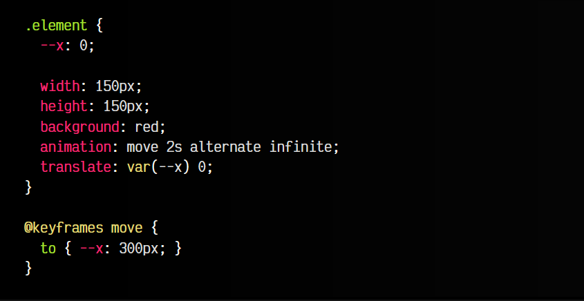
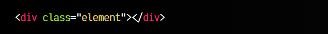
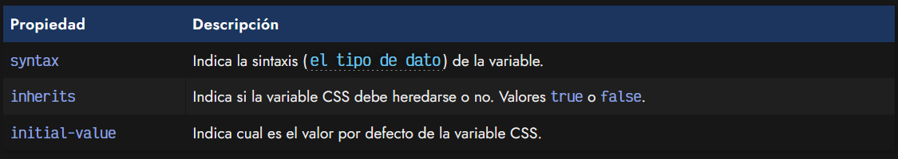
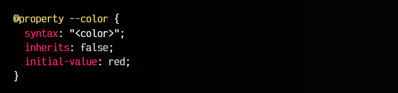
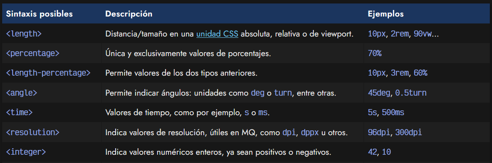
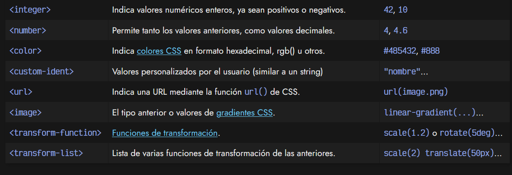
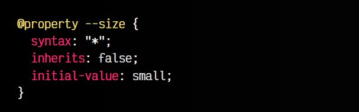
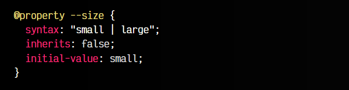
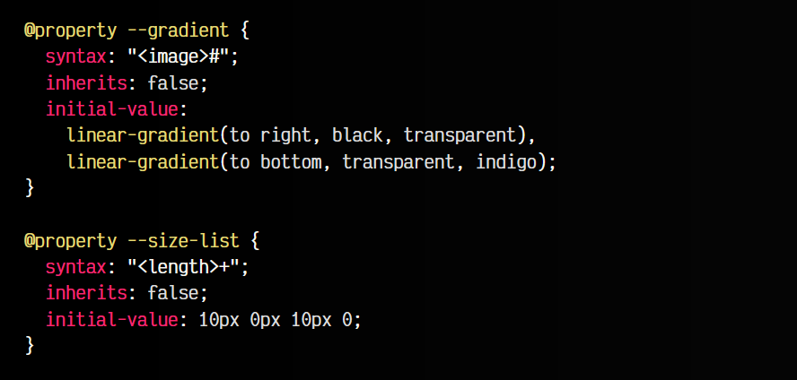
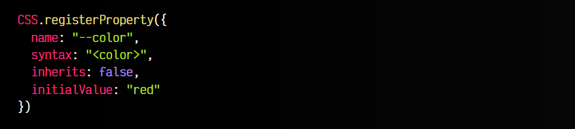

# 
La regla @property

La regla @property de CSS es una sencilla pero potente característica de una serie de API denominadas CSS Houdini (en referencia al famoso ilusionista que hacía cosas que parecían imposibles), mediante las cuales puedes realizar ciertas tareas que, en principio, eran imposibles de hacer sólo con CSS directamente en el navegador.

## ¿Qué es la regla @property?.
La regla @property nos permite indicar al navegador el tipo de dato, así como algunos datos relacionados, que tiene una variable CSS. Si conoces la idea base de Typescript, que es dotar de una comprobación de tipos a Javascript, la idea de la regla @property es muy similar.

¿Para qué podemos necesitar esto en CSS? Existe un caso particular donde se ve muy claro su utilización. Imagina que queremos crear una animación para mover un elemento, y el valor que vamos a animar es un tamaño que está guardado en una variable CSS. El navegador desconoce el tipo de dato que está guardado en las variables CSS, por lo que no aplicará la animación sino que saltará de golpe entre el primer valor y el último:

css:

html:

👓vista:

Sin embargo, con la regla @property podemos indicarle específicamente de que tipo de dato se trata, y que actúe como corresponde, entendiendo que esa variable contendrá un tamaño, y como consecuencia, soportando la animación que antes no soportaba:

css:

html:

👓vista:

Además, ofrece otras ventajas que iremos explicando a continuación.

## Sintaxis de la regla @property.
Como hemos visto en el ejemplo anterior, para establecer una regla @property debemos establecer la regla seguida de la variable CSS sobre la cuál va a actuar. En su interior debemos establecer tres propiedades:

Así pues, veamos otro ejemplo de declaración de @property en acción. En este caso, hemos establecido un tipo de dato de color, para que se pueda animar el color:

Como ves, muy sencillo.

## Tipos de datos CSS de @property.
Los valores posibles de la propiedad syntax deben colocarse entre signos angulares < y > (como si fuera una etiqueta HTML) y podemos utilizar cualquiera de los siguientes:

## El valor any.
Por defecto, sin indicar una propiedad @property, las variables CSS funcionan como lo hace Typescript de indicar el valor any. Dicho de otra forma, acepta cualquier tipo de dato. Si queremos definir explícitamente este comportamiento podemos utilizar el asterisco:

Sin embargo, la idea de @property es justamente restringir el tipo de dato, no dejarlo abierto a cualquiera, que ya es el comportamiento por defecto. No obstante, podría existir alguna casuística donde queremos sobreescribir con ese comportamiento concreto de forma explícita.

## Múltiples tipos.
Sin embargo, también podemos hacer cosas un poco más avanzadas. En lugar de establecer un tipo de dato en la propiedad syntax, podemos establecer un tipo de dato múltiple.

Esto nos permitirá establecer más de un tipo de dato en la misma variable CSS:

En este caso, hemos indicado que la sintaxis de la variable CSS --size puede ser tanto el valor de texto small como large. Además, observa que no hemos indicado un tipo de dato genérico, sino un dato muy concreto. También podríamos utilizar cosas como <integer> | <length> si quisieramos permitir tanto números enteros como tamaños o longitudes con unidades.

## Valores múltiples.
Añadiendo ciertos carácteres podemos permitir múltiples valores en un tipo de dato, como ocurre por ejemplo en propiedades como background-image cuando queremos añadir varias imágenes o gradientes. Para ello, al final de nuestra sintaxis utilizamos un caracter especial:

   - Si añadimos el carácter #, nos permite valores separados por coma.
   - Si añadimos el carácter +, nos permite valores separados por espacio.

## Usar @property desde Javascript.
Si estamos trabajando con Javascript, es posible definir estas variables CSS para añadirle su tipo de dato desde Javascript, con una sintaxis muy parecida a la que hacemos con la regla @property. Para ello, utilizamos el método registerProperty() del objeto CSS.

Veamos el mismo ejemplo anterior, en su equivalente Javascript:

Observa, que al método registerProperty() se le pasa un objeto que contendrá:

   - 👩‍🎓 El nombre de la variable CSS mediante la propiedad name.
   - 👓 La sintaxis (tipo de dato) igual que se le aplica en CSS, con syntax.
   - 🎈 La propiedad inherits con un booleano que indica si se hereda o no.
   - ✨ El valor inicial de la variable CSS. Ojo que la propiedad se pasa a camelCase: initialValue.

Poco a poco se va ampliando el soporte de CSS Houdini en navegadores, y la regla @property es uno de los mecanismos base para utilizar todo lo demás.