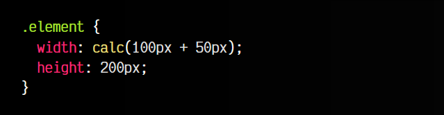
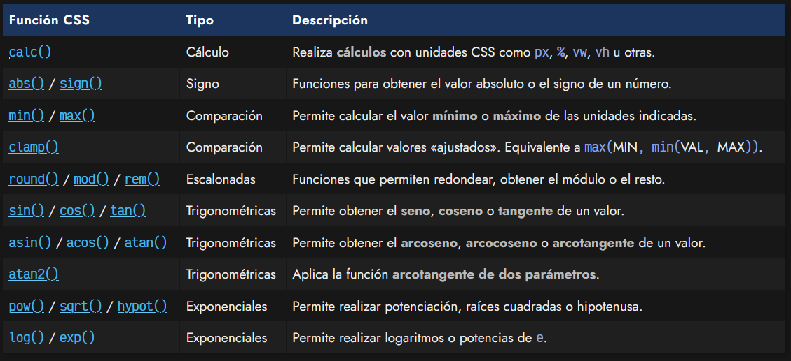

# 
Funciones CSS

En CSS muchas veces necesitamos utilizar un mismo valor en varios lugares diferentes de nuestro código. Si lo hacemos indicando el valor en cuestión en cada uno de esos lugares, si en algún momento necesitamos cambiarlo, tendremos que cambiarlo en todos los lugares donde aparece, cuidando que no se nos olvide alguno o modifiquemos de forma errónea (algo bastante habitual). Por esta razón, con el tiempo, se han ido añadiendo mejoras, como las custom properties, un mecanismo similar a unas variables CSS.

Sin embargo, también tenemos un sistema de apoyo para realizar operaciones donde el navegador realiza los cálculos o ciertos trabajos, en lugar de realizarlos nosotros de forma manual. Es un método más cercano a un lenguaje de programación que a un lenguaje de estilos, como pueden ser realizar operaciones matemáticas o usar valores precalculados.

Un ejemplo sencillo (en el que profundizaremos más adelante) podría ser el siguiente:

En este caso, estamos realizando una operación mediante la función CSS calc(), donde sumamos la cantidad 100px y 50px. Obviamente, este es un ejemplo muy sencillo para entenderlo, pero se puede complicar bastante.

## Funciones CSS matemáticas.
Aunque en CSS existen múltiples funciones CSS muy variadas y diferentes, en esta sección vamos a centrarnos en ciertas funciones CSS matemáticas, que no son más que funciones de apoyo que podemos utilizar en CSS para realizar cálculos u operaciones sencillas de una forma fácil y rápida, sin tener que abandonar CSS y/o recurrir a Javascript.

Un resumen rápido de las funciones CSS que veremos serían las siguientes:

Ten en cuenta, que al añadir estas funciones matemáticas, también tenemos la posibilidad de utilizar u obtener palabras clave que representan constantes matemáticas en CSS, como e, pi o Infinity, o incluso valores especiales como NaN.

En los siguientes artículos analizaremos las funciones matemáticas detalladamente.

