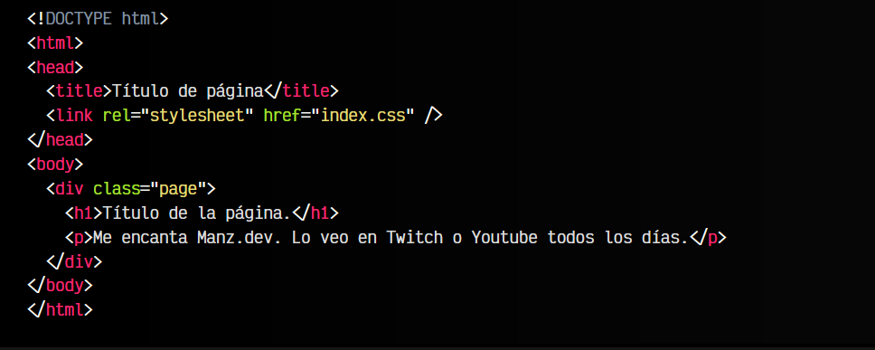
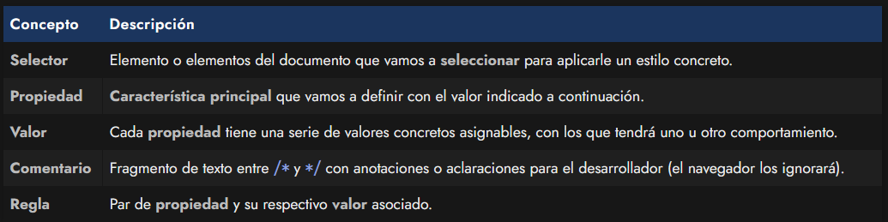
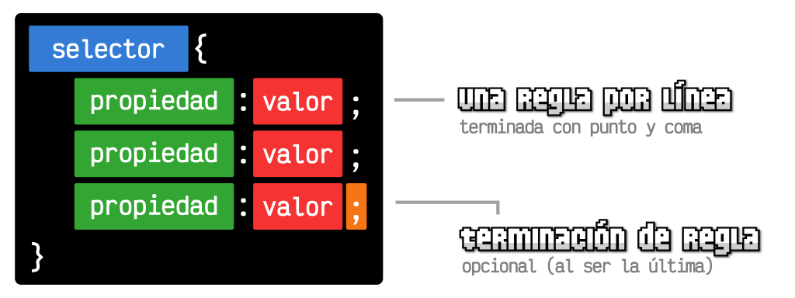
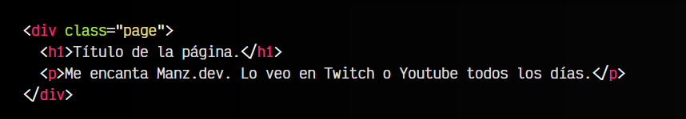
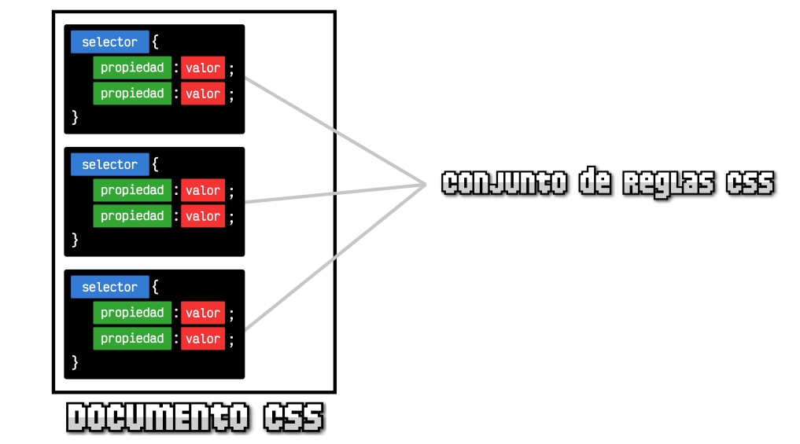

# 
Estructura de CSS

Los documentos CSS son archivos de texto (igual que los documentos HTML), sólo que en este caso tienen extensión .css en lugar de .html. En el código de un documento .css se escriben una serie de órdenes y el cliente (navegador) las interpreta y aplica a los documentos HTML.

En este artículo vamos a ver como es la sintaxis de un archivo .css y como se debe escribir el código CSS, a la vez que ponemos en práctica lo aprendido en los artículos anteriores.

## Relación del HTML con CSS.
En primer lugar, recuerda que debemos tener el documento .css enlazado desde nuestro documento .html, preferiblemente desde una etiqueta <link rel="stylesheet">. En su atributo href colocaremos el nombre del documento .css que contiene los estilos:

Bien, ya tenemos nuestro archivo .html conectado con nuestro archivo .css. Ahora todo el código CSS que coloquemos en nuestro index.css se aplicará al HTML y se verá reflejado en el navegador.

## Sintaxis CSS.
Vamos a centrarnos ahora en el contenido de nuestro documento index.css. El código CSS de dicho documento, se basa en una serie de conceptos que debemos tener claros antes de continuar. Demos un repaso a cada uno de ellos:

Así pues, tras aprender estos conceptos, la estructura de un documento .css se basaría en organizar el código siguiendo el formato del siguiente bloque:

Vamos a verlo con un ejemplo para afianzar conceptos:

En este caso, estamos seleccionando todas las etiquetas 
 del documento HTML (en este ejemplo es una sola, pero si existieran más se aplicaría a todas), y les aplicaremos las reglas que contenga, en este caso una regla que define el color de texto rojo. Cada una de estas reglas se terminará con el carácter punto y coma (;), seguido de la siguiente regla. El último punto y coma es opcional y se puede omitir si se desea.

  Ojo: Como hemos visto, se pueden incluir comentarios entre los caracteres /* y */, los cuales serán ignorados por el navegador. Estos suelen servir para añadir notas o aclaraciones dirigidas a humanos.

## Documento CSS.
Sin embargo, esto es sólo un ejemplo muy sencillo. Los documentos CSS se forman por cientos de reglas de este estilo, con diferentes selectores, propiedades y valores. Habitualmente, cada bloque declarado suele incluir múltiples reglas (y no sólo una como en el ejemplo anterior):

Documento CSS

Ten en cuenta que, a medida que escribimos código CSS, este se va haciendo más grande y más difícil de controlar y mantener. Para intentar evitar perder el control del mismo, hay que seguir una serie de buenas prácticas al escribir código, que aunque no son necesarias para que funcione en el navegador, los desarrolladores consideramos obligatorias para que sea más fácil de leer:

   - Escribe una regla por línea. Será mucho más fácil de leer y modificar.

   - Usa la indentación. Tras escribir el carácter { al empezar un bloque de reglas, las propiedades se separan hacia la derecha. Esto hace que sea más fácil de leer y se considera una buena práctica de desarrollo y de programación en general.

   - El último punto y coma de un bloque de reglas es opcional. Sin embargo, se suele aconsejar escribirlo para mantener una coherencia y evitar problemas o descuidos al modificar posteriormente el código.

Como puedes ver, estos consejos mejoran sustancialmente la legibilidad del código. Se consideran prácticas de cumplimiento obligatorio para ayudar a entender más rápidamente el código ajeno (o incluso el nuestro) sin necesidad de invertir mucho tiempo.

Más adelante, en un capítulo dedicado expresamente a ello, veremos que la estructura CSS puede ser más compleja, pero de momento trabajaremos con este esquema simplificado.

