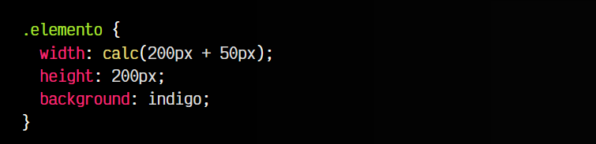
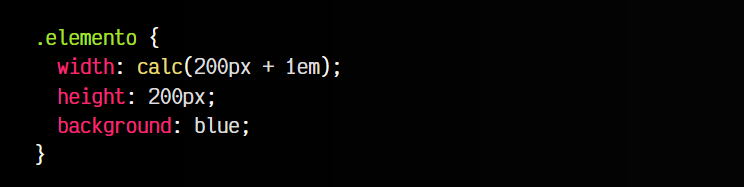
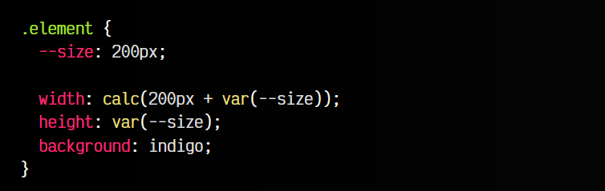
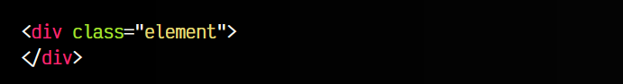
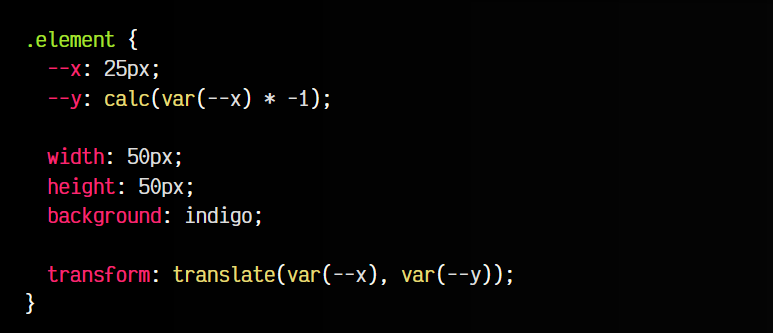
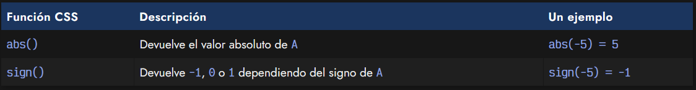
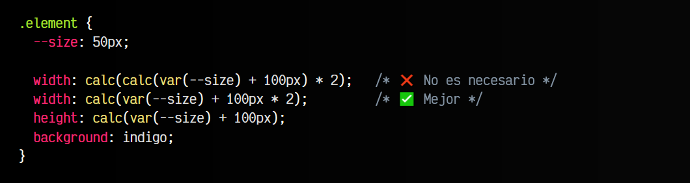

# 
Calculos matemáticos en CSS

Es posible que en algunas ocasiones necesitemos indicar valores precalculados por el navegador, ya porque sea más cómodo o porque simplemente queremos hacer el código más organizado o fácil de leer y mantener.

Por ejemplo, podríamos tener un caso donde tenemos que sumar dos valores que a priori el desarrollador desconoce. Esto puede ocurrir frecuentemente, ya que cuando hacemos una web, esa web será visualizada tanto por usuarios de escritorio con pantallas gigantes, como usuarios de móvil con pantallas pequeñas.

Es frecuente que queramos realizar operaciones de forma abstracta, sin saber tamaños exactos, por lo que delegamos esa tarea al navegador del usuario, que podrá calcularlo fácilmente en su dispositivo.

## La función calc().
Estos calculos son posibles de realizar mediante la función calc() de CSS, como se muestra en el ejemplo a continuación:

css:

html:

vista:

Observa que hemos realizado la operación 200px + 50px mediante esta función calc(). Esta operación es muy sencilla y prácticamente obvia, sin embargo, podemos realizar operaciones variadas:

   - ➕ Sumas ( + )
   - ➖ Restas ( - )
   - ✖️ Multiplicaciones ( * )
   - ➗ Divisiones ( / )

## Uso de diferentes unidades.
Recuerda siempre utilizar alguna de las unidades soportadas por CSS (números, medidas, dimensiones, porcentajes, tiempos, ángulos, etc...). Incluso podemos mezclar diferentes tipos de unidades y el navegador intentará hacer su conversión:

css:

html:

vista:

En este caso, hemos realizado la operación calc() con los valores 200px y 1em (que por defecto suelen ser, aproximadamente, 16 píxeles). Por lo tanto, el navegador hará los calculos e indicará un ancho width de 216px al elemento.

## Cálculos con variables CSS.
De la misma forma que utilizamos valores con diferentes unidades, también podemos utilizar variables CSS para realizar los cálculos:

css:

html:

vista:

## Signo de un número.
Si tenemos la necesidad de cambiar de signo un valor mediante CSS, comprobaremos que no podemos simplemente preceder el signo -. Sin embargo, hay una forma muy sencilla de hacerlo:

css:

En el caso de la variable --x, su valor será 25px. Sin embargo, en el caso de la variable --y, su valor será -25px, ya que hemos multiplicado el valor de --x por -1, cambiándole el signo.

Además de esto, disponemos de las funciones abs() y sign(). Estas funciones nos permiten jugar con los signos, de modo que la función abs() obtiene el valor absoluto de un número, mientras que la función sign() nos devuelve -1, 1 o 0, dependiendo del valor del signo:

## Operaciones múltiples.
Es posible que en algunos casos queramos realizar operaciones más complejas, donde realizamos múltiples cálculos. En el caso de utilizar la función calc() no es necesario utilizar múltiples funciones calc(), sino que con una función padre es suficiente:

css:

html:

vista:

Observa que en el caso del ancho del elemento, estamos realizando 2 operaciones:

   - Sumamos 100px a la variable --size, lo que nos da 150px.
   - Luego, multiplicamos por 2 el resultado: 300px

Ten en cuenta que, en el segundo caso, hemos multiplicado un valor de medida (píxeles) por un valor numérico. Esto es posible en CSS, pero cuidado, multiplicar un valor en píxeles por otro en píxeles, por ejemplo 100px * 2px, no funcionaría. Debe multiplicarse por un número.

