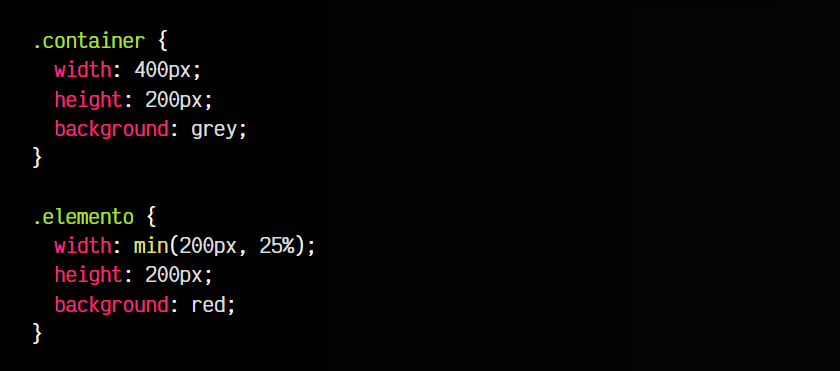
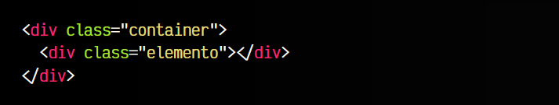
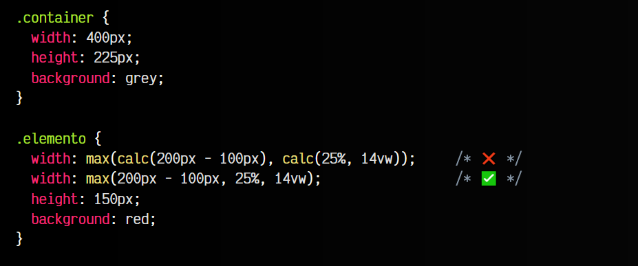
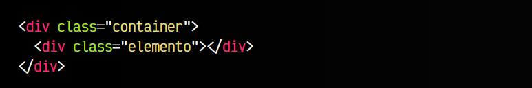
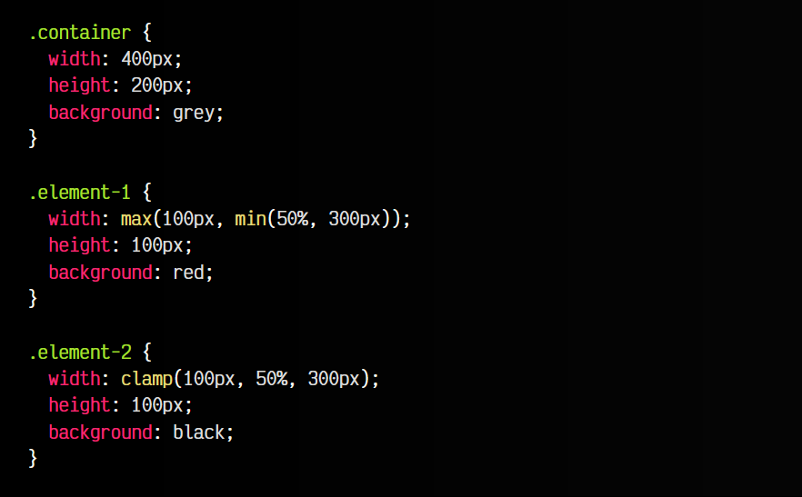
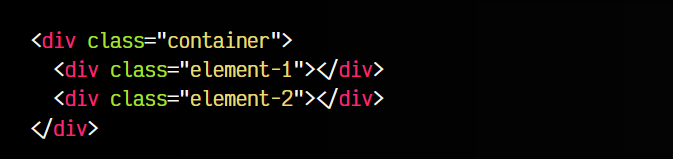

# 
Máximos y mínimos en CSS

Además de la función calc(), CSS incorpora otras funciones matemáticas que nos pueden servir para realizar cálculos de forma sencilla, rápida y cómoda. Es el caso con las tres funciones siguientes que vamos a explicar:

   - ✨ Función min(): Obtiene el valor mínimo de varios valores
   - ✨ Función max(): Obtiene el valor máximo de varios valores
   - ✨ Función clamp(): Obtiene un valor ajustado entre un mínimo y un máximo de varios valores

Pero vamos a explicar cada uno en detalle, con algunos ejemplos para que se entienda mejor.

## La función min().
En algunas ocasiones, necesitaremos que en una propiedad se aplique un valor entre varias posibilidades posibles, y lo que nos interesa es el valor más pequeño de todos los propuestos.

CSS permite realizar esto utilizando la función min(), eligiendo el valor más pequeño de 2 o más posibilidades aplicadas por parámetro:

css:

html:

vista:

En este caso, se pide el valor mínimo entre:

   - 200px, el primer parámetro
   - 25% del ancho del padre de .elemento, es decir: 100px

Como el valor más pequeño entre 200px y 100px es 100px, aplicará este último al ancho de .elemento. Todo este cálculo, se solía realizar en Javascript debido a su cualidad de lógica de cálculo, sin embargo, con estas funciones podemos realizarlo en CSS, ya que tiene que ver con los criterios estéticos.

Recuerda: Puedes tener más de 2 parámetros en la función min(), no está limitado a 2 parámetros.

## La función max().
De la misma forma que tenemos una función min(), también tenemos una función max(). Como podemos imaginar, dicha función sirve para lo opuesto de la función min(): obtener el valor máximo entre varias posibilidades.

Observa el siguiente ejemplo, donde utilizamos en este caso más de 2 parámetros:

css:

html:

vista:

En este ejemplo hemos repetido la propiedad width. La primera es equivalente a la segunda, sin embargo, es preferible utilizar la segunda forma, ya que es más sencilla y no hace falta hacer referencia a la función calc() aunque estés haciendo un cálculo. Los cálculos dentro de la función min(), max() o clamp() se realizan automáticamente, sin necesitar calc().

## La función clamp().
Ahora pensemos en un nuevo caso que podría ocurrir. Imagina que necesitas indicar un valor específico, con una unidad relativa, pero a la que le quieres establecer un mínimo y un máximo, ya que te interesa que se mueva en un rango determinado, pero no salga de ese rango numérico.

Con la función clamp() podemos realizar de forma concisa la operación max(MIN, min(VALUE, MAX)) y crear valores flexibles, siempre respetando un mínimo y un máximo preestablecido.

Veamos un ejemplo:

css:

html:

vista:

Observa que existen dos elementos: .element-1 y .element-2. Ambos son equivalentes. El primer elemento (rojo) utiliza las funciones max() y min() para obtener el valor apropiado. Por otro lado, el segundo elemento (negro) utiliza la función clamp(), que es equivalente al anterior. Con el clamp(), el navegador realiza lo siguiente:

   - Obtiene el valor mínimo entre el segundo y tercer parámetro.
   - Obtiene el valor máximo entre el primer parámetro y el resultado anterior.
   - Utiliza el resultado de la operación anterior en el width.

