# 
Redondeos y módulos en CSS

Las funciones escalonadas se denominan así porque al aplicarlas sobre determinados valores, permiten crear una gráfica en forma de escalones. Esta serie de funciones CSS permiten redondear números, calcular el módulo o el resto. Vamos a ver cada una de ellas, por separado.

## La función round().
La función round() permite redondear valores, es decir, prescindir de pequeñas diferencias en las cantidades, teniendo en cuenta sólo unidades superiores.

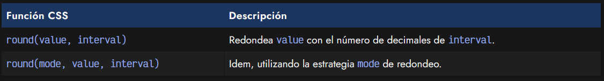

Observa el siguiente ejemplo, donde puedes ver como funciona la función round():

css:
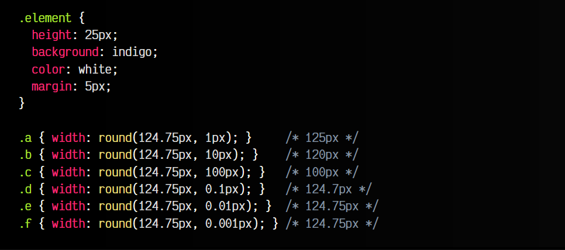

html:
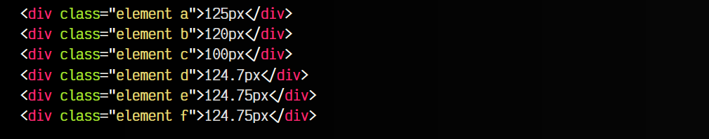

vista:
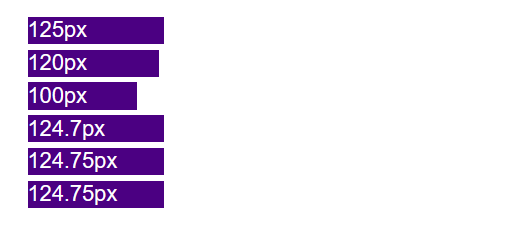

Ten en cuenta que, si indicamos un valor de interval igual a 0, entonces el redondeo no será válido (realmente devuelve NaN), por lo que ignora la propiedad..

## Tipos de redondeos.
Si queremos un tipo de redondeo específico, podemos indicar un primer parámetro en la función round() y establecer la estrategia de redondeo:

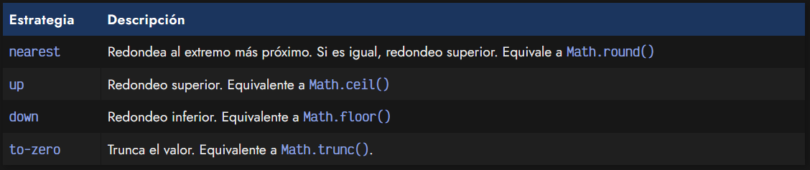

Si no se especifica ninguna estrategia de redondeo en round(), por defecto se usa nearest.

Veamos algunos ejemplos:

css:
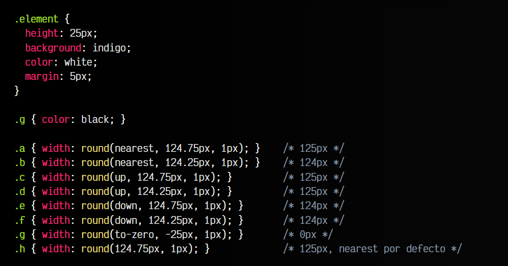

html:
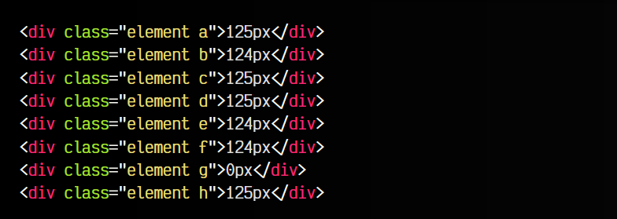

vista:
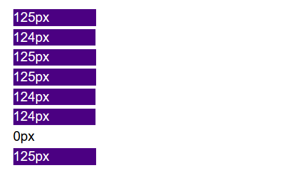

## La función mod().
La función mod() de CSS, permite realizar el módulo de un número, que no es más que obtener el resto de la división de un número entre otro. Veamos un ejemplo utilizándolo en CSS:

css:
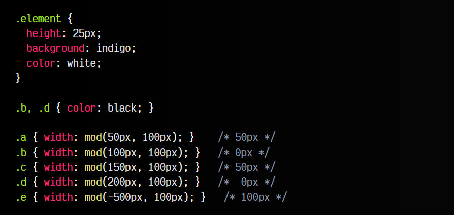

html:
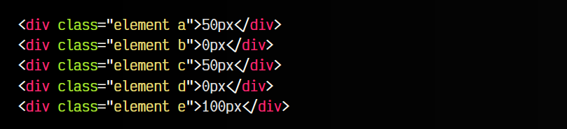

vista:
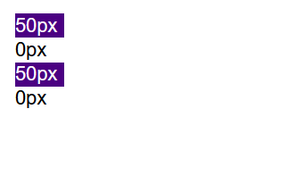

Esta operación suele ser muy utilizada en programación para realizar cálculos incrementales y acotar los límites, de modo que cuando se superen, se vuelvan al valor inicial. De esta forma siempre te encuentras del rango deseado:

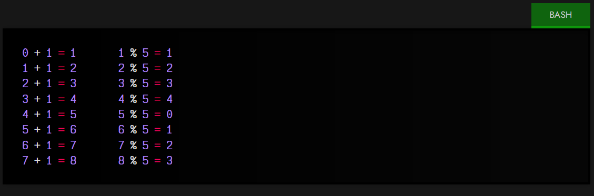

## La función rem().
La función rem() de CSS, permite realizar el resto. Funciona de forma muy similar al módulo, sin embargo, hay diferencias cuando utilizamos números negativos.

css:
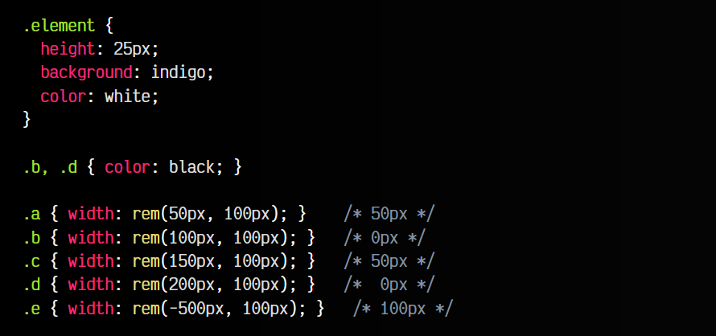

html:
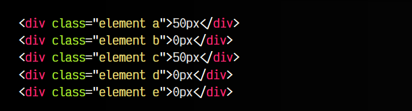

vista:
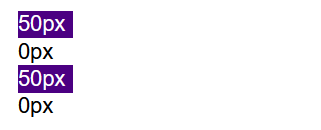

