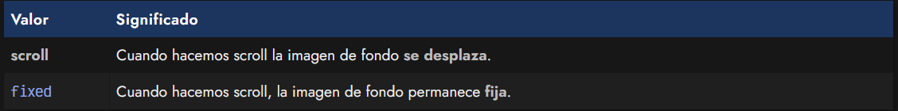

# 
La propiedad background

Es posible que, buscando hacer un diseño más avanzado, en lugar de utilizar un color de fondo quieras utilizar imágenes. Para ello, CSS te proporciona la propiedad background-image, con la cuál puedes indicar imágenes de fondo o, como veremos más adelante, incluso gradientes o degradados de varios colores.

## 
La propiedad background-image

En el caso de querer utilizar imágenes de fondo, como ya hemos dicho, utilizaremos la propiedad background-image y en el valor, el nombre de la imagen (o la dirección URL donde está alojada), siempre rodeada del texto url().

En el caso de que sólo se coloque el nombre de la imagen (por ejemplo, imagen.jpg), el navegador buscará la imagen en la misma carpeta donde está el archivo CSS que estamos escribiendo. Esto es lo que se llama una ruta relativa. En el caso de que se coloque la ruta completa, por ejemplo https://lenguajecss.com/assets/logo.svg, se accederá a la imagen alojada en esa dirección URL. Esto es lo que se llama ruta absoluta.

Ojo: En el caso de que no se encuentre la imagen o el valor de background-image se haya establecido a none, no se utilizará ninguna imagen de fondo, y en su lugar se mostrará el color establecido con background-color. Esto puede observarse también si tenemos una imagen de fondo que no se repite.

## 
Opciones de imagen de fondo

Una vez establecida una imagen de fondo con background-image, se puede personalizar la forma en la que se mostrará dicha imagen mediante propiedades como background-repeat, background-attachment o background-position, entre otras:

Analicemos cada una de las propiedades a continuación:

## 
La propiedad background-repeat

La propiedad background-repeat especifica si la imagen se repetirá horizontalmente (repeat-x), si se repetirá verticalmente (repeat-y), si lo hará en ambas direcciones (repeat) o en ninguna (no-repeat). Por defecto, si no se indica nada, esta propiedad está ajustada en repeat.

Existen también dos valores interesantes, space y round, los cuales asumen implícitamente que se repite el fondo. En el caso de que tengamos una imagen de fondo que se repita varias veces en mosaico, space evita que se corte la imagen, introduciendo un espacio entre las repeticiones individuales.

Por su parte, round lo que hace es ajustar la imagen individual, de modo que la expande o contrae para ajustarla al espacio disponible. En ambos casos la repetición de los fondos nunca se mostrará cortada.

Siempre se podrá combinar en cada eje, con valores mixtos, por ejemplo, utilizando background-repeat: space round, lo que aplicará space al eje X y round al eje Y. Si sólo se especifica uno, se aplicará a ambos ejes.

## 
La propiedad background-attachment

La propiedad background-attachment especificará si la imagen de fondo seguirá el desplazamiento del usuario al hacer scroll por la página, es decir, si el usuario al hacer scroll y bajar para ver el contenido de la página, la imagen de fondo de desplazará hacia arriba siguiendo el flujo normal de una página. Este comportamiento se consigue con la opción scroll, que es la que viene establecida por defecto.

Por el contrario, si indicamos el valor fixed, la imagen de fondo se quedará fijada y no se moverá mientras el usuario se desplaza por la página, algo que puede ser útil en muchos escenarios.

## 
La propiedad background-position

La propiedad background-position permite desplazar la imagen en la zona especificada por POSX y POSY por . Por defecto, esos valores son 0% 0%, y pueden especificarse tanto con unidades (porcentajes, píxels, etc...) como mediante palabras clave que representan zonas predefinidas (top, left, right, bottom y center).

## 
La propiedad background-clip / -origin

En CSS existen unas propiedades para indicar como afectará la imagen de fondo al elemento según su modelo de cajas. Es importantísimo que conozcas como funciona el modelo de cajas y concretamente la propiedad box-sizing para entender bien estas propiedades.

Dichas propiedades son las siguientes:

Por un lado, la propiedad background-clip establece el área externa que afectará la imagen de fondo, mientras que background-origin establece el área interna que afectará la imagen de fondo. La primera utiliza border-box como valor por defecto, mientras que la segunda utiliza padding-box. 

Ambas propiedades pueden tomar uno de los siguientes valores:

Consejo: Observa el borde grueso punteado que usamos en el ejemplo. Usando border-box la imagen de fondo se extenderá en todo el elemento, incluyendo borde, espaciado y contenido. El valor padding-box extenderá la imagen de fondo sólo mediante el padding y el contenido, y por último, la propiedad content-box extenderá la imagen de fondo sólo en la zona del contenido.

## 
La propiedad background-clip / -origin

Una propiedad muy interesante es background-size, la cuál nos permite dar un tamaño a la imagen de fondo. Podemos ajustar tanto el tamaño de ancho como el de alto, e incluso tenemos algunas palabras clave predefinidas para obtener un resultado específico. Veamos la sintaxis:

Por defecto, una imagen de fondo toma automáticamente el tamaño de la imagen (que podría ser demasiado grande, por ejemplo). Para no tener que modificar la imagen original de forma manual con un editor de imágenes, podemos utilizar esta propiedad y ajustarla a nuestro agrado mediante CSS:

css:

html:

vista:

Ten en cuenta que al indicar el tamaño de ancho y alto de forma manual, hay que vigilar el tamaño original de la fotografía para evitar que se deforme y aparezca estirada o deformada porque el nuevo tamaño no manteniene la proporción de aspecto.

Ten en cuenta que con background-size puedes utilizar los siguientes valores:

Los dos últimos valores, cover y contain, sólo pueden indicarse en el caso de que se especifique un sólo parámetro como valor en la propiedad background-size.

## 
Atajo: background

Es posible establecer todas estas propiedades anteriores en una sola regla de CSS a modo de atajo, y así ahorrar mucho espacio en escribir las propiedades anteriores por separado. Si alguno de los valores no necesitamos indicarlo, simplemente lo omitimos.

El atajo se construye con la propiedad background y sigue la siguiente estructura:

Ten en cuenta que el parámetro /SIZE es opcional. De indicar el carácter /, la propiedad background se esperará el valor background-size a continuación. Veamos varios ejemplos del uso de la propiedad background (recuerda que si no necesitamos algún valor, simplemente podemos omitirlo):

El último caso del ejemplo utiliza fondos múltiples. Mediante la coma estamos describiendo dos fondos, si quieres aprender más sobre esto, visita el siguiente artículo: [Fondos múltiples con CSS](https://lenguajecss.com/css/imagenes-y-fondos/fondos-multiples/).

