# 
Fondos y gradientes múltiples

Hasta ahora, hemos trabajado con la propiedad background-image (o la propiedad de atajo background) para establecer fondos. Sin embargo, CSS permite establecer múltiples fondos, simplemente separando sus valores mediante comas, como veremos a continuación.

## 
Fondos múltiples con background-image

La forma de añadir múltiples fondos a un mismo elemento mediante background-image es tan fácil como vemos en la tabla siguiente:

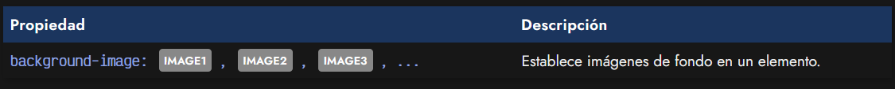

Simplemente creamos una lista de imágenes, separadas por coma. Podemos indicar cuantas queramos, siempre y cuando se separen correctamente y tengan una sintaxis adecuada. Las imágenes se irán apilando una sobre la otra, de modo que la última que se indica en la propiedad background-image es la primera que se renderiza en la página:

css:
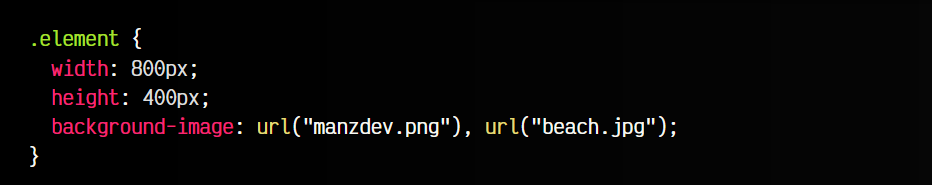

html:
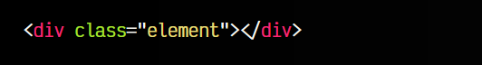

vista:

De este modo, vemos en el ejemplo que primero se pinta la playa beach.jpg, y luego se pinta encima el logo de manzdev.png.

## 
Otras propiedades con fondos múltiples

Como habrás podido observar, el truco de esta estrategia es que las últimas imágenes deben tener partes transparentes, de este modo se puede ver lo que hay debajo: las demás imágenes de fondo. Recuerda que, por lo tanto, las imágenes que están encima deben estar en formato .png, .webp o .avif, ya que son los formatos de imagen que soportan transparencia (canal alfa).

Ten en cuenta que al tener varias imágenes, todas las propiedades con el prefijo background- se aplican a todos los fondos, por lo que puede haber conflicto.

En el ejemplo anterior hicimos «trampa». Ambas imágenes de fondo ocupan exactamente lo mismo, por lo que no tenemos problema. Pero vamos a utilizar ahora dos imágenes con diferentes tamaños:

css:
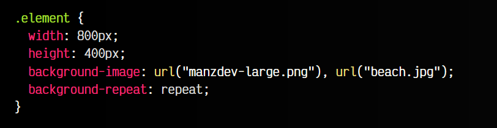

html:
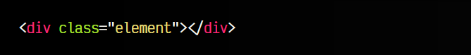

vista:

Como puedes ver, el manzdev-large.png ahora es menos ancho y más alto y se repite múltiples veces. Esto ocurre porque tenemos el background-repeat: repeat y se aplica a ambos fondos. Vamos a modificar el ejemplo para añadir varias propiedades separadas cor coma y darle un valor a cada fondo:

css:
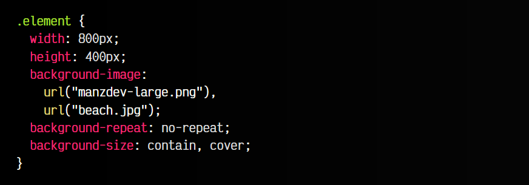

html:
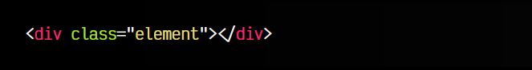

vista:

Observa que en este caso hemos indicado dos fondos: manzdev-large.png y beach.jpg.

   - 1️⃣ El background-repeat solo tiene un valor, por lo que se aplica a todos los fondos.
   - 2️⃣ El background-size tiene dos valores, por lo que se aplica contain a manzdev-large.png y cover a beach.jpg.

Cuando utilizamos propiedades como background-image con valores múltiples (sobre todo cuando se trata de valores largos), se suelen separar en diferentes líneas, bien indentadas.

## 
Imágenes con gradientes

Recuerda que background-image permite indicar todo lo que corresponda con una imagen, por lo tanto, puedes utilizar tanto imágenes como gradientes, e incluso combinarlos, ya que ambos se identifican como imágenes.

css:
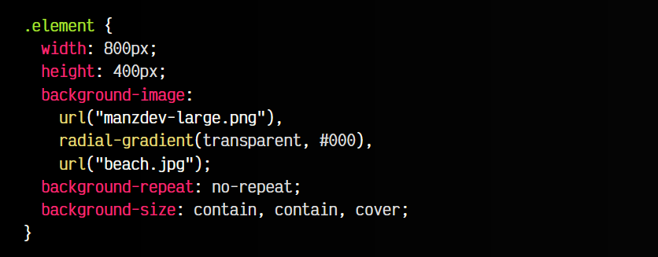

html:
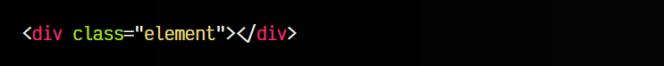

vista:

Observa que en este ejemplo hemos creado un gradiente a modo de viñeteado (vignette, un efecto fotográfico que oscurece las esquinas de la imagen). Este efecto se consigue con un gradiente radial (ovalado) con el color negro en los extremos de la imagen hacia dentro, donde es transparente.

El gradiente, al estar sobre la imagen de la playa beach.jpg, sólo esta se ve afectada. La imagen del personaje manzdev-large.png está sobre dicho gradiente, por lo que no se ve oscurecido.

Los gradientes los explicaremos detenidamente un poco más adelante, en el tema de [gradientes](https://lenguajecss.com/css/gradientes/que-son/).

## 
Fondos con gradientes múltiples

Los gradientes múltiples son un recurso muy infravalorado que puede permitirnos hacer cosas increíbles con un par de líneas de código. Por ejemplo, observa el siguiente fragmento de código, donde utilizamos 3 gradientes (y ninguna imagen):

css:
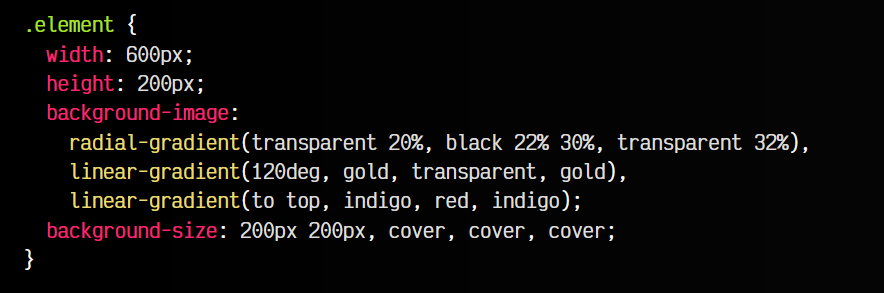

html:
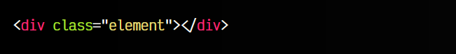

vista:

   - 1️⃣ El último gradiente es el primero que se pinta. Un gradiente de lila a rojo y a lila, que va desde abajo hacia arriba.
   - 2️⃣ Sobre él, pintamos otro gradiente que va en dirección 120 grados (diagonal abajo-derecha), de dorado a transparente y luego a dorado.
   - 3️⃣ El primer gradiente es el último en pintar (sobre los demás). Es un gradiente radial (circular) que va de transparente a negro y nuevamente transparente. Como le hemos puesto un tamaño de 200x200 y el background-repeat por defecto está a repeat, se repite hasta cubrir los 600px de ancho, apareciendo 3 círculos radiales.

Con los gradientes se pueden hacer cosas muy avanzadas y atractivas, con muy poco código, que son fáciles de modificar. En los streams de Twitch, solemos hacer cosas interesantes. Por ejemplo, echa un vistazo al [Sistema Solar dibujado con CSS](https://www.youtube.com/watch?v=pJGpscsl7hE): [resultado final aquí](https://manzdev.github.io/twitch-solar-system/).

## 
Atajo con fondos múltiples

Por último, ten en cuenta que igual que puedes utilizar fondos múltiples en background-image y propiedades relacionadas con los fondos, puedes hacerlo con la propiedad de atajo background. Para ello, debes respetar la sintaxis general de background y luego combinar separando con comas.

Observa el último ejemplo de la playa, utilizando la propiedad de atajo:

css:
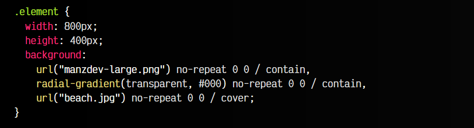

html:
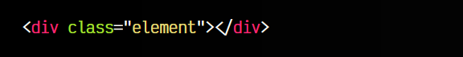

vista:
![alt text]./imagenes-fondos-y-gradientes-multiples/(image-18.png)

Recuerda que el valor de la propiedad background-size, en la propiedad de atajo debe venir definido tras el valor de background-position, que por defecto es 0% 0%.

