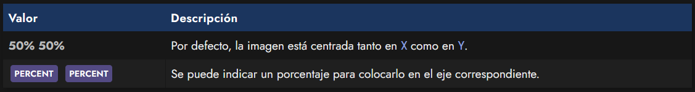

# 
Objetos en CSS

En CSS, se denominan objetos a imágenes a través de la etiqueta < img >, elementos multimedia a través de < video > u otros elementos como < textarea > o < input >, por ejemplo. Dichos elementos tienen su propia forma de mostrarse en pantalla ya que tienen características ajenas a CSS.

Por dicha razón, muchas veces estos objetos tienen un tamaño inicial que no encaja con el uso que queremos darle, no se adapta a las cajas o contenedores que usamos o no funciona como tenemos previsto que lo haga.

## 
Propiedades para objetos

Sin embargo, existen algunas propiedades en CSS que nos permiten modificar ciertos aspectos de muchos de estos elementos, pudiendo darle estilo y adaptarlos.

Aquí puedes ver una tabla resumen de las propiedades que vamos a analizar:

Veamos detalladamente, una por una.

## 
La propiedad object-fit

La propiedad object-fit nos va a permitir cambiar el modo en el que se rellena o adapta una imagen < img > (o cualquier otro objeto de representación externa a CSS) en su contenedor padre o en si mismo. Los valores que puede tomar dicha propiedad son los siguientes:

Imaginemos que una imagen, que tiene su propio tamaño, es notablemente superior que los elementos contenedores (o el tamaño) que lo va a contener. Por defecto, la imagen tiene su propio tamaño y se desbordará, pero nos podría interesar cambiar su tamaño de alto y/o ancho para que se adapte.

Para ello, utilizaremos los diferentes valores de la propiedad object-fit:

Así pues, podemos plantear el siguiente código de ejemplo, donde se puede utilizar la propiedad object-fit con sus diferentes valores y comprobar como se comporta:

css:

html:

vista:

## 
La propiedad object-position

Además, tenemos la propiedad object-position que nos sirve para utilizar junto a la propiedad object-fit y cambiar la posición donde aparece la imagen, especialmente cuando está recortada y sólo aparece un fragmento o parte de la imagen. La propiedad funciona de forma muy parecida a como lo hace la propiedad background-position:

También se pueden indicar palabras clave como top, left, right, bottom o center para indicar en que zona quieres centrar la imagen, incluso, añadiendo un porcentaje tras ellos para ajustar más concretamente:

css:

html:

vista:

## 
La propiedad object-view-box

La propiedad object-view-box nos permite indicar al navegador la región visible de un elemento a visualizar, es decir, su viewbox (caja de visualización). Con esta herramienta a nuestra disposición, podremos mostrar sólo una parte de una imagen o video, o incluso hacer zoom con animaciones si activamos las transiciones.

Para ello, utilizaremos por ejemplo, la función inset() para determinar la región que recortaremos. Esta función trabaja exactamente de la misma forma que explicamos en el apartado [recortes con clip-path](https://lenguajecss.com/css/mascaras-y-recortes/clip-path/).

css:

html:

vista:

Estamos utilizando 4 parámetros en la función inset(). Si son el mismo, se puede resumir en un sólo parámetro. Para suavizar el cambio estamos usando trasiciones, que las explicamos en el apartado de [Transiciones CSS.](https://lenguajecss.com/css/animaciones/transiciones/)

En el ejemplo superior, recortamos la imagen un 25% por cada lado, es decir, top right bottom left, en el sentido de las agujas del reloj. Si quieres aprender a utilizarla, incluso con animaciones, echa un vistazo al siguiente video:

