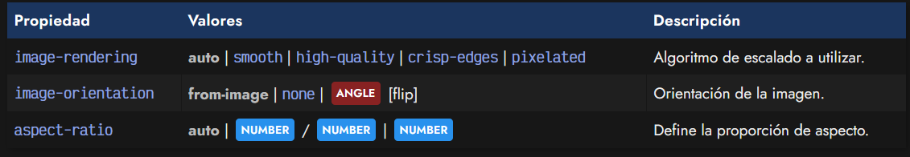
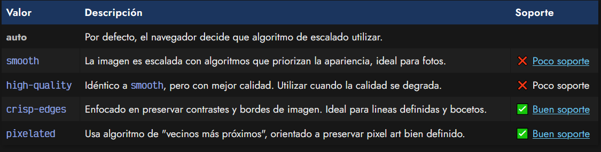
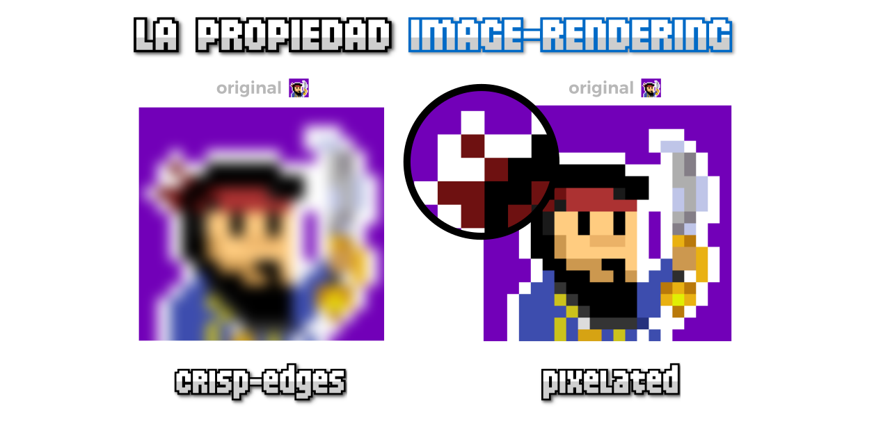
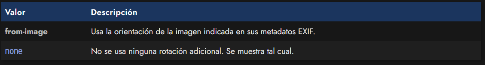

# 
Procesamiento de imágenes

En algunas situaciones nos podría interesante modificar la forma en la que el navegador procesa las imágenes. Temas como la orientación en la que se muestra una imagen o como se renderiza cuando hacemos una imagen más grande, es algo configurable mediante las siguientes propiedades CSS:

Vamos a explicar cada una de ellas.

## 
La propiedad image-rendering

La propiedad image-rendering permite indicar al navegador como se debería renderizar una imagen, y más concretamente, que algoritmo de reescalado se debería aplicar. Por lo general, este valor lo utilizará correctamente el navegador, pero en algunas situaciones, al cambiar de tamaño a ciertas imágenes, es posible que se vean con una menor calidad o con defectos como bordes borrosos o ciertas imperfecciones.

Con la propiedad image-rendering indicamos al navegador que sistema de reescalado debe utilizar, algo muy interesante cuando utilizamos por ejemplo, imágenes pixel art, donde nos interesa que se utilicen algoritmos como nearest neighbour (vecinos más próximos) que respeta y preserva la definición del pixel art.

Los valores que puede tomar la propiedad son los siguientes:

Aquí puedes ver, por ejemplo, la diferencia de aplicar image-rendering con los valores crisp-edges y pixelated respectivamente a una imagen orientada para representar un dibujo pixel art. Como se observa, el Manz pirata de la derecha tiene los bordes mucho más definidos que el Manz pirata de la izquierda, el cuál se ve más borroso:

No obstante, ten en cuenta que es una particularidad de pixel art. Con otras imágenes, normalmente el valor predeterminado es más que suficiente.

## 
La propiedad image-orientation

La propiedad image-orientation permite rotar una imagen respecto a la información que se encuentra en sus metadatos EXIF, o por el contrario, desactivarla y mostrarla tal cuál aparece en la propia imagen.

Algunas imágenes .jpg guardan metadatos EXIF donde guardan cierta información, entre dichos datos, tenemos la información de orientación de la imagen, que establece cuál es la orientación correcta de la misma.

Mediante esta propiedad image-orientation y el valor from-image, se puede recuperar esa orientación de sus datos y utilizarlos para mostrarla de forma correcta.

