# 
Gradientes radiales

Dentro de la categoría de gradientes tenemos una función que permite crear los llamados gradientes radiales. Estos son un tipo de degradado con formas circulares o elípticas. Para crearlos, sólo tenemos que utilizar la función radial-gradient() en lugar de la más conocida y frecuente función linear-gradient().

## La función radial-gradient()
Dentro de los gradientes radiales también tenemos diferentes modalidades. Como mínimo, debemos escoger una forma específica entre circle y ellipse (que si no es indicada, se usará ellipse), y los colores del gradiente a utilizar:

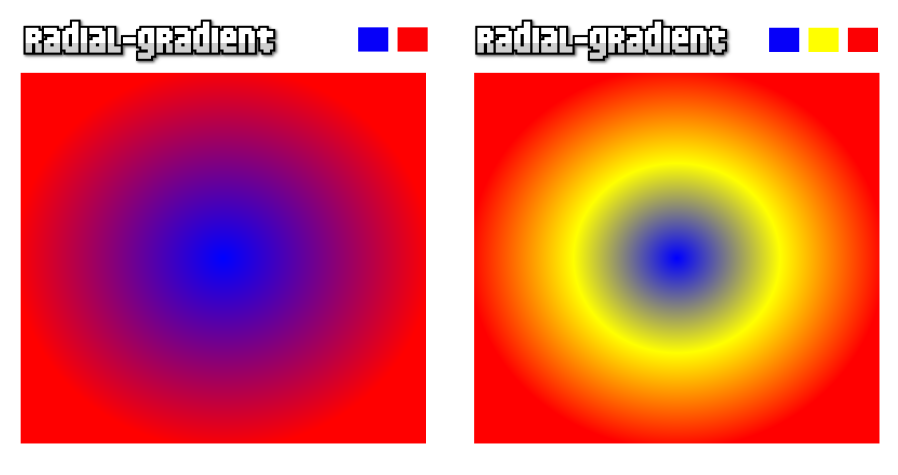

Veamos la sintaxis de las diferentes modalidades:

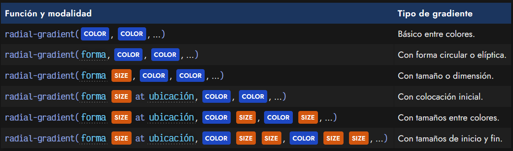

Y ahora, apliquemos estas modalidades en algunos ejemplos de código con sus diferentes parámetros:

css:
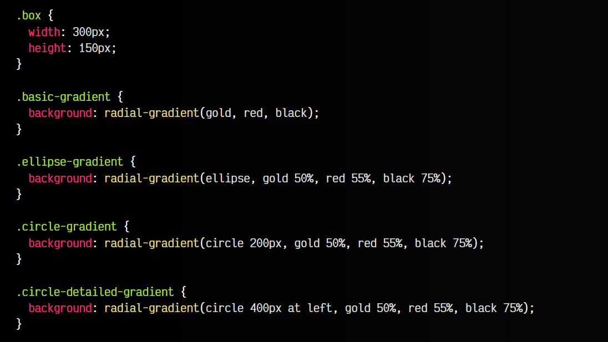

html:
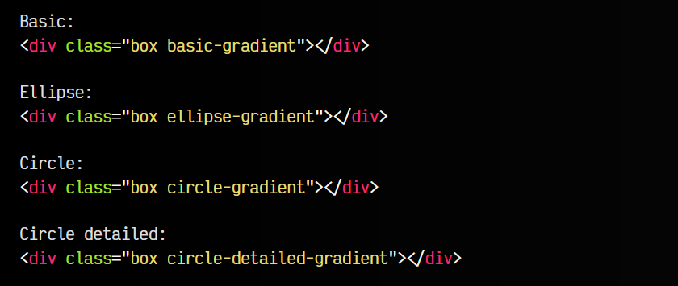

vista:
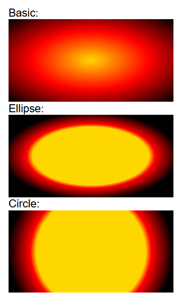
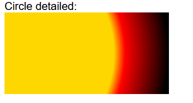

## Forma del gradiente radial
El primer parámetro de la función radial-gradient() es la forma del gradiente radial, que puede ser circle o ellipse, esta última la opción por defecto que se seleccionará de no indicar ninguna explícitamente.

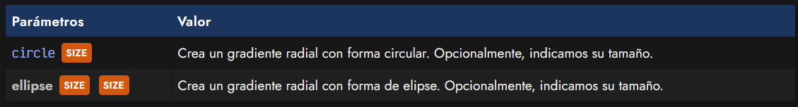

Donde el tamaño SIZE puede ser uno de los siguientes valores:

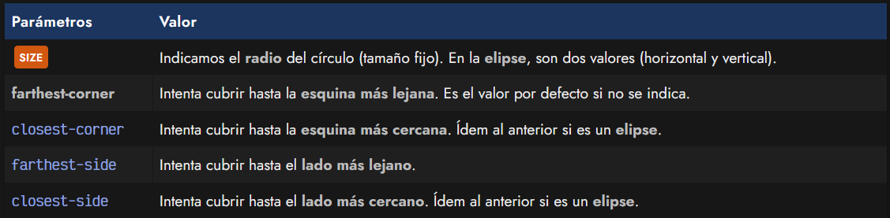

Veamos algunos ejemplos:

css:
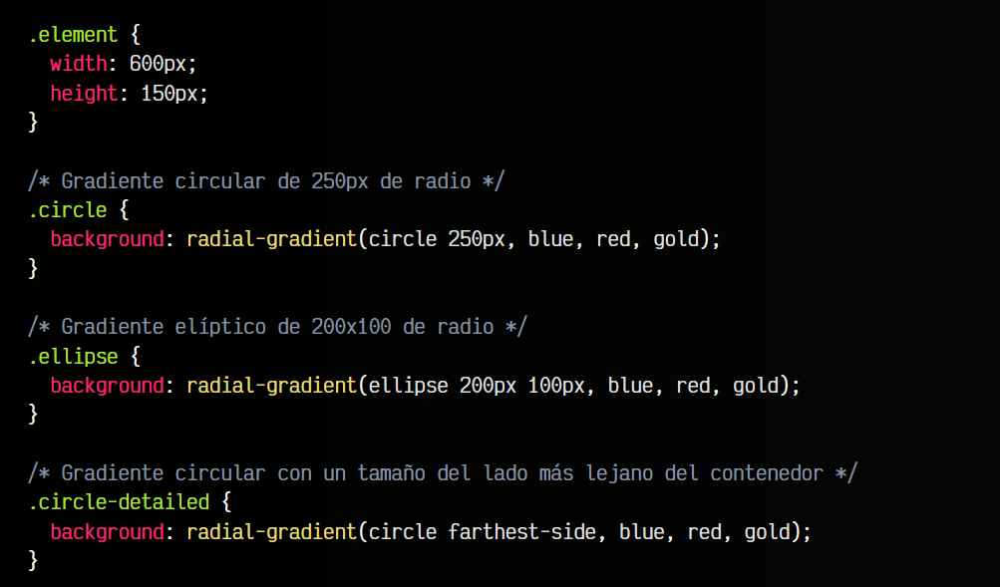

html:
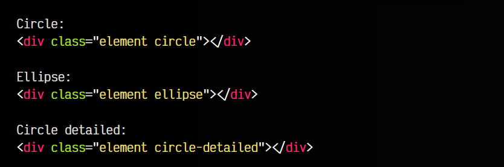

vista:
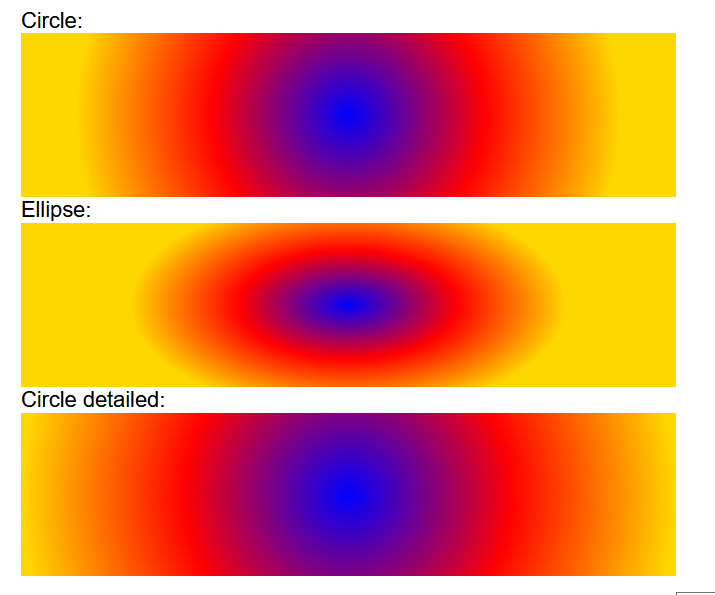

## Posición del gradiente
A cualquiera de las formas del gradiente se le puede indicar una posición específica para colocarlo en el fondo. Para ello, solo tenemos que indicar la palabra clave at, seguido del lugar donde queremos colocarlo:

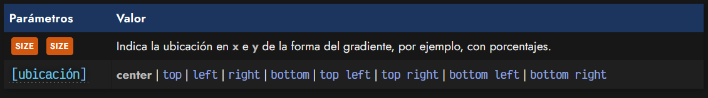

Un pequeño ejemplo para ilustrar como dar posición a un gradiente:

css:
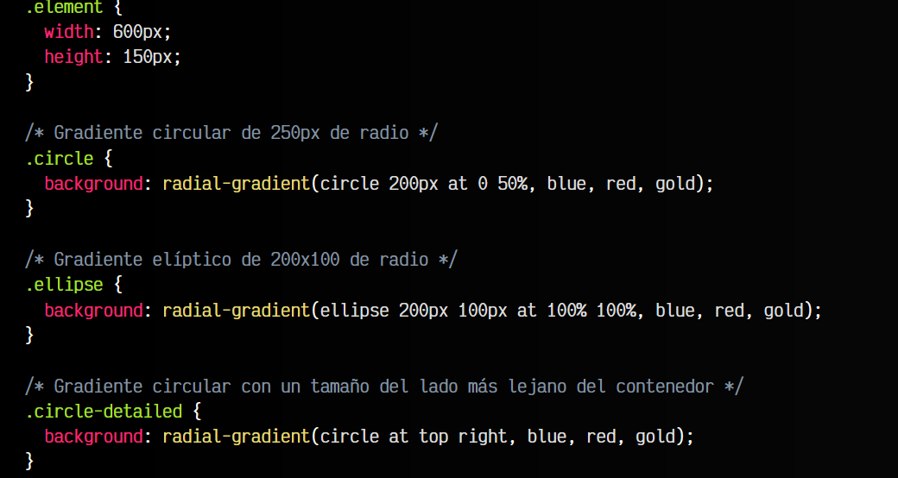

html:
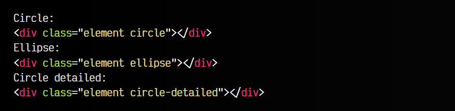

vista:
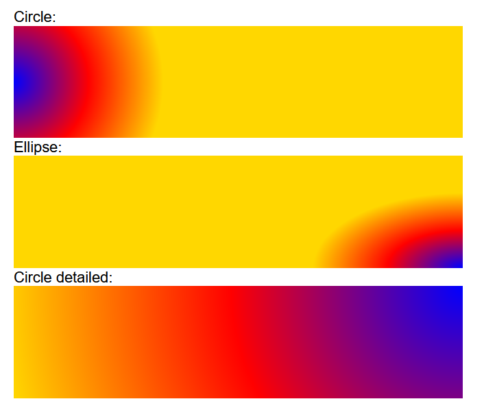

Por su parte, indicar los colores del gradiente se hace exactamente de la misma forma que en los [gradientes lineales](https://lenguajecss.com/css/gradientes/linear-gradient/), salvo que en este caso, seguirán la forma circular o elíptica escogida.

## La función repeating-radial-gradient()
En lugar de utilizar la función radial-gradient() podemos utilizar la función repeating-radial-gradient() para indicar un patrón de colores que se repetirá continuamente.

El truco está en que los tamaños SIZE indicados a continuación del color, teniendo en cuenta que no debe llegar al 100%, y el navegador se encargará de completarlos y repetirlos una y otra vez hasta que no quede más espacio en el elemento HTML seleccionado:

css:
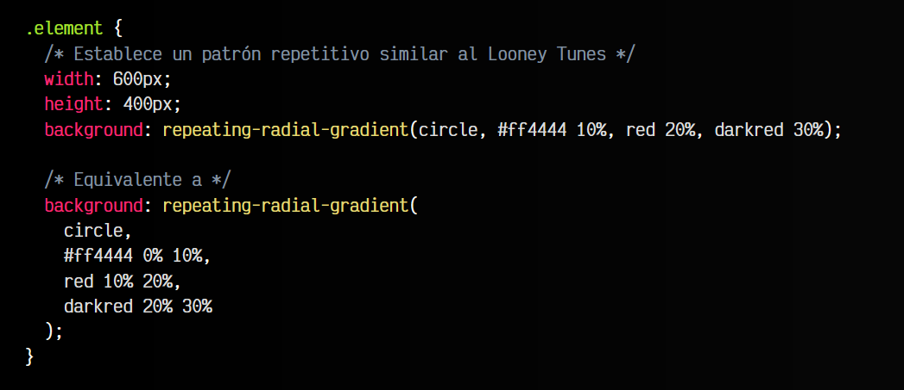

html:
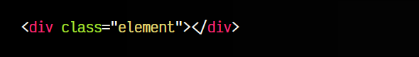

vista:
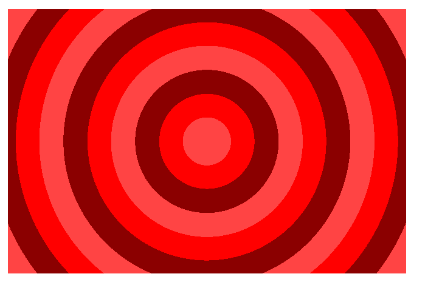

Como se puede ver, el patrón de colores se ajusta a los tamaños indicados y el navegador se encarga de repetirlos una y otra vez, lo que puede sernos de utilidad en muchas ocasiones.