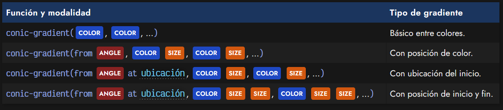
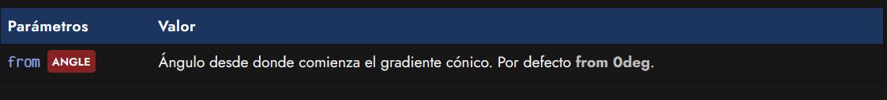
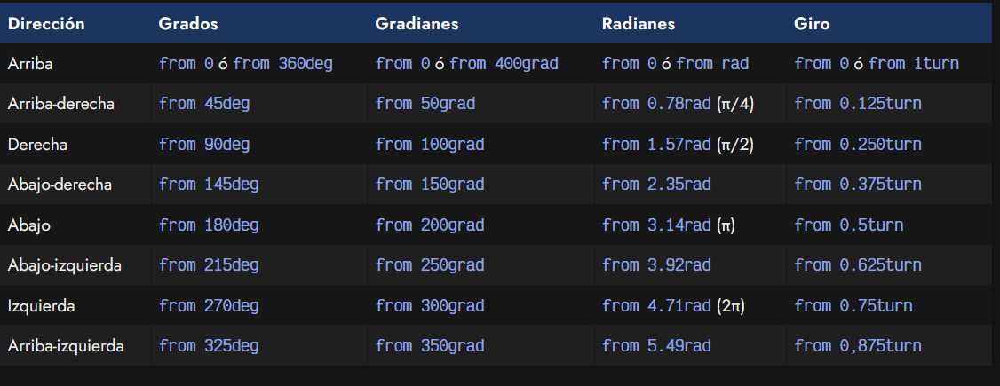
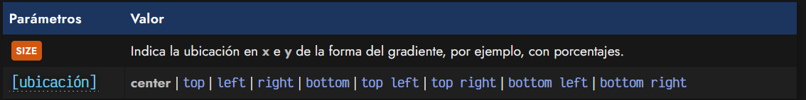
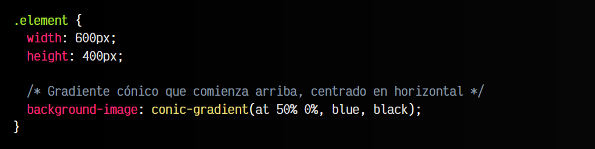
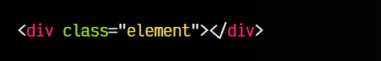
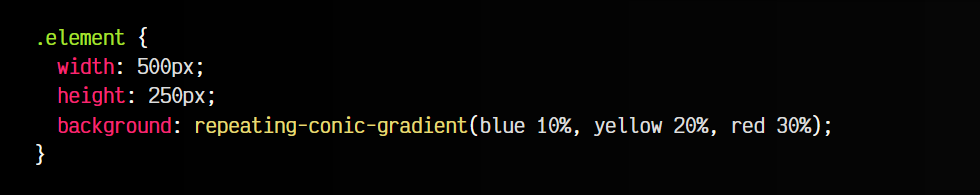
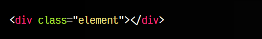
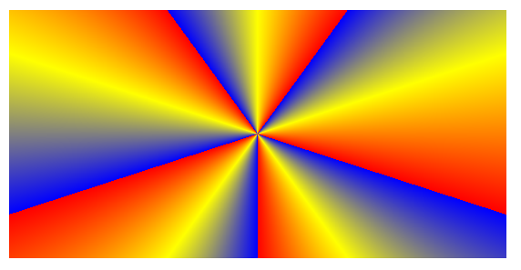

# 
Gradientes cónicos

Existe un tercer tipo de gradiente en CSS, visualmente muy similar al gradiente radial, pero haciendo referencia a una figura cónica vista desde un plano superior, incluyendo sus sombras y brillos.

## La función conic-gradient()
Se trata de la función conic-gradient(), que permite crear gradientes cónicos. Su sintaxis es la siguiente:

## Punto de inicio del gradiente
Mediante la palabra clave from podemos indicar los grados ANGLE desde los cuales comenzamos el gradiente cónico, que por defecto, se establece en 0deg.

Recuerda que es posible indicar varios tipos de unidades, entre las que se encuentran grad, rad o turn, a parte de deg:

## Posición del centro
Es posible indicar una ubicación específica para colocar el centro del gradiente en el elemento en cuestión en el que nos encontremos. Para ello, solo tenemos que indicar la palabra clave at, seguido del lugar donde queremos colocarlo:

Un pequeño ejemplo para ilustrar como dar posición a un gradiente cónico:

css:

html:

vista:

Por su parte, indicar los colores del gradiente se hace exactamente de la misma forma que en los [gradientes lineales](https://lenguajecss.com/css/gradientes/linear-gradient/), salvo que en este caso se trata de un gradiente cónico.

## La función repeating-conic-gradient()
Por último, todos los gradientes que hemos visto hasta ahora, permiten la posibilidad de añadir el prefijo repeating- para conseguir que el efecto del gradiente, en lugar de adaptarse a la región completa, realice una repetición constantemente. El caso de los gradientes cónicos no es una excepción:

css:

html:

vista:

Es importante que al usar el prefijo repeating- se especifiquen tamaños a los colores, puesto que se necesita saber cuando comenzará a repetirse. En los ejemplos anteriores, los colores seguirían el patrón hasta el último color y volverían a repetirse sucesivamente, de forma que tendríamos:

   - Primera repetición: blue 10%, yellow 20%, red 30%
   - Segunda repetición: blue 40%, yellow 50%, red 60%
   - Tercera repetición: blue 70%, yellow 80%, red 90%
   - Cuarta repetición: blue 100%

