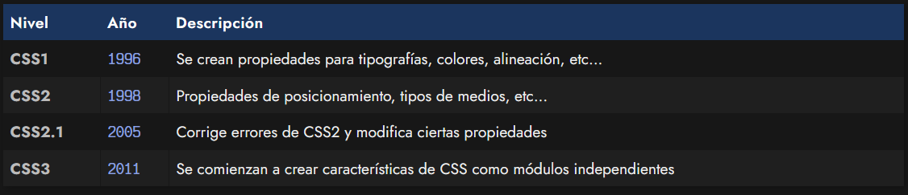
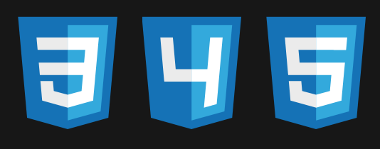
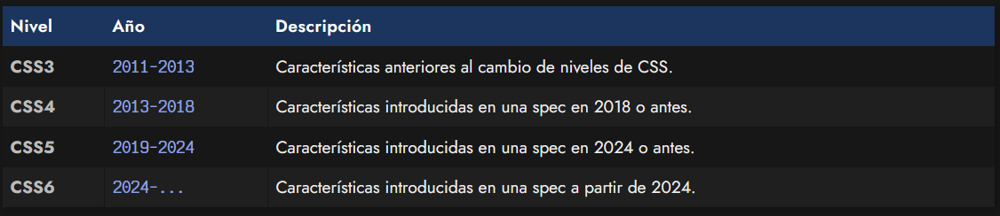

# 
Niveles de CSS

CSS es una especificación desarrollada para que el lenguaje CSS esté definido según unas "normas", y por lo tanto, en todos los navegadores funcionen de la misma forma. De no tener una especificación o estándar definido que los guíe, los navegadores implementarían el lenguaje CSS cada uno a su forma, y el CSS que escribe un desarrollador podría funcionar diferente en cada navegador.

Aún así, es posible que te hayas encontrado con situaciones en las que te has encontrado que ciertas cosas no funcionan dependiendo del navegador. Es cierto, esto ocurre en ciertos casos (es mucho menos frecuente que si no tuviesemos un estándar), pero ocurre por otras razones que explicaremos más adelante.

## ¿Qué es el W3C?
El [World Wide Web Consortium (W3C)](https://www.w3.org/) es una comunidad internacional que se encarga de desarrollar estándares para asegurar el crecimiento y la neutralidad de la web, que funcionen en todos los dispositivos (independientemente de sistema operativo, navegador u otras cuestiones) e independizándolo de intereses de empresas particulares, alejando la promoción de tecnologías propietarias e intentando aunar esfuerzos para satisfacer la demanda de características útiles e interesantes para el público.

En este consorcio participan y colaboran prácticamente casi todas las empresas relacionadas con Internet, como por ejemplo: Apple, Adobe, Akamai, Cisco, Google, Facebook, HP, Intel, LG, Microsoft, Nokia, Twitter, Yahoo, entre [muchos otros](https://www.w3.org/membership/list/).

Existen múltiples grupos de trabajo que se enfocan en temáticas particulares, como por ejemplo:

   - https://whatwg.org/: Web Hypertext Application Technology Working Group
   - https://www.w3.org/Style/CSS/: CSS Working Group
   - https://www.w3.org/WAI/GL/: Accesibility Guidelines Working Group
   - https://www.w3.org/WoT/wg/: Web of Things Working Group

Por ejemplo, desde hace algunos años, la comunidad WHATWG participa en el desarrollo y evolución de especificaciones como las de [HTML](https://lenguajehtml.com/), [DOM](https://lenguajejs.com/javascript/dom/que-es/) u otras tecnologías relacionadas.

## El pasado de CSS
Aunque muchas veces se habla de CSS3 casi como algo análogo de CSS, a lo largo de su historia, CSS ha ido evolucionado por diferentes niveles (algo parecido a las versiones de un programa). Por ejemplo, desde su creación en 1996 hasta 2011, pasaron por los siguientes niveles:

A partir de 2011, la especificación CSS decide separar sus nuevas funcionalidades en pequeños módulos en lugar de aumentar versiones, para facilitar la implementación en navegadores. De esta forma, las características avanzan independientemente del lenguaje. Por ejemplo, el módulo Flex puede encontrarse en el nivel 2, mientras que el módulo Grid puede encontrarse en el nivel 3.

Es posible que en Internet encuentres artículos mencionando que nunca habrá una versión 4 de CSS. Estos artículos están desactualizados porque fueron escritos en esta época inicial. Sin embargo, la realidad actual es diferente, como explicamos en el siguiente apartado.

En la web del consorcio W3C hay información técnica sobre estos [módulos relacionados con CSS.](https://www.w3.org/TR/?filter-tr-name=css)

## El futuro de CSS
Recientemente, un nuevo grupo de trabajo llamado CSS Next está replanteando la idea de volver al sistema de versionado general de CSS. Con el tiempo, la muerte de Internet Explorer y la evolución de las tecnologías, CSS ha comenzado a avanzar rápidamente, y el sistema de niveles por módulo complica mucho la organización de los temas.

Por esta razón, se ha planteado un nuevo modelo de organización, donde se normalizarán las características existentes en varias versiones como CSS4, CSS5 o CSS6, de modo que así sea mucho más sencillo aprender CSS para programadores aprendices, los navegadores sepan que características deben implementar antes, saber que features son novedad, etc:

Presumiblemente, cada 5 años se generará un nuevo nivel de CSS con las características que se hayan introducido en una especificación desde el lanzamiento del último nivel.

Sin embargo, recuerda que aunque se vaya a cambiar a este modelo de versiones, se va a continuar con el sistema de módulos internamente. Este sistema de versiones de CSS4, CSS5, CSS6, etc. es simplemente una forma de simplificar y organizar las características de modo que sean más fáciles de aprender y gestionar.