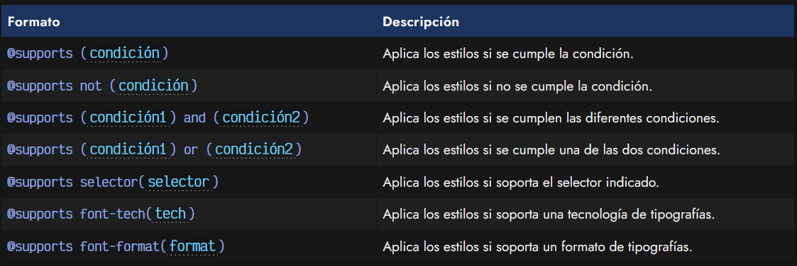
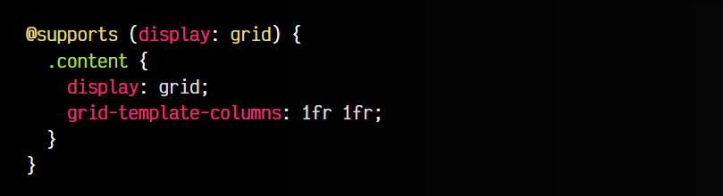
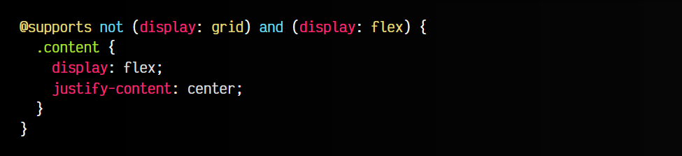
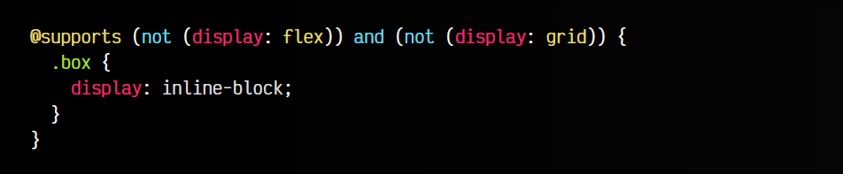
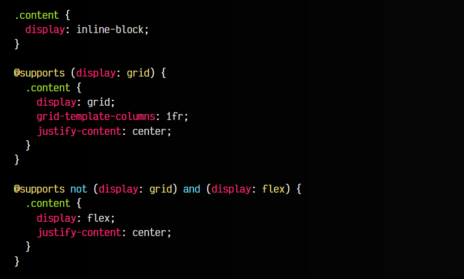
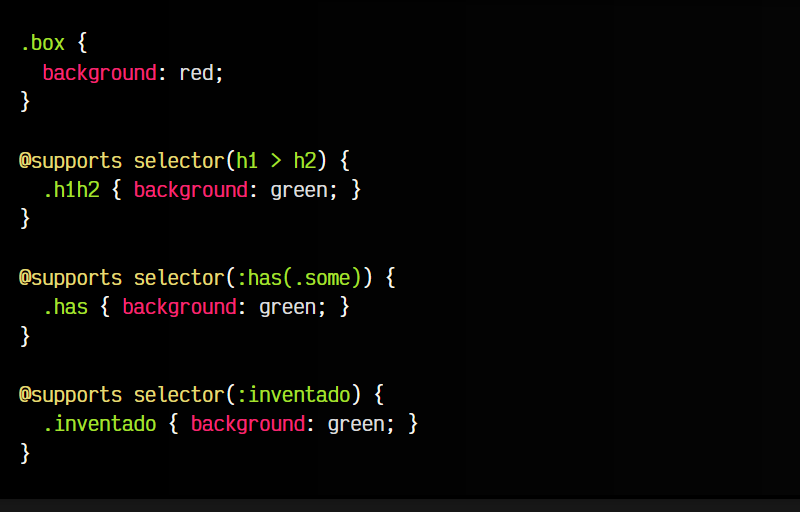
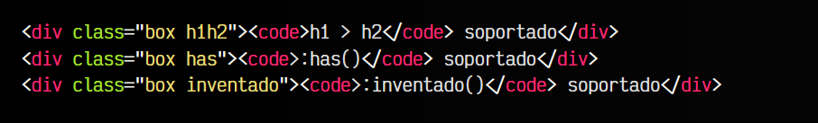
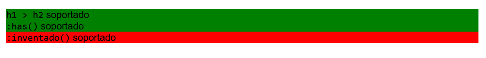
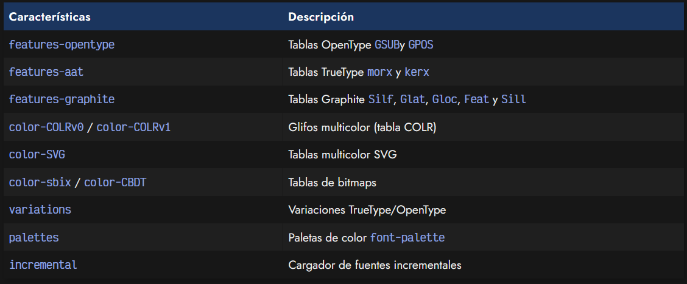
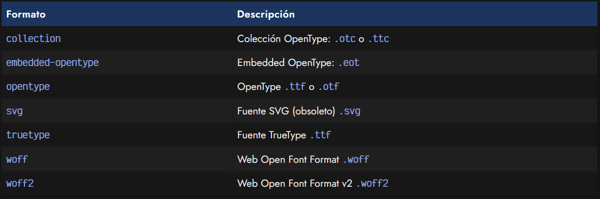

# 
La regla @supports

Existe una regla CSS denominada @supports que permite establecer fragmentos de código CSS condicionales, aplicando estilos CSS sólo cuando se cumplen ciertas condiciones y restricciones. Esto puede ser muy útil para aplicar unos estilos si el navegador soporta una característica, o aplicar un estilo diferente como fallback si no lo hace.

Un ejemplo de la regla @supports podría ser la siguiente:

Observa que en este ejemplo, se definen unos estilos para la clase .content que el navegador sólo aplicará en el caso de que tenga soporte para la propiedad display con el valor grid, es decir, que tenga soporte de [Grid CSS](https://lenguajecss.com/css/maquetacion-y-colocacion/grid-css/). Podemos hacer esto mismo con cualquier otra propiedad CSS, y utilizar la regla @supports para crear códigos condicionales.

## Reglas compuestas
Sin embargo, podemos crear también reglas compuestas un poco más complejas. Por ejemplo, combinemos una regla de negación con una normal:

En este ejemplo creamos una clase .content con contenido estructurado con flexbox, siempre en el caso de que el navegador no soporte Grid CSS pero si soporte Flex. Observa que hemos combinado tanto el not que afecta sólo a la primera condición, como el and que afecta a ambas y exige que se cumplan ambas.

Si quisieramos crear una doble condición con ambas negadas, deberíamos hacer similar a este ejemplo:

Esto podría ser interesante, pero recuerda no utilizarlo con propiedades muy antiguas. La regla @supports fue implementada en navegadores alrededor del año 2019-2020, por lo que utilizarla para excluir navegadores muy antiguos no funcionará porque tampoco tendrán la regla @supports implementada.

## Reglas con fallbacks
En lugar de establecer reglas negadas compuestas, es mejor utilizar un enfoque donde establezcas unos estilos generales, que se sobreescriben si el navegador tiene implementadas nuevas características, como explicaremos a continuación.

En el siguiente ejemplo verás un primer bloque de código fuera de reglas, que se aplicará en cualquier navegador, moderno o antiguo. Sin embargo, a continuación tenemos dos reglas @supports que se ejecutarán en navegadores más actuales:

En el caso de tratarse de un navegador que implemente Grid CSS, establecerá los estilos indicados en el primer bloque con la regla @supports. Luego, la siguiente regla @supports se ejecutará sólo en el caso de que el navegador no soporte Grid CSS pero si Flexbox.

## La función selector()
Mediante la función selector() podemos comprobar si un cierto selector esta soportado en el navegador. Observa este ejemplo, donde comprobamos si existen los diferentes selectores:

css:

html:

vista:

## La función font-tech()
Mediante la función font-tech() podemos indicar si se soportan diferentes tecnologías relacionadas con las tipografías. A continuación, tienes una lista de las tecnologías que puedes indicar en la función font-tech():

## La función font-format()
Mediante la función font-format() podemos detectar si el navegador soporta un formato de tipografía concreto. La lista de formatos disponibles sería la siguiente:

Tienes más información sobre formatos de tipografías en el post[ La regla @font-face.](https://lenguajecss.com/css/cargar-tipografias/regla-font-face/)