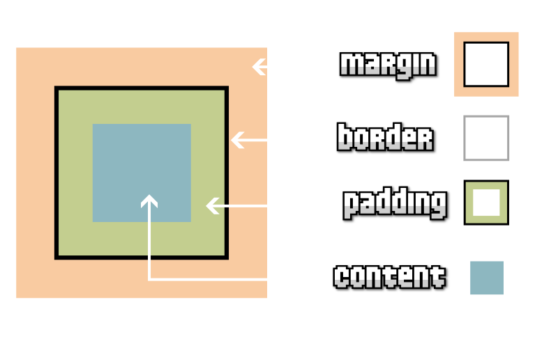

# 
Propiedades CSS

## ¿Qué es el modelo de cajas?.
Cuando hablamos del modelo de cajas en CSS, estamos haciendo referencia a un sistema que tiene el navegador de interpretar las diferentes partes de lo que solemos denominar «caja»: un elemento HTML con unas ciertas dimensiones.

La representación básica del modelo de cajas se basa en varios conceptos importantes, como veremos a continuación:

   - El borde (border), en negro, es el límite que separa el interior del exterior del elemento.
   - El márgen (margin), en naranja, es la parte exterior del elemento, por fuera del borde.
   - El relleno (padding), en verde, es la parte interior del elemento, entre el contenido y el borde.
   - El contenido, en azul, es la parte interior del elemento, excluyendo el relleno.

Márgenes y espaciados

Como veremos, cada una de estas partes del modelo de cajas de CSS se puede alterar, cambiando sus dimensiones, colores, etc. Así pues, cada elemento HTML tendrá su propio borde, margen, relleno y contenido.

Un poco más adelante, profundizaremos en cada uno de ellos:

## Zonas de un elemento.
Antes de continuar, es importante saber que en CSS existen ciertas palabras clave para hacer referencia a una zona u orientación concreta sobre un elemento. Son conceptos muy sencillos y prácticamente lógicos, por lo que no tendrás ningún problema en comprenderlos. Son los siguientes:

Estas palabras clave las utilizaremos muy a menudo en diferentes propiedades CSS para hacer referencia a una zona particular del elemento.

## El «Margin Collapse».
Otro detalle que merece la pena destacar, y que sorprende mucho en el aprendizaje del modelo de cajas de CSS, es el llamado «margin collapse» o colapso de márgenes.

Como veremos más adelante, CSS tiene varios mecanismos de maquetación. Los más básicos son inline y block, y en ellos, ocurre la siguiente situación. Imaginemos que tenemos dos elementos adyacentes, y cada uno de ellos, tiene un margen de 20px definido.

Quizás, lo más intuitivo es pensar que que el elemento de la izquierda tiene 20px de margen derecho, mientras que el elemento de la derecha tiene 20px de margen izquierdo, que al sumarse, predecimos que resultará un tamaño de 40px. Sin embargo, la realidad es distinta:

El margin collapse es una situación que ocurre en estos modelos de maquetación básica, donde los márgenes de dos elementos se colapsan, ocupando el mismo tamaño una sola vez. En el ejemplo anterior, ocupa sólo esos 20px, en lugar de los 40px de la suma del margen de cada caja.

En modelos de maquetación avanzados como flex o grid no se aplica el «margin collapse», ya que es algo que sólo afecta a modelos básicos como inline o block.

