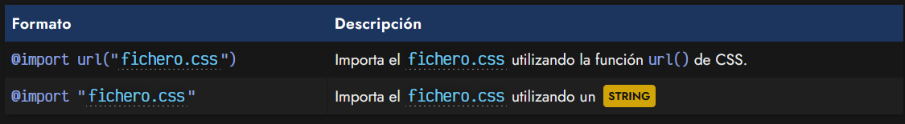
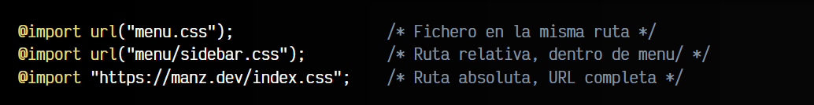
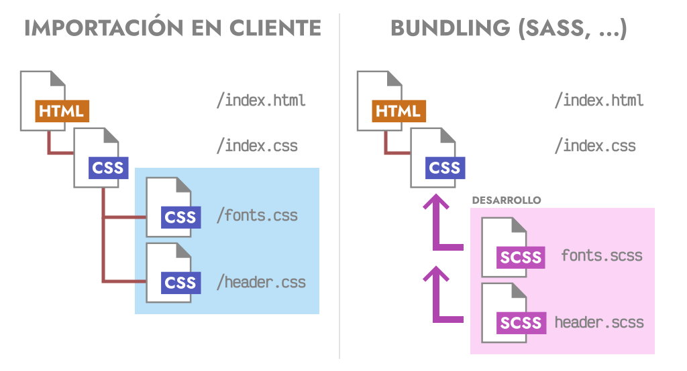
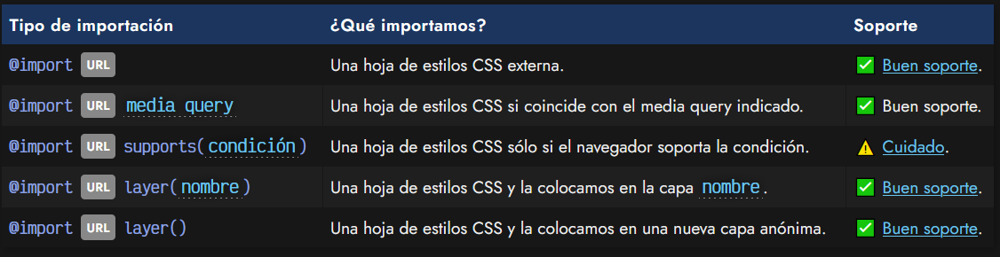
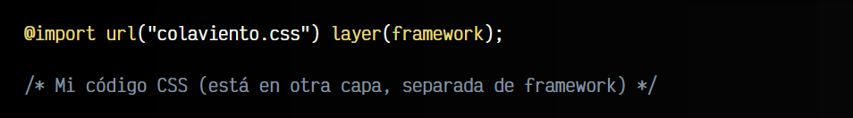
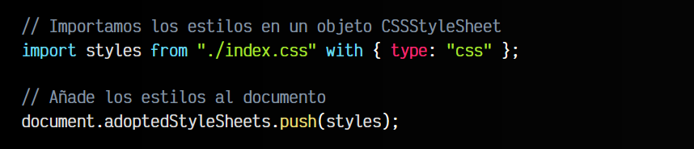

# 
La regla @import

La regla @import es una regla de CSS que permite cargar un fichero .css externo, leer sus líneas de código e incorporarlo al archivo actual. Estas reglas CSS se deben indicar en las primeras líneas del fichero, ya que deben figurar antes de otras reglas CSS.

## Sintaxis de @import
En principio, existen dos sintaxis para cargar ficheros externos mediante la regla @import:

   - 1️⃣ Utilizando la función url()
   - 2️⃣ Indicando simplemente un STRING entre comillas

En cualquiera de las dos sintaxis se pueden utilizar tanto los nombres de los archivos, como rutas relativas o absolutas:

El soporte de la regla @import es muy bueno, ya que es una regla tradicional en CSS que lleva bastante tiempo.

## Importación en cliente
Un detalle muy importante que es necesario tener siempre en cuenta, es que la regla @import se evalua en el navegador a la hora de cargar la página. Es decir, cada regla @import equivale a una petición al servidor para descargarse un nuevo archivo .css.

Tradicionalmente, las importaciones mediante @import suponían un problema importante de rendimiento, ya que podría ser mucho mejor incluir todo el código CSS en un solo archivo para reducir el número de peticiones. Sin embargo, actualmente, en páginas que funcionen bajo el protocolo HTTP/2 o superior, podría no ser un detalle tan crítico.

or otro lado, herramientas como Sass, PostCSS o LightningCSS tienen mecanismos para realizar imports de forma anticipada y generar un sólo fichero con todo el código CSS para que el navegador realice menos peticiones.

## Modalidades de @import
Además de su objetivo principal, importar un fichero externo .css, existen algunas modalidades con añadidos interesantes en la regla @import. Dichas modalidades son las siguientes:

Veamos estas modalidades adicionales.

## Importaciones con media queries
Tenemos la posibilidad de importar hojas de estilo .css externas a la vez que indicamos posteriormente a la URL, una media query. Esto nos permitirá que esa hoja de estilos externa se descargue y procese, sólo si estamos en un navegador de un dispositivo que cumple las condiciones de la media query.

Observa algunos ejemplos de un @import con media queries:

   - 1️⃣ En el primer caso, el archivo mobile.css se descargará sólo si se está utilizando una pantalla que tenga como máximo 640px de ancho, presumiblemente un dispositivo móvil.

   - 2️⃣ En el segundo caso, hacemos lo mismo con el archivo desktop.css, pero sólo si el dispositivo tiene como mínimo 1280px de ancho, presumiblemente un dispositivo de escritorio.

   - 3️⃣ En el tercer caso, el archivo print.css se aplicará sólo si estamos imprimiendo con el navegador la página actual, de lo contrario, no se descargará ni se aplicará.

Esto es un mecanismo que puede ser bastante interesante para reducir la cantidad de estilos CSS que se descargarán y procesarán en el navegador.

## Importaciones condicionales
Existe otra forma de importar condicionalmente código CSS, y es utilizando supports tras la de nuestra regla @import. Esto permite que descarguemos y procesemos dicho archivo .css sólo si se cumple la condición del supports, basada en la regla @supports:

En este caso, si estamos en un navegador antiguo que no soporta grid, descargará y procesará el fichero flex-fallback.css donde colocaremos los estilos alternativos (utilizando flex, por ejemplo). En el caso de que lo soporte, hará lo que tenemos en la regla @supports, que aunque se indica en este ejemplo, no tiene relación directa con el @import y no es obligatorio utilizarlo en conjunto.

► Aprender más sobre [la regla @supports](https://lenguajecss.com/css/reglas-css/la-regla-supports/)

## Importaciones en capas
Una característica moderna que han implementado los navegadores, es la posibilidad de utilizar capas en CSS. Se trata de un sistema similar a las capas de un programa de diseño gráfico (como Photoshop), pero orientado a código CSS de cara a la Especificidad CSS.

La idea es que puedes importar un archivo .css y meter su contenido en una capa virtual de CSS, donde se revisará la especificidad antes de pasar a otra capa. De esta forma puedes mantener aislados los estilos de un framework con los tuyos propios y no necesitar utilizar !important o reescribir los selectores para forzarlos.

► Aprender más sobre [la regla @layer](https://lenguajecss.com/css/cascada-css/la-regla-layer/)

## Importaciones desde Javascript
Aunque aún es muy pronto para utilizarlas, Javascript utiliza un sistema muy similar para importar módulos ESM con contenido Javascript. Sin embargo, ese estándar se está ampliando para poder importar módulos JSON, CSS o HTML.

La sintaxis sería algo similar a lo siguiente:

Esto nos permitirá en el futuro, trabajar con CSS desde Javascript a nivel nativo, e incluso que sea mucho más sencillo añadir o modificar estilos parciales en nuestra web.

► Aprender más sobre [Módulos HTML/CSS/JSON](https://lenguajejs.com/webcomponents/componentes/que-son-webcomponents/#htmljsoncss-modules)

