# 
La regla @scope

Históricamente, uno de los principales problemas para un programador respecto a CSS, es el tema de la cascada y la especificidad. Cuando desarrollamos con CSS y estamos creando código CSS a pequeña escala no suelen haber demasiados problemas. Sin embargo, cuando el código CSS crece, todo comienza a ser diferente.

## ¿Por qué usar @scope?
Antes de explicar como funciona @scope, convendría entender porque (o para qué) lo necesitamos. El caso más claro es aquel donde estamos creando estilos CSS en una parte concreta de nuestra página. Todo va maravillosamente bien y funciona correctamente.

Tenemos el siguiente fragmento de HTML:

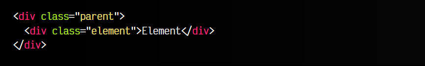

Nuestra idea es darle estilo al elemento con clase .parent, y a los elementos con clase .element que estén en su interior.

En principio pensamos que no vamos a tener más elementos .element en el interior de un elemento con clase .parent, por lo que no vemos mayor problema y continuamos con nuestra tarea. El problema es que en este punto no solemos tener una visión global de lo que estamos haciendo, y estamos metidos en resolver un problema local que suele resolverse bien. Establecemos los siguientes estilos CSS:

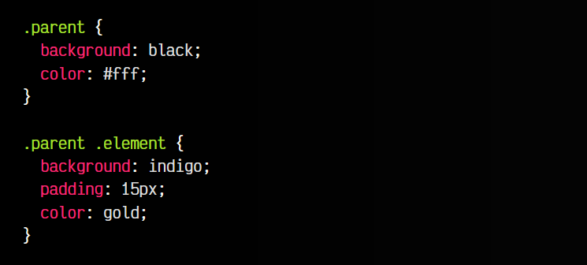

A medida que nuestro código HTML y CSS crece y pasa el tiempo, se necesitan hacer cambios, modificar y añadir nuevos elementos HTML y nuevo código CSS. La naturaleza de CSS es global, y cualquier cambio que hagamos repercute en todo el documento, salvo que lo tengas bien acotado.

Podría ocurrirnos que, posteriormente, comenzamos a crear otra zona de la página y creamos un nuevo elemento con clase element, que queremos que tenga otro estilo diferente. Como efecto secundario, el CSS de cada uno se va a mezclar, porque coinciden sus nombres (es complejo predecir esto).

Para solucionar esto, se han ideado multitud de sistemas:

   - Añadir un !important (la más usada, y casi siempre, la peor solución)
   - Reorganizar los selectores y hacerlos más complejos (más espeCSSíficos)
   - Reescribir o cambiar los nombres de los selectores para que no coincidan.
   - Utilizar nomenclaturas o metodologías para evitar coincidencias de clases CSS (BEM, CUBECSS, etc...)
   - Usar herramientas/librerías que renombran para evitar colisiones (CSS Modules, CSS-in-JS...)
   - Utilizar Shadow DOM para impedir acceso al CSS del elemento desde dentro o fuera.

Sin embargo, todas tienen su complejidad, ventajas y desventajas. Ahora, con la regla @scope tendremos un mecanismo más, pero esta vez muy simple, con CSS nativo, sin recurrir a complejas herramientas, metodologías o tecnologías.

## La regla @scope en línea
Un detalle interesantísimo sobre la regla @scope es que puede trabajar en níveles de profundidad concretos del HTML, dependiendo de donde declares los estilos, mediante una etiqueta <style>.

Observa el siguiente ejemplo, donde se declara la etiqueta <style> en el interior de un 
 con clase .container. La regla @scope en una etiqueta <style> actúa sólo en el ámbito de su etiqueta padre, por lo que estos estilos están limitados sólo a la etiqueta <strong> interior:

html:
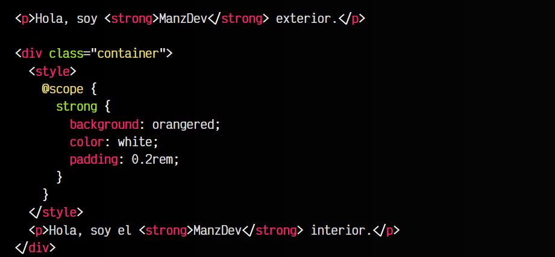

vista:
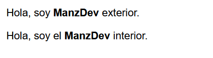

Repasemos varios detalles clave aquí:

   - El primer strong está fuera de .container.
   - El segundo strong está dentro de .container.
   - El @scope se declara en un style dentro de .container, por lo que sólo le afecta a él.

Esto es la funcionalidad básica de @scope, sin embargo, no es necesario utilizarlo en línea en una etiqueta style, tiene muchas posibilidades más que veremos a continuación.

## La regla @scope
La regla @scope es muy sencilla de utilizar. Por defecto, cuando escribimos CSS, el navegador interpreta los estilos para todo el documento. La regla @scope nos da un sistema para delimitar el ámbito en el que afectan los estilos, de modo que podemos marcar un principio y un final de ámbito en nuestro DOM, es decir, en los niveles de profundidad de nuestras etiquetas HTML.

La estructura de esta regla es la siguiente:

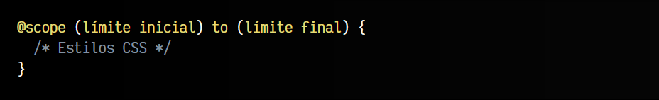

   - La regla @scope define que el CSS que contiene actuará en un ámbito limitado.
   - El límite inicial (opcional) define desde donde se aplicarán los estilos.
   - El límite final (opcional) define hasta donde (excluído) se aplicarán los estilos.

## Límite inicial de @scope
Veamos un fragmento de código utilizando la regla @scope. Entre paréntesis delimitaremos el ámbito inicial para el que se van a aplicar los estilos CSS:

css:
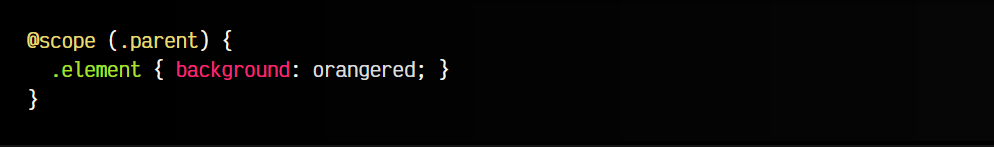

html:
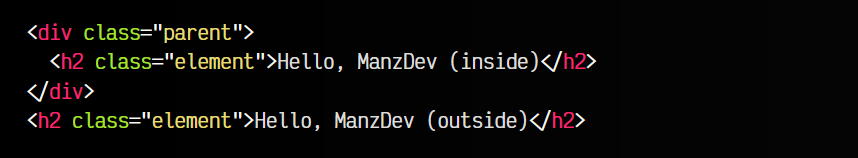

vista:
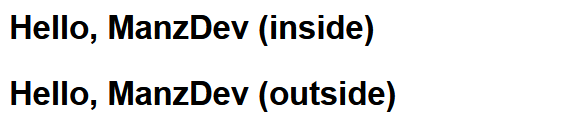

Este código aplicará los estilos a cualquier elemento con clase .element que esté en el interior de un elemento con clase .parent. Vamos, prácticamente igual que la siguiente opción 1, o incluso la opción 2, que tiene menor especificidad por el uso del [combinador funcional :where():](https://lenguajecss.com/css/selectores/combinadores-logicos/#el-combinador-where)

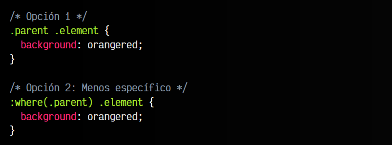

Pero... ¿entonces? Si esto ya se podía hacer hasta ahora... ¿Dónde es verdaderamente útil y novedosa la regla @scope? Pues por ejemplo, cuando delimitamos también el final del ámbito.

## Límite final con to
Observa el siguiente caso, donde queremos delimitar el inicio donde se aplicarán unos estilos y también el final. Para ello, compliquemos un poco más nuestro HTML anterior.

Observa que ahora tendremos 4 elementos .element:

   - El primer .element está dentro de .grandparent pero fuera de los demás.
   - El segundo .element está dentro de .grandparent y .parent.
   - El tercer .element está dentro de .grandparent, .parent y .child.
   - El cuarto .element fuera fuera de todos.

Ahora, vamos a escribir un nuevo fragmento de código CSS con ámbito limitado. Observa que en este caso indicamos que el ámbito de los estilos va a aplicarse desde el elemento con clase .grandparent hasta el elemento con clase .child (excluído):

css:
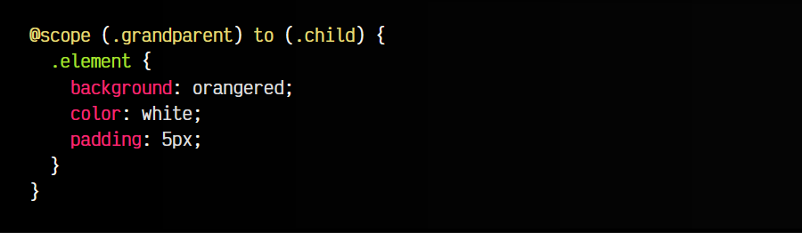

html:
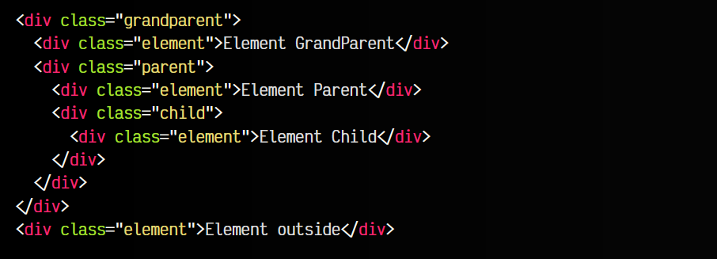

vista:
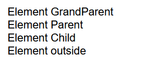

Si realizas este proceso, se dará estilo al primer y segundo .element, pero no al tercero ni al cuarto. Esto ocurre porque se hace mediante niveles de profundidad de los elementos HTML.

   - Al cuarto .element no se le da estilo porque está fuera de .grandparent.
   - Al tercer .element no se le da estilo porque está en nivel 4, nosotros pedimos «desde .grandparent» (nivel 1) hasta .child» (nivel 3).

Si reescribieramos el selector de límite como @scope (.grandparent) to (.child > .element > *) entonces si estaríamos obteniendo el tercer elemento .element, porque estamos seleccionando hasta el contenido del elemento .element dentro de .child.

## Límite final inexistente
Podría darse la circunstancia de que definamos un límite de ámbito final que realmente no existe en el HTML, como por ejemplo el siguiente:

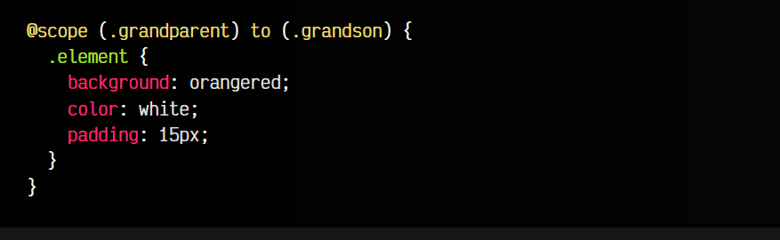

Como el elemento con clase .grandson no existe, el navegador interpretará la regla scope como si no tuviera límite final, es decir, como @scope (.grandparent). De esta forma, estaría seleccionando todos los .element que se encuentren en el interior de un .grandparent.

## Múltiples límites
Otro detalle interesante sobre la regla @scope es que podemos utilizar múltiples valores, de forma similar al combinador lógico :is(). Observa el siguiente ejemplo:

css:
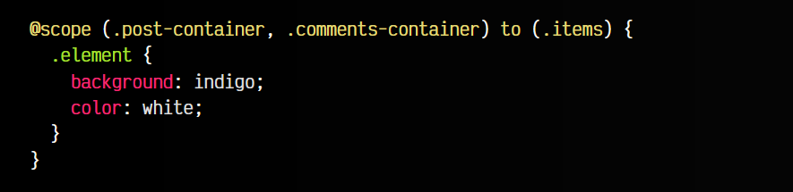

html:
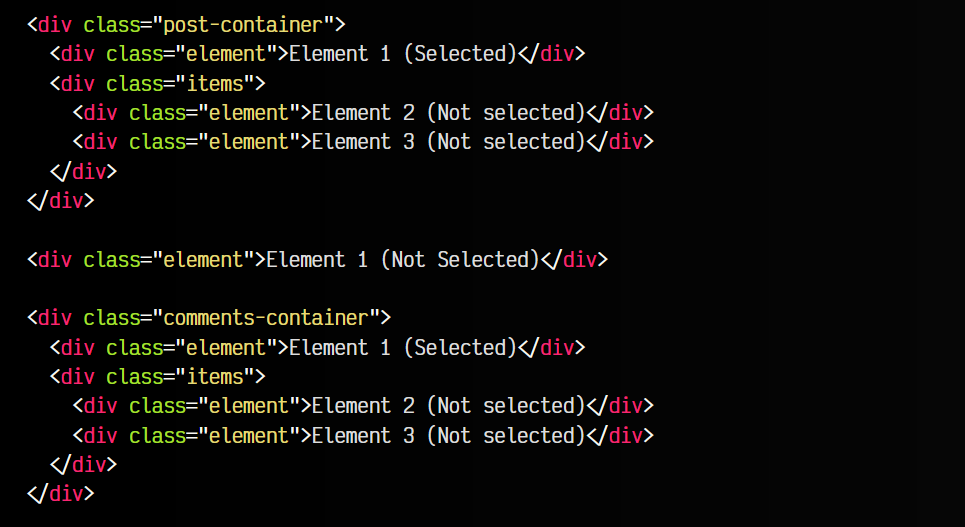

vista:
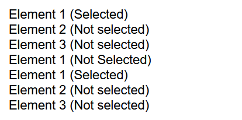

En este ejemplo, dentro de los selectores de los paréntesis indicamos múltiples valores, por lo que podemos establecer selecciones múltiples y no atarnos a elecciones más sencillas. Esto puede resultar especialmente útil de cara a la mantenibilidad.

## La pseudoclase :scope
La pseudoclase :scope se puede utilizar en las reglas @scope para hacer referencia al ámbito donde nos encontramos. Por ejemplo, observa que en el siguiente ejemplo, el ámbito seleccionado es desde .grandparent hasta .child (excluído), por lo tanto, al indicar la pseudoclase :scope estamos haciendo referencia al ámbito inicial, es decir, a grandparent:

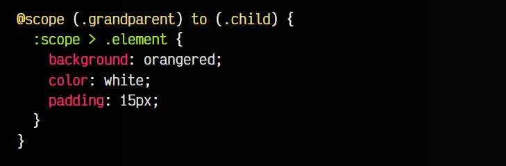

En este caso, el navegador aplicaría los estilos únicamente al .element del interior de .grandparent. Sin embargo, si le quitamos el >, observa que aplicaría estilos al .element del .grandparent y del .parent, ya que ambos están dentro de .grandparent. El de .child se obvia, porque recuerda que el límite final está excluído.

Esta característica podría ser realmente útil para simplificar código cuando tenemos múltiples valores en los límites del scope.

Ten en cuenta que también podríamos seleccionar elementos según sus ancestros:

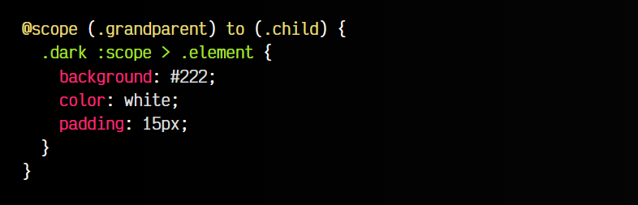

En este caso, seleccionamos los .element que estén dentro de un .grandparent que tenga algún padre con la clase .dark. Podríamos también utilizar el carácter & del Nesting CSS en lugar del :scope, ya que funciona de una forma muy similar.

## Bloques estilo Sass-BEM
Una característica muy interesante que brinda @scope es la posibilidad de crear bloques de «componentes CSS» al estilo de como se suele hacer con Sass, pero de forma nativa. Observemos el siguiente código Sass, donde aprovechamos nomenclatura BEM para crear nombres de clase que eviten especificidades altas o nombres de clase potencialmente colisionables:

css:
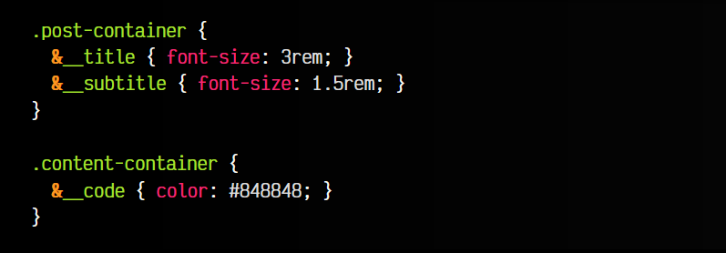

html:
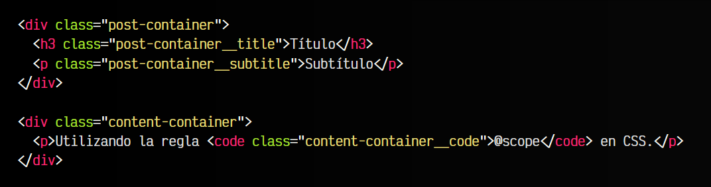

Esto, usado en Sass, permite producir un código CSS donde los nombres de clases anidados que empiecen por __, se concatenan (atención al nombre de clases):

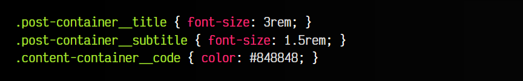

Ahora, en lugar de hacer cosas como estas, podríamos aprovechar la regla @scope (incluso usando los límites superiores si queremos excluir alguna parte) para obtener un código nativo muy fácil de leer, modificar, mantener y delimitar:

css:
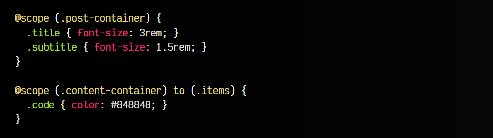

html:
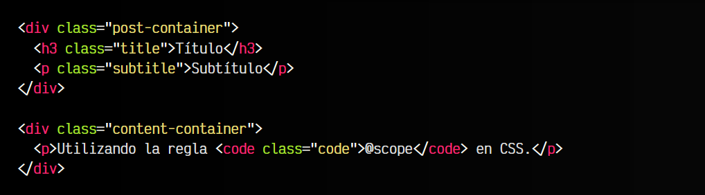

