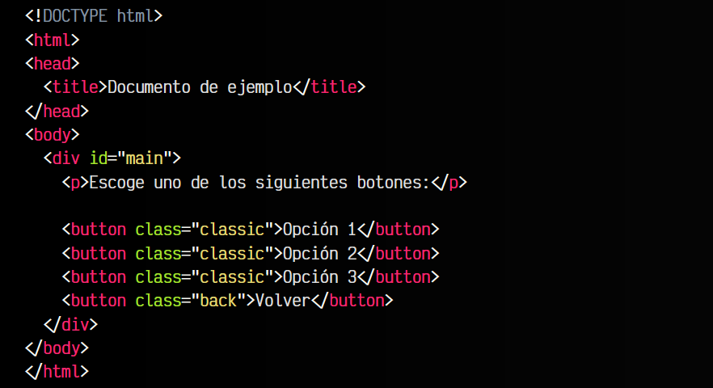

# 
Selectores básicos

Como su mismo nombre indica, un selector CSS es una referencia a uno o varios elementos HTML, escrito generalmente desde código CSS (también pueden utilizarse desde ciertos lugares en Javascript). Es una forma rápida y cómoda de hacer referencia a elementos individuales o grupos de elementos, para posteriormente darles estilo.

Cuando estamos en una fase de aprendizaje muy inicial con CSS, es habitual dar estilo con selectores muy sencillos, donde generalmente utilizamos un selector genérico que representa una etiqueta HTML (por ejemplo div). Sin embargo, con el tiempo aprendemos a utilizar selectores más complejos que nos permitirán hacer más cosas y escribir menos.

Aunque el esquema completo es mucho más amplio, vamos a centrarnos en la sintaxis más básica de los selectores CSS, y en los siguientes temas continuaremos con temas más avanzados.

Empezaremos por selectores de etiqueta, id y clases:

Un resumen de los tipos de selectores CSS básicos que veremos son los siguientes:

Vamos a explicarlos uno por uno con sus peculiaridades.

## Seleccionar por etiquetas
En este primer ejemplo, le vamos a decir al navegador que todas las etiquetas div que encuentre en la página, le ponga color de fondo rojo. La parte donde he colocado div es lo que se denomina selector, y puede llegar a ser mucho más complejo y potente, como veremos en los siguientes capítulos:

La verdadera potencia de CSS radica en la capacidad de poder seleccionar sólo los elementos que nos interesen, ya que a medida que el documento HTML crezca, aparecerán nuevos elementos que podrían adoptar ese estilo, y eso es algo que, probablemente, no nos va a interesar.

Otro ejemplo. Recuerda: Aplicamos los estilos CSS a TODOS los elementos de ese tipo:

En el ejemplo anterior, todos los elementos que sean etiquetas HTML strong se visualizarán de color rojo. Este pequeño ejemplo es didáctico pero no suele ser práctico, ya que no nos permite diferenciar entre los diferentes elementos de ese tipo. Para ello, tenemos los selectores que veremos a continuación.

## Seleccionar por ID (únicos)
Todas las etiquetas HTML pueden tener un atributo id con un valor concreto. Este valor será el nombre que le daremos a la etiqueta. Un buen símil con la vida real es la de un DNI o tarjeta de identificación, ya que la particularidad clave de los ID es que no se deben repetir, es decir, que sólo debe haber una etiqueta con el mismo ID por documento. Veamos un ejemplo:

html:

css:

vista:

En el documento anterior, encontramos dos elementos div. El primero de ellos, tiene ID saludo, una capa donde se le da la bienvenida al usuario. La segunda, con ID main, es una capa donde hay contenido. Sería incorrecto crear otra etiqueta con ID saludo o main en este mismo documento, ya que ya existe una con esos nombres.

Como podemos ver en el ejemplo, en CSS la forma de hacer referencia a los IDs es con el símbolo #, mientras que en el HTML se indica el atributo id="saludo".

En la práctica, los id no suelen utilizarse para dar estilo, ya que en la mayoría de los casos utilizar una clase es perfectamente válido y mucho más mantenible a largo plazo. La situación más recomendable para usar id es cuando designamos una zona como única en el documento (no se va a repetir) y queremos [crear un ancla a ella](https://lenguajehtml.com/html/texto/enlaces-o-hipervinculos/).

## Seleccionar por clases
A medida que vamos codificando y creando nuestros documentos HTML, comprobaremos que necesitamos formas más flexibles y cómodas, ya que los elementos tienden a repetirse y con los id no deben ser únicos. Aquí es donde entran en escena las clases de CSS.

Las etiquetas HTML pueden tener otro atributo interesante: class. La diferencia principal respecto a los id es que las clases no necesitan ser únicas, sino que pueden repetirse a lo largo del documento HTML:

Observa que tenemos cuatro botones HTML. Los 3 primeros son botones de opciones, por lo que establecemos una misma clase llamada classic, mientras que el último botón (un botón para volver hacia atrás), le hemos indicado la clase back para que tenga un estilo diferente a los anteriores.

Para hacer esto con id (recordemos que son únicos, no deberían repetirse) tendríamos que crear 3 id con nombres diferentes, mientras que con las clases (las cuales si se pueden repetir) podemos reutilizar el mismo nombre. Esto nos permite indicar en la parte de CSS un sólo selector con los estilos y reutilizarlos en todos los elementos HTML que se desee.

En CSS se hace referencia a las clases con el símbolo del punto: .classic, mientras que en el código HTML se escribiría el atributo class="classic":

Además, en el caso de las clases, podemos incluso diferenciar el tipo de elemento del que se trata. Gracias a esto podríamos utilizar la clase .classic en button para dar estilo visual a botones, y la clase .classic en p para dar otros estilos diferentes a los párrafos de texto.

## Selecciones mixtas
Al margen de todo lo que hemos visto, es posible utilizar varias clases en un mismo elemento HTML, simplemente separando por espacios dentro del atributo class.

De esta forma, a dicho elemento se le aplicarán los estilos de cada una de las clases indicadas, las cuales suelen tener un grupo de características relacionadas con su nombre, lo cuál puede ser muy interesante y práctico en algunos casos, dándonos mucha soltura a la hora de crear clases y reutilizarlas:

Este enfoque se considera una de las bases del CSS atómico, donde se fundamenta una técnica llamada clases de utilidad (utility-classes) en las que se basan populares frameworks CSS como [Tachyons](https://tachyons.io/) o [TailwindCSS](https://tailwindcss.com/). Tienes más información sobre esto en [Metodologías CSS](https://lenguajecss.com/css/calidad-de-codigo/metodologias-css/).

Por último, mencionar que también tenemos la posibilidad de ser más específicos y aplicar estilo sólo a los elementos HTML que contengan todas las clases indicadas, colocando cada clase de forma consecutiva en el CSS, de la siguiente forma:

En este ejemplo, sólo se aplicarán los estilos cuando el elemento HTML cumpla las siguientes condiciones (observa que no existen espacios entre las clases classic, primary y large):

   - Sea un elemento HTML <button>button
   - Tenga una clase .classic
   - Tenga una clase .primary
   - Tenga una clase .large

Se debe cumplir todas y cada una de ellas. Si falta alguna, no se seleccionará el elemento y no se aplicará el estilo.

