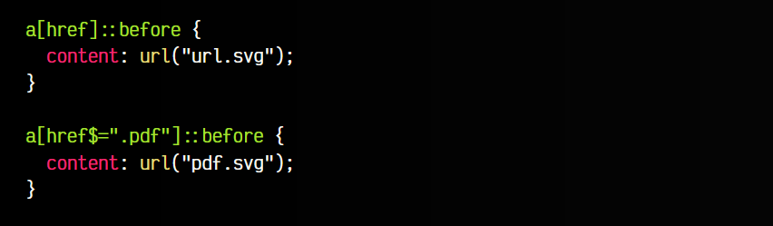

# 
Selectores de atributos

Una característica muy interesante de CSS, pero poco utilizada, es la posibilidad de aplicar estilos dependiendo de la existencia o contenido de ciertos atributos en los elementos HTML.

## ¿Qué son los atributos CSS?
Hasta ahora, hemos visto una forma rápida y extendida de hacer esto para atributos muy conocidos como id o class, a través de #nombre o .nombre, respectivamente. Sin embargo, podríamos querer hacer esto, pero no para los atributos class o id, sino para otros atributos diferentes:

html:

vista:

En algunos casos puede que no tengamos clases ni id establecidas, y nos interese dar estilo por otros atributos. En el ejemplo anterior, no existen atributos class ni id, pero si existe un atributo disabled. Con los atributos CSS podríamos seleccionar los elementos que contienen un atributo específico.

En CSS, estos atributos se indican rodeando de corchetes [] al atributo en cuestión. Veamos un ejemplo:

Observa que en el primer caso, seleccionamos todos los elementos que sean button. En el segundo caso, seleccionamos todos los botones que sean button pero que además tengan el atributo disabled. En la última opción, al no indicar el elemento button, estamos seleccionando todos los elementos html que tengan el atributo disabled, independientemente de que sean button, input o cualquier otro elemento.

## Atributos CSS
Sin embargo, no todo es tan sencillo como el ejemplo anterior. Hay varias formas de utilizar los atributos CSS, algunas muy potentes y flexibles, basadas en un concepto llamado expresiones regulares en los que están inspirados (aunque no son estrictamente expresiones regulares):

Veamos cada uno de ellos por separado para entenderlos bien.

## Atributo existente
Para empezar, y como hemos mencionado antes, podemos utilizar el atributo [disabled] para seleccionar todas las etiquetas HTML que contengan un atributo disabled, utilizado para desactivar el elemento. Estos elementos, aparecerían con fondo gris:

El atributo disabled es sólo un ejemplo, podríamos utilizar cualquier otro atributo que queramos. Si el elemento no tiene el atributo mencionado, no se le aplican los estilos.

## Atributo con valor exacto
La potencia de los atributos CSS es que podemos indicar el valor exacto que deben tener para que sean seleccionados. Para ello, simplemente utilizamos el símbolo = y escribimos el texto entre comillas dobles:

Este ejemplo selecciona los enlaces a que tienen un atributo rel establecido a nofollow. Esta es una característica que le indica a Google (u otros robots o crawlers) que ese enlace no se debería tener en cuenta para seguirlo, algo que puede ser realmente útil para desincentivar SPAM en comentarios, por ejemplo.

## Atributo con lista de palabras
Imagina que un elemento HTML tiene un atributo (en este ejemplo concreto el atributo data-mood) con una lista de palabras separadas por espacio. En nuestro código CSS, mediante el mecanismo de Atributos CSS y el símbolo ~=, puedes seleccionar los elementos que contengan la palabra indicada en su lista de palabras separadas por espacio.

Veamos un ejemplo:

css:

html:

vista:

En este caso, el elemento div se seleccionará porque la palabra happy está dentro de la lista de palabras separadas por espacio del atributo data-mood.

## Atributo con lista compuesta
Por otro lado, podemos utilizar el símbolo |= para seleccionar elementos HTML que tengan un atributo con una lista de palabras compuestas separadas por un guión. Indicando un valor, le diremos al navegador que seleccione el elemento si contiene una palabra donde su prefijo sea el valor indicado.

Veamos un ejemplo donde se verá claramente:

css:

html:

vista:

En este caso, el 
 será seleccionado porque contiene una palabra compuesta que comienza por es-, es decir, concretamente la palabra compuesta es-MX.

## Comienzo de un atributo
Una de las características más potentes de los atributos CSS proviene de las llamadas expresiones regulares de Javascript. Aunque realmente, no son expresiones regulares, los atributos CSS permiten seleccionar elementos HTML dependiendo de si empiezan (o acaban) por el valor indicado.

Veamos un ejemplo, donde en el primer bloque, cualquier enlace con un atributo href aplica un código CSS donde se añade el texto del enlace. Esto podría ser útil para mostrar en el CSS para imprimir una página:

css:

html:

vista:

En este ejemplo, los enlaces a> a páginas http:// (inseguras) se prefijarán con el texto (Página no segura): antes del enlace. Esto es posible gracias a utilizar los símbolos ^= a la hora de indicar el valor del atributo, en el cuál se especifica el texto por el que debe empezar.

## Final de un atributo
De la misma forma, es posible seleccionar elementos HTML dependiendo del texto con el que que acaban. Para ello, utilizaremos los símbolos $=, con los que indicaremos el texto en que debe acabar el valor del atributo.

Observa el siguiente ejemplo, donde en su primer bloque CSS, mostramos una imagen con una cadena, icon_url.png, antes de cualquier enlace "a" con el atributo href:

css:

html:

vista:

Además de esto, y aplicando herencia, en el segundo bloque CSS se sobrescribe la propiedad content anterior en los enlaces donde el atributo href acaba en .pdf. Si es así, mostramos el icono icon_pdf.png, donde se visualizará un icono de un archivo PDF.

## Atributo contiene texto
Por último, también podemos indicar un fragmento de texto que debe estar contenido en el valor de un atributo CSS, pero que no es necesariamente el texto íntegro. El fragmento de código CSS debería ser el siguiente:

En este fragmento de código se indica que para seleccionar un enlace "a", el enlace al que apunta debe contener de alguna forma el texto manz. En la siguiente tabla se pueden ver varios ejemplos de enlaces, y cuáles se seleccionarían en cada caso:

Observa que en el último caso, aún incluyendo la palabra manz no se seleccionaría, ya que el atributo href que lo contiene es una etiqueta "link" y no de una etiqueta "a" como se pide en el fragmento de código anterior.

## Mayúsculas y minúsculas
Algo importante que cabe destacar, es que estos fragmentos de código para seleccionar atributos CSS son sensibles a mayúsculas y minúsculas (case sensitive), o lo que es lo mismo, sólo tendrían en cuenta uno de los dos casos:

En el caso del ejemplo anterior, sólo se seleccionarían los enlaces que tengan un fichero .pdf donde la extensión esté en minúsculas. Si tenemos un enlace a un fichero .PDF no se incluiría en esa selección. Para evitar esto, podemos añadir una i antes del cierre ] del atributo. De esta forma, no será sensible a mayúsculas y minúsculas:

