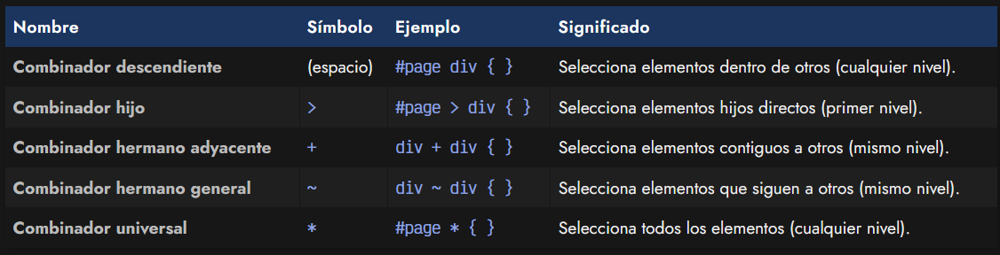
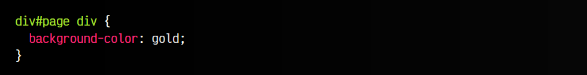
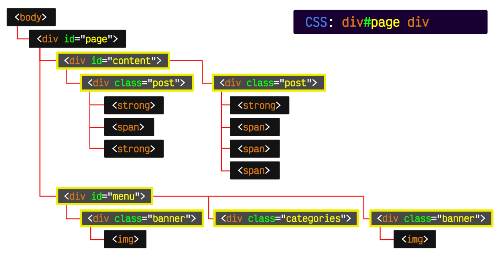
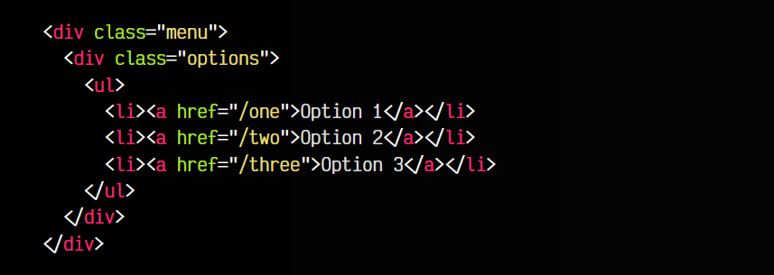
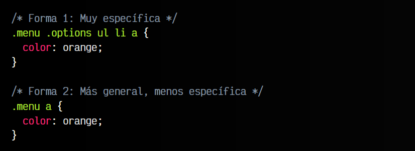
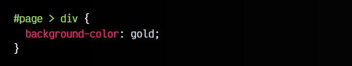
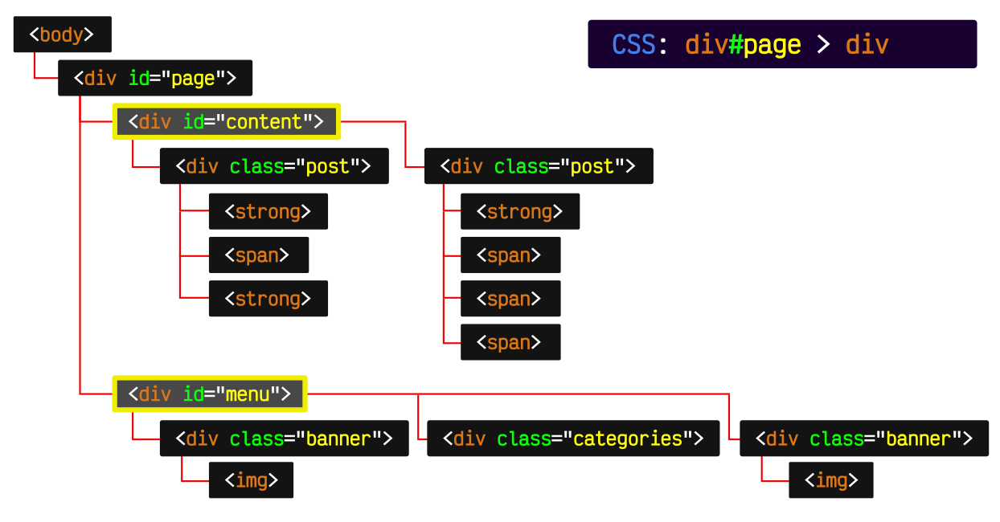
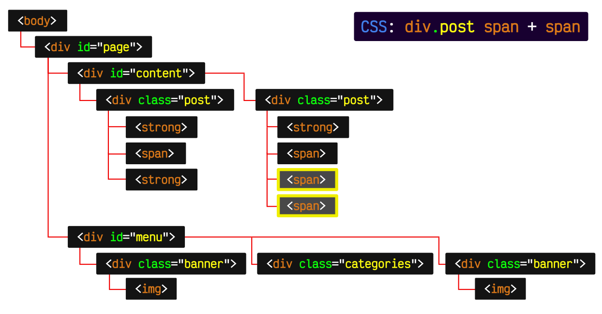
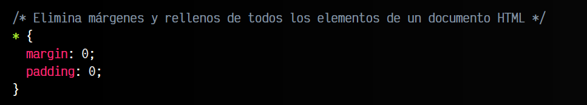

# 
Combinadores

Al margen de los selectores básicos de CSS, elementos, clases, id e incluso atributos, existe una amplia gama de formas de crear selectores más complejos que permitan seleccionar elementos HTML de una forma más potente y flexible.

## ¿Qué es un Combinador CSS?
Un combinador CSS es un símbolo que permite combinar dos o más selectores CSS, formando uno más complejo y potente. Existen varios combinadores en CSS, que mostraremos en la siguiente tabla:

En los siguientes apartados, veremos varios ejemplos gráficos sobre un supuesto ejemplo de documento HTML, dibujado en forma de árbol esquemático. Así sabremos que elementos están dentro de otros y nos será más fácil entender cada uno de los combinadores CSS.

## Combinador descendiente
En CSS podemos utilizar lo que se llama el selector descendiente, que no es más que una forma de seleccionar ciertos elementos que están dentro de otros elementos. Esto puede parecer sencillo, pero cuidado, ya que puede ser una fuente de problemas si no se comprende bien.

Su sintaxis se basa en colocar los elementos uno a continuación de otro, separado por un espacio. Ese espacio hace de combinador con los demás selectores:

En el ejemplo anterior, aplicamos los estilos CSS (color azul de fondo) a todos los elementos "div" que estén dentro del elemento div id="page". De esta forma, si existe un elemento div fuera del elemento con id="page", no se aplicarán los estilos indicados.

Observa la siguiente estructura HTML y observa las líneas rojas que marcan que elementos están dentro de otros, para así ser conscientes de en que nivel se encuentran:

Repasemos varios detalles importantes respecto a este combinador CSS:

   - Se están seleccionando todos los elementos 
 que están dentro del elemento con id="page".
   - Observa que se seleccionan independientemente del nivel al que estén (hijos, nietos, ...)
   - En este caso, el div de div#page es innecesario, ya que habíamos dicho que los id no se pueden repetir. Si ya existe un elemento con id page, no hace falta diferenciarlo también por etiqueta. Si se tratase de una clase, si podría usarse.

Se pueden construir selectores muy complejos con tantos elementos como se quiera, pero una buena práctica es intentar mantenerlos siempre lo más simples posibles. Cuántos más elementos descendientes existan en un selector, más complejo será el procesamiento de dicha regla por los navegadores y más específico será el navegador, lo que puede introducir algunas complicaciones.

Lo recomendable es utilizar buenos nombres, que sean simples, y que sean lo bastante claros para entenderlos rápidamente:

Observando el fragmento de código HTML anterior, veamos dos formas de aplicar estilos CSS a los enlaces "a" del fragmento de código:

Mientras que la primera es mucho más específica, es una muy buena práctica en CSS mantener los selectores lo menos específicos posibles para evitar problemas de [Especificidad](https://lenguajecss.com/css/cascada-css/que-es-cascada/) (a.k.a. CSS Peter Griffin):

## Combinador hijo >
Aunque el selector descendiente es bastante interesante, nos puede interesar hacer la misma operación, pero en lugar de seleccionar todos los elementos descendientes, seleccionar sólo los descendientes directos del elemento con el símbolo >, descartando así nietos y sucesivos.

Veamos los elementos seleccionados en el documento de ejemplo para afianzar conceptos:

Al contrario que en el caso anterior, no se seleccionan todos los elementos "div" descendientes, sino solo aquellos que son hijos directos del primer elemento especificado.

## Combinador hermano contiguo + >
Es posible también hacer referencia a los elementos hermanos, es decir, aquellos elementos que están directamente a continuación del elemento especificado. Mediante el símbolo + del selector hermano adyacente, se pueden seleccionar aquellos elementos hermanos que están seguidos el uno de otro (en el mismo nivel):

Cómo se podrá ver en este nuevo ejemplo, este combinador CSS hará que se seleccionen los elementos span que estén a continuación de un span dentro de un div con clase .post:

Selector hermano adyacente

Obsérvese que el primer elemento "span" no es seleccionado, puesto que es el que estamos tomando de referencia de base. Una buena forma para entenderlo es leerlo de la siguiente forma: «todo elemento "span" que esté inmediatamente precedido de un "span".

## Combinador hermano general ~ >
Si pensamos otras opciones en el ejemplo anterior, es posible que necesitemos ser menos específicos y en lugar de querer seleccionar los elementos hermanos que sean adyacentes, queramos seleccionar todos los hermanos en general, sin necesidad de que sean adyacentes. Esto se puede conseguir con el selector hermano general, simbolizado con el carácter ~:

Como se ve en el ejemplo, no es necesario que el elemento strong se encuentre adyacente al primero, sino que basta con que esté a continuación y sean hermanos en el mismo nivel.

## Combinador universal * >
Por último, el selector universal se simboliza con un asterisco * y es la forma de aplicar ciertos estilos en TODOS Y CADA UNO de los elementos HTML correspondientes.

Este ejemplo selecciona todos los elementos dentro de div#menu. Es importante recalcar la diferencia de seleccionar #menu, a seleccionar todos los elementos dentro de #menu, que es lo que estamos haciendo en este caso.

El selector universal puede ser muy útil en algunos casos para resetear ciertas propiedades de todo un documento, como en el siguiente ejemplo, donde se eliminan los márgenes de todos los elementos del documento HTML, puesto que algunos navegadores ponen márgenes diferentes y esto puede producir ciertas inconsistencias en los diseños:

