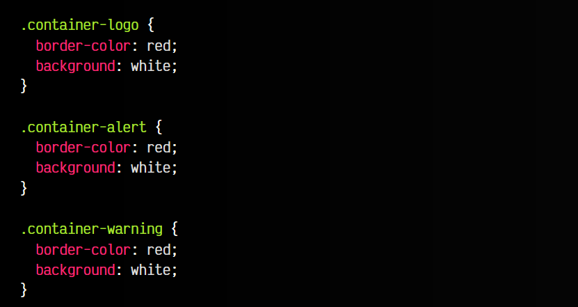
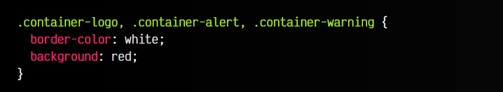
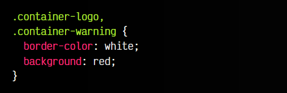
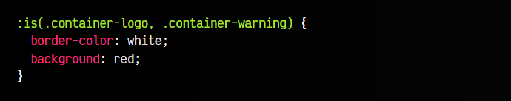
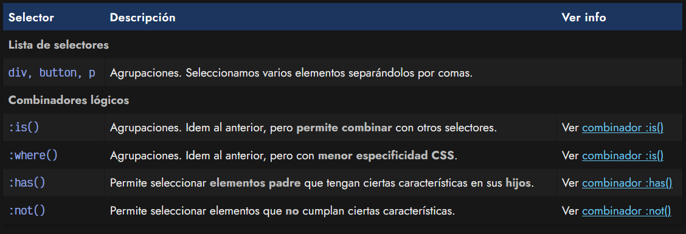

# 
Combinadores lógicos

En ciertas situaciones, es posible que queramos crear grupos con diferentes selectores con el objetivo de escribir menos código, o reutilizar bloques de código CSS en más situaciones, de forma que sean más potentes y flexibles.

La forma más sencilla de conseguir esto, es crear agrupaciones con diferentes selectores separando por comas.

## Agrupación de selectores
Imagina una situación en la que varios bloques de código CSS contienen las mismas propiedades con los mismos valores. Generalmente, escribir cada bloque de forma individual no es apropiado, ya que duplica un código que es exactamente igual:

Si esto ocurre a menudo, el tamaño del documento CSS será más grande y tardará más en descargarse. Una buena práctica para evitarlo es ahorrar texto y simplificar nuestro documento CSS lo máximo posible, por lo que podemos hacer uso de la agrupación CSS utilizando el símbolo de la coma.

De esta forma, podemos pasar de tener el ejemplo anterior, a tener el siguiente ejemplo (que es totalmente equivalente), donde hemos utilizado la agrupación para decirle al navegador que aplique dichos estilos a las diferentes clases:

Al margen de esto, dos buenas prácticas que podríamos aplicar en esta situación serían las siguientes:

   - Simplifica por responsabilidades: .container-alert y .container-warning parecen tener un concepto muy similar: alertas o mensajes de advertencia. Es posible que estos selectores tengan la misma funcionalidad y sean sinónimos. Si es así, lo ideal sería refactorizar y simplificarlos a uno: .container-warning, haciendo desaparecer el otro.

   - Legibilidad por delante: El código CSS por si sólo puede ser difícil de leer y mantener. Aunque a priori puede parecer que es mejor escribir la lista de selectores uno detrás de otro, la experiencia nos dicta que deberíamos separarlos en una línea diferente cada selector. Esto lo hace mucho más legible a la hora de leer.

Estos consejos pueden parecer poco importantes, pero a medida que avanzamos con nuestro diseño y escribimos más código CSS, este se hace muy grande y difícil de mantener, por lo que cuanto más sencillo lo mantengamos, mejor.

## ¿Qué es un combinador lógico?
Sin embargo, las comas sólo son la forma más sencilla y simple de reutilizar selectores. En CSS, tenemos a nuestra disposición una serie de mecanismos para agrupar o combinar selectores de una forma más potente y flexible, dentro de una categoría denominada combinadores lógicos.

Estos combinadores lógicos nos permiten seleccionar elementos con ciertas restricciones y funcionan como una [pseudoclase](https://lenguajecss.com/css/pseudoclases/que-son/), sólo que se le pueden pasar parámetros, ya que son de tipo pseudoclase funcional.

Observa el siguiente fragmento de código CSS donde utilizamos el combinador lógico :is():

Este fragmento es sólo un ejemplo simplificado para comprender fácilmente la sintaxis de un combinador lógico. Lo más probable es que aún no le veas la ventaja sobre agrupación de selectores. Dichas ventajas las veremos cuando lo combinamos con otros selectores, como veremos en el siguiente artículo.

## Tipos de combinadores lógicos
A continuación, una tabla donde podemos ver que mecanismos de combinadores lógicos tenemos a nuestra disposición:

En los siguientes temas vamos a explicarlos detalladamente.