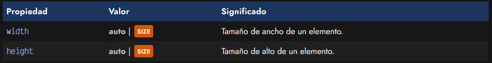
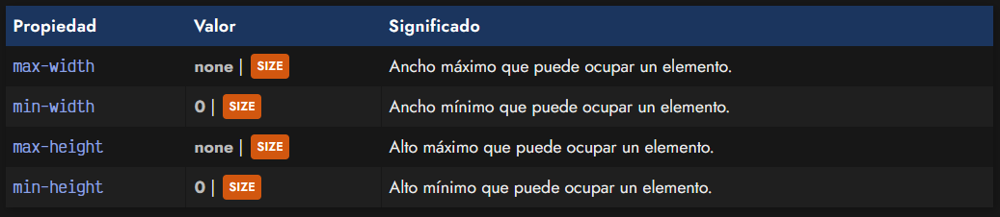
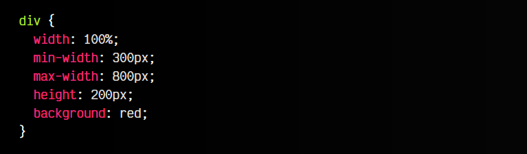
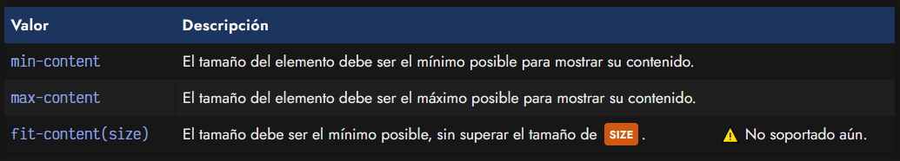
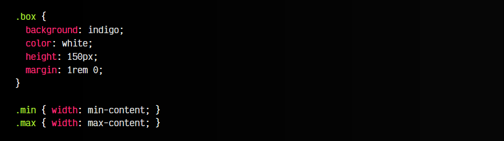
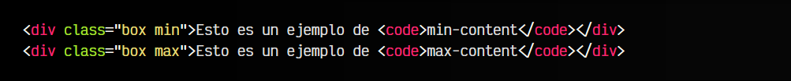
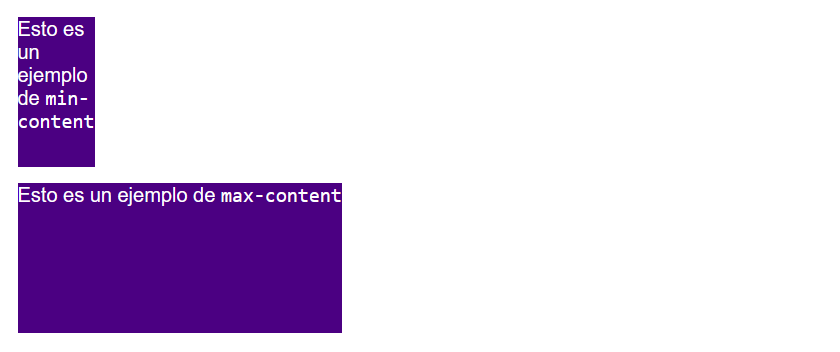
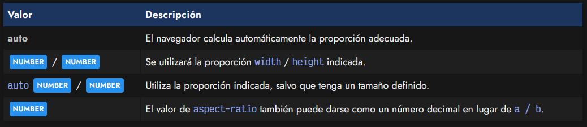

# 
Dimensiones en CSS

Al trabajar con CSS, una de las primeras cosas que debemos aprender es la de dar tamaño o establecer dimensiones a un elemento HTML. Es algo relativamente sencillo, pero que se puede complicar mucho y que tiene muchos matices y aspectos a tener en cuenta.

## Las propiedades width y height.
Para dar tamaños específicos a los diferentes elementos de un documento HTML, necesitaremos asignarles valores a las propiedades width (ancho) y height (alto):

En el caso de indicar el valor auto, el navegador se encargará de darle el tamaño que considere más apropiado, dependiendo de su contenido. Ten en cuenta que este valor es el que tienen por defecto estas propiedades. De no indicar un valor concreto, width y height tendrán el valor auto.

Es importante recalcar que el tamaño automático dado a un elemento depende del tipo de elemento (bloque, en línea...). Este tema lo veremos en un capítulo posterior.

Hay que ser muy conscientes de que, sin indicar valores de ancho y alto para una caja, el elemento generalmente toma el tamaño que debe respecto a su contenido, mientras que si indicamos un ancho y alto concretos, estamos obligando mediante CSS a tener un aspecto concreto y podemos obtener resultados similares al siguiente (conocida broma de CSS) si su contenido es más grande que el tamaño que hemos obligado a tener:

 - En el próximo artículo hablaremos de [Desbordamiento CSS](https://lenguajecss.com/css/modelo-de-cajas/overflow/), donde veremos que ocurre cuando el contenido sobrepasa el tamaño del contenedor y la correspondiente propiedad overflow.

## Rangos de dimensiones.
Otra forma de lidiar con esto, es utilizar las propiedades hermanas de width: por un lado, min-width y max-width y por otro, sus equivalentes de height: min-height y max-height.

Con estas propiedades, en lugar de establecer un tamaño fijo, establecemos unos rangos máximos y mínimos, donde el ancho o alto podría variar entre esos valores:

CSS:

HTML:

👓VISTA:

En este caso, puedes probar a redimensionar la ventana de demostración (esquina inferior-derecha). Hemos definido un tamaño máximo de ancho de 800px, y un mínimo de 300px. A la misma vez, le aplicamos un width de 100% para que intente ocupar el máximo posible, siempre respetando los límites anteriores: nunca superará los 800px y nunca será más pequeño de los 300px.

Como resultado, el cuadrado será flexible y se irá haciendo más pequeño hasta llegar a su límite inferior, donde aparecerá la barra de desplazamiento inferior.

 - Ojo: Las propiedades de mínimos min-width y min-height por defecto tienen valor 0, mientras que las propiedades de máximos max-width y max-height, tienen por defecto valor none.

## Valores intrínsecos.
Hay algunos valores especiales denominados valores de tamaño intrínseco. Estos valores son palabras clave que establecen tamaños concretos, dependiendo del tamaño interior del elemento.

Esto se entiende muy fácilmente con el siguiente ejemplo:

CSS:

HTML:

👓VISTA:

De momento, la función fit-content() no está soportada en navegadores.

## La propiedad aspect-ratio.
La propiedad aspect-ratio permite cambiar la proporción de aspecto entre los valores width y height de una imagen u objeto desde CSS. De esta forma, podemos asegurarnos de que las imágenes no se deformarán o tendrán una relación de aspecto no adecuada en nuestras páginas, sin necesidad de darle un tamaño concreto de ancho y alto al elemento.

Los valores de la propiedad aspect-ratio son:

