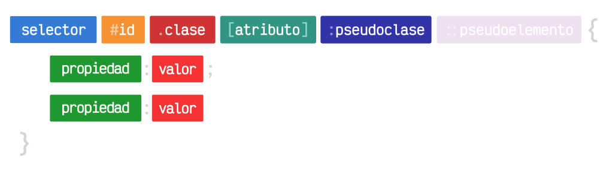
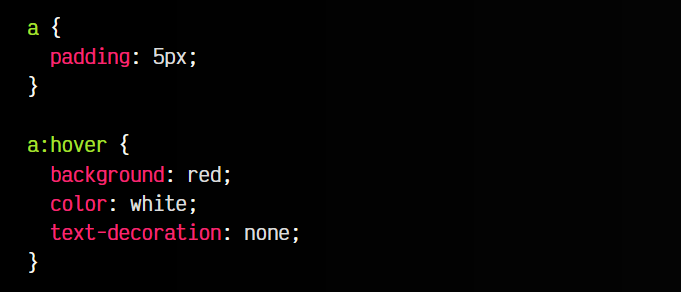
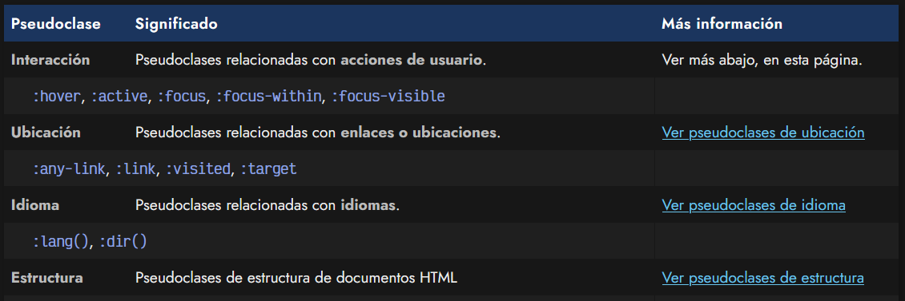
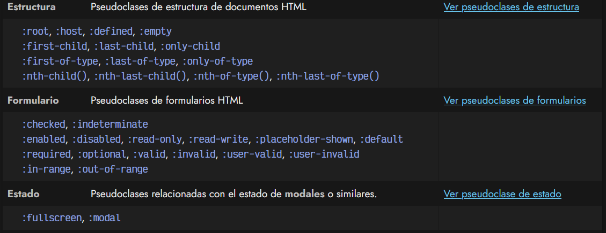
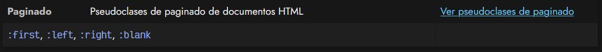

# 
¿Qué son las pseudoclases?

Hasta ahora hemos visto como trabajar con selectores básicos y combinadores, sin embargo, CSS ofrece más formas de seleccionar elementos HTML, y una de ellas son las llamadas pseudoclases.

Las pseudoclases se utilizan para hacer referencia a elementos HTML que tengan un cierto comportamiento concreto. Volvamos a recordar el esquema general de sintaxis de CSS, donde ahora añadiremos las pseudoclases, que se definen añadiendo dos puntos antes del nombre de la pseudoclase concreta, de la siguiente forma:

De esta forma, podremos seleccionar elementos que en principio parecen iguales, pero tienen diferentes características de comportamiento. Para entenderlo bien, vamos a ver las categorías o tipos de pseudoclases y ver cuales se encuentran entre ellas.

## Ejemplo de una pseudoclase
La forma de utilizar pseudoclases en nuestro código CSS es, simplemente, añadir : tras la etiqueta o selector y luego añadir el nombre de la pseudoclase. Por ejemplo, una de las pseudoclases más populares, que veremos en el próximo artículo, es :hover.

Cuando utilizamos la pseudoclase :hover, estamos indicando al navegador que de estilo al elemento cuando el usuario coloque su ratón (o dispositivo apuntador) encima de ese elemento.

Veamos un ejemplo, con una etiqueta "a" de enlace:

css:

html:

vista:

En este caso hacemos lo siguiente:

   - El enlace siempre tendrá un padding de 5 píxeles.
   - El enlace tendrá color rojo de fondo, color blanco de texto y no tendrá subrayado cuando el usuario mueva el ratón por encima.

Existen multitud de pseudoclases CSS, y profundizaremos más sobre ellas en los siguientes artículos.

## Tipos de pseudoclases CSS
Existen múltiples pseudoclases, así que para entenderlas mejor, las categorizamos en las siguientes secciones. Aquellas que sean muy extensas o abundantes, las enlazaremos en un artículo posterior más detallado:

En los siguientes temas aprenderemos a utilizar las pseudoclases de cada categoría.
