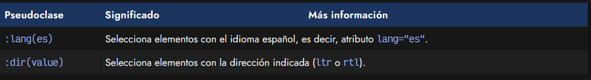
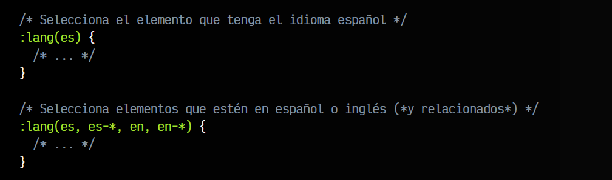
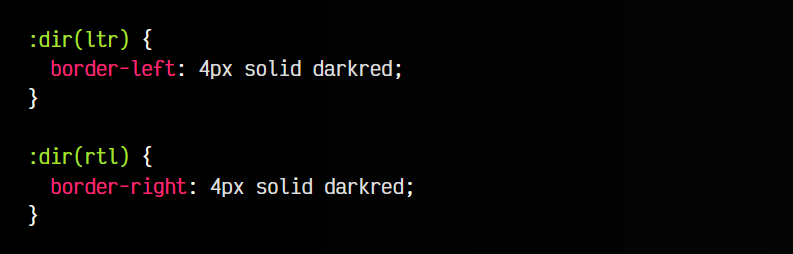

# 
Pseudoclases de idioma

En CSS podemos encontrarnos con varias pseudoclases relacionadas con el idioma utilizado en la página o en los elementos HTML en cuestión.

Veamos una pequeña tabla de resumen con ellos:

## La pseudoclase :lang()
El atributo HTML lang permite indicar en una etiqueta HTML el idioma en el que está el contenido de sus elementos hijos. De esta forma, un atributo lang="es" indica que el contenido de esa etiqueta se encuentra generalmente en español.

La pseudoclase :lang() acepta por parámetro un idioma (o una lista de ellos separados por comas) para seleccionar el elemento HTML que coincida con uno de ellos:

Además, como se puede ver en el ejemplo anterior, también se pueden utilizar asteriscos a modo de comodín, lo que lo diferencia considerablemente de seleccionar mediante un selector de atributos [lang="es"], ya que es más potente.

## La pseudoclase :dir()
La pseudoclase :dir() permite seleccionar elementos dependiendo de la dirección que tienen establecida. Generalmente, la direccionalidad del texto se establece con el atributo dir, indicándole el valor ltr (left to right) o el valor rtl (right to left), sin embargo, con valores como auto o sin valores indicados, también tendrán una direccionalidad dependiendo del lenguaje establecido en el documento o fragmento.

Ten en cuenta que la diferencia entre :dir(ltr) y [dir="ltr"] es que en el primer caso se selecciona al elemento tanto si tiene el valor ltr como si no lo tiene, pero lo hereda por contexto. Sin embargo, con [dir="ltr"] sólo se selecciona si está indicado explícitamente.