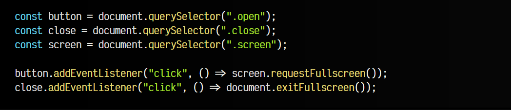

# 
Pseudoclases de estado

Existen una serie de pseudoclases para comprobar el estado visual de un elemento que se considera modal, es decir, que «centran» la interacción del usuario en un elemento principal (y sus hijos) y no permiten la interacción con otros elementos hasta que se cierre ese elemento principal.

Estas pseudoclases son las siguientes:

Expliquemos un poco cada una de ellas.

## La pseudoclase :fullscreen
Mediante la pseudoclase :fullscreen podemos seleccionar elementos que se encuentren en modo pantalla completa, lo que habitualmente se realiza mediante la API FullScreen de Javascript.

html:

css:

js:

vista:

## La pseudoclase :modal
Mediante la pseudoclase :modal se puede seleccionar un elemento que está actuando como una ventana o elemento modal, o lo que es lo mismo, un elemento que centra la atención del usuario y no permite interacción con otros elementos que no son sus hijos.

En el ejemplo anterior, modificando :fullscreen por :modal continuaría siendo válido y funcionando porque un elemento a pantalla completa con .requestFullscreen() también es un elemento modal, ya que no permite interacción con otros elementos fuera de él hasta que se cierre el modo pantalla completa.

html:

css:

js:

vista:

También ten en cuenta que existe la posibilidad de que múltiples elementos sean modales, aunque sólo uno de ellos sea el que se encuentre activo y capaz de recibir interacciones.

En este ejemplo, hemos utilizado una etiqueta <dialog> para crear ventanas de diálogo, en este caso, una ventana modal. Puedes aprender más en este artículo sobre ventanas de [diálogo con HTML](https://lenguajehtml.com/html/interactivas/etiqueta-html-dialog/).

