# 
Pseudoelementos: ¿Qué son?

Hasta ahora, hemos visto selectores básicos, atributos, combinadores y pseudoclases. Sin embargo, existe una última categoría, un poco más extraña y fuera de lo común, pero que en muchos casos nos puede resultar bastante interesante para dar estilo en ciertas situaciones.

Los pseudoelementos son una característica de CSS que permite hacer referencias a «comportamientos virtuales no tangibles».

¿Qué significa esto? Dicho de otra forma: Los pseudoelementos permiten seleccionar y dar estilo a elementos que no existen en el HTML, o que no son un simple elemento en sí. La sintaxis de los pseudoelementos está precedida de dos puntos dobles (::) para diferenciarlos de las pseudoclases, las cuales sólo tienen dos puntos (:).

La sintaxis con :: no surgió desde los inicios de CSS, por lo que aún hoy en día es posible encontrar fragmentos de código desactualizados que utilizan pseudoelementos como ::before o ::after con la sintaxis de pseudoclase: :before y :after.

## Tipos de pseudoelementos
Existen varios tipos de pseudoelementos, que se encuentran organizados en categorías. Puedes encontrarlos en la siguiente tabla:

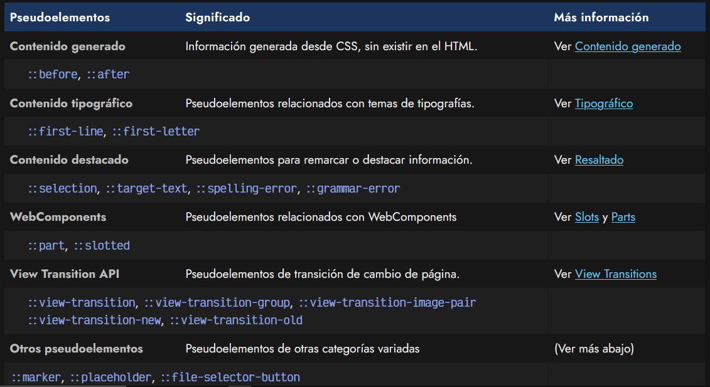

## Otros pseudoelementos
Al margen de los pseudoelementos anteriores, explicados en su respectiva sección, nos quedan algunos pseudoelementos sin catalogar.

Vamos a repasarlos:

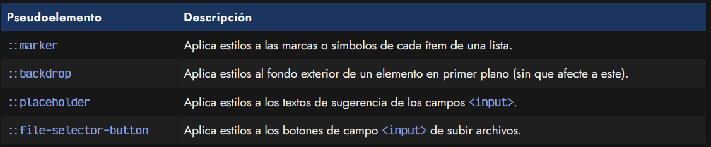

Veamos cada uno de ellos.

## Pseudoelemento ::marker
El pseudoelemento ::marker sirve para hacer referencias a los signos o marcas de la listas (ol o ul), en el caso de que queramos que tengan un estilo diferente al del texto de la lista.

En este ejemplo se aplica el estilo a los elementos <li> de los ítems de una lista "ul":

css:
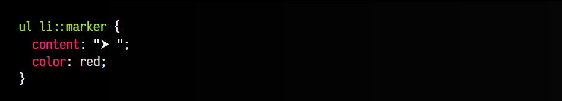

html:
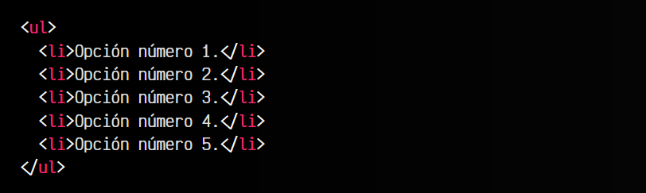

vista:
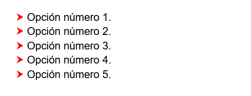

Ten en cuenta que ciertas propiedades CSS puede que no tengan efecto en este pseudoelemento. Sin embargo, propiedades como font-size, color o content funcionarán correctamente.

## Pseudoelemento ::backdrop
El pseudoelemento ::backdrop nos permite aplicar estilos como oscurecer o desenfocar el fondo detrás de un elemento para darle más protagonismo al elemento que está en primer plano. Este pseudoelemento debe utilizarse en un diálogo o mensaje modal <dialog>, que comunica información importante y hay que prestarle atención y poner el foco en él.

Veamos un pequeño ejemplo:

css:
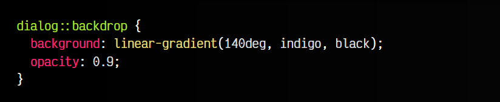

html:
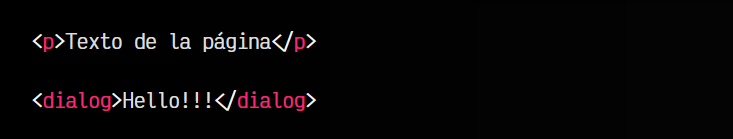

js:
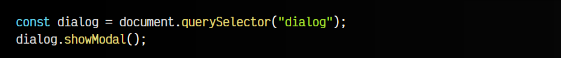

vista:

En este caso, el pseudoelemento ::backdrop aplicará los estilos al contenido de fondo del diálogo, sin que afecte al mismo. También se podría utilizar con una imagen de fondo, junto a la propiedad CSS backdrop-filter con el valor blur(3px) (o similar). En ese caso, se desenfocaría la imagen y se le restará importancia al fondo y el usuario se centrará en el mensaje o la información de primer plano.

## Pseudoelemento ::placeholder
Mediante el pseudoelemento ::placeholder podemos dar estilos particulares a los elementos <input> que tienen el atributo placeholder definido. El atributo placeholder sirve para indicar una sugerencia o mensaje de ayuda o de información con la finalidad de ese campo de texto, normalmente una ayuda de lo que deben escribir o similar.

css:
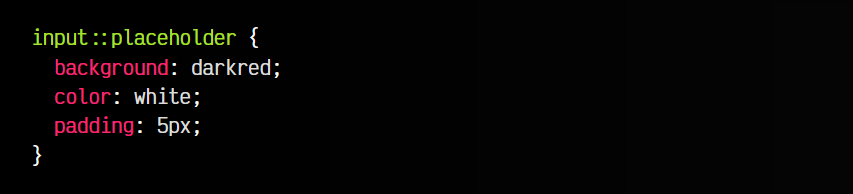

html:
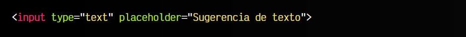

vista:
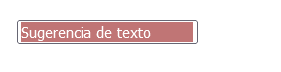
Con ::placeholder podremos cambiar este color, por ejemplo, que suele ser un gris apagado por defecto. Ten en cuenta que afectará sólo al mensaje de placeholder, no a las dimensiones del propio elemento "input".

## Pseudoelemento ::file-selector-button
El pseudoelemento ::file-selector-button hace referencia al <button> que se incluye dentro de un elemento <input type="file">, o lo que es lo mismo, un botón para enviar ficheros a través de un formulario. De esta forma, podemos personalizar la apariciencia del botón del formulario.

css:
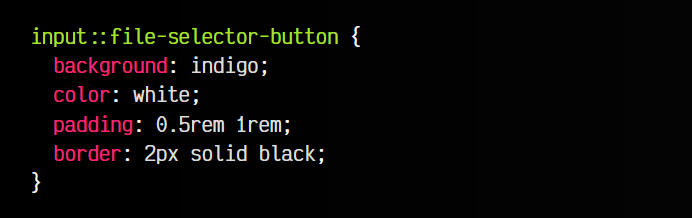

html:
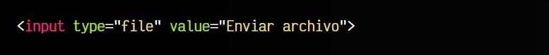

vista:
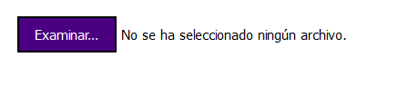
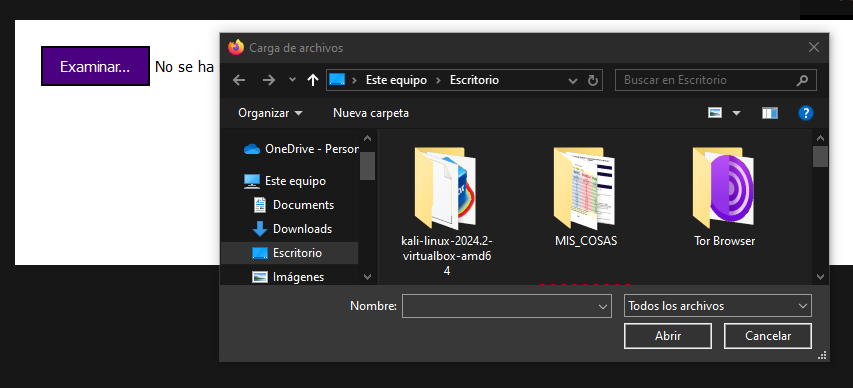

