# 
Contenido generado en CSS

Dentro de la categoría de los pseudoelementos CSS, y quizás uno de los más conocidos, se encuentra la propiedad content. Esta propiedad se utiliza en selectores que incluyen los pseudoelementos ::before o ::after (que explicaremos un poco más adelante), y su objetivo es indicar que vamos a crear contenido antes o después del elemento indicado en cuestión.

Veamos un pequeño resumen de los elementos que participan en esta categoría:

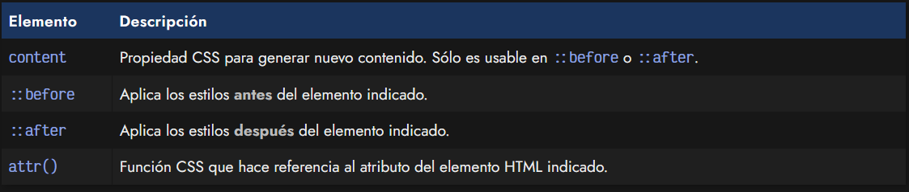

Vamos a explicar como funciona cada uno de ellos.

## La propiedad content
La propiedad content admite parámetros de diverso tipo, incluso concatenando información mediante espacios. Podemos utilizar varios tipos de contenido:

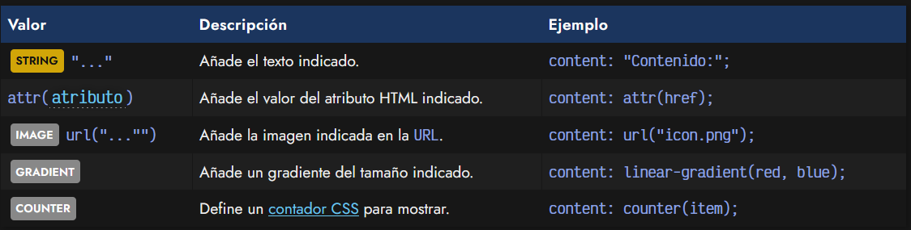

Ten en cuenta que la propiedad content sólo funciona dentro de pseudoelementos, como por ejemplo ::before y ::after, los cuales explicaremos a continuación. No puede utilizarse en otros selectores.

## El pseudoelemento ::before
Los pseudoelementos ::before y ::after permiten hacer referencia a «justo antes del elemento» y «justo después del elemento», respectivamente. Además de selectores básicos como clase o id, combinadores, atributos o pseudoclases, puedes añadir un pseudoelemento, precedido por ::.

En el caso del pseudoelemento ::before, el navegador se encargará de añadir contenido antes del inicio de la etiqueta de apertura del elemento que has seleccionado con el resto del selector:

css:
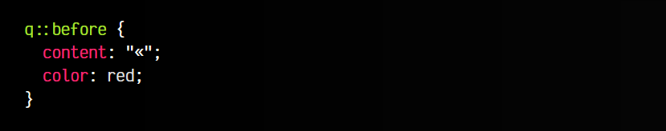

html:
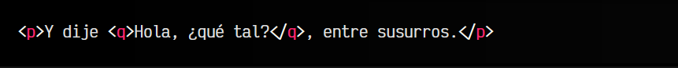

vista:
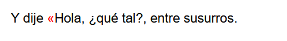

En este caso, estamos añadiendo el texto « justo antes de los elementos <q> que aparezcan en nuestro documento, además de pintarlos de color gris. De esta forma, podemos generar información (usualmente con fines decorativos) que no existe en el HTML, pero que por circunstancias de diseño sería más apropiado colocar en el código CSS.

## Pseudoelemento ::after
De la misma forma, tenemos el pseudoelemento ::after, que permitirá añadir contenido después de la etiqueta de cierre en cuestión. Vamos a completar el código anterior, utilizando también un ::after y añadiendole más estilos a la propia etiqueta:

css:
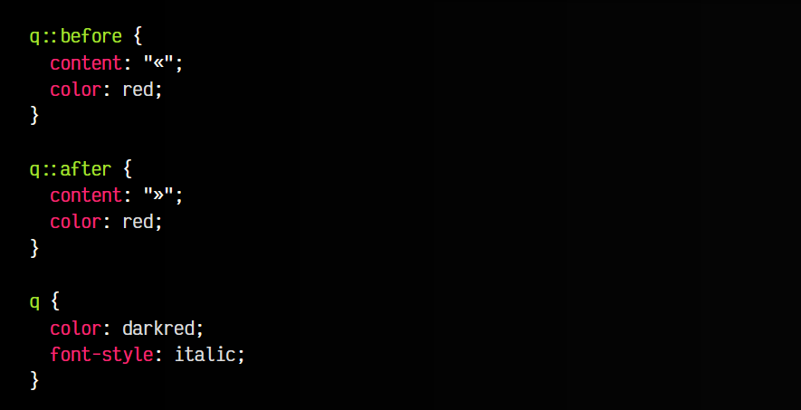

html:

vista:
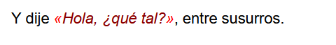

Ahora, como se puede ver en la demo, el ejemplo es mucho más sencillo de entender visualmente, a la vez que posee cierta semántica que lo hace más fácil de entender, no sólo para humanos, sino también para una máquina, sistemas automatizados o desarrolladores que quieran interactuar con la información y comprenderla.

## La función attr()
Es interesante recalcar la utilidad de la función CSS attr(A). Esta función se puede utilizar en la propiedad content para recuperar el valor del atributo HTML especificado en A.

Vamos a ampliar el ejemplo anterior, añadiéndole al elemento q un atributo con el autor de ese mensaje:

css:
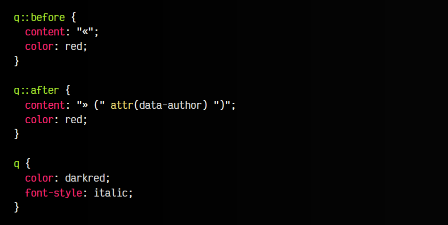

html:
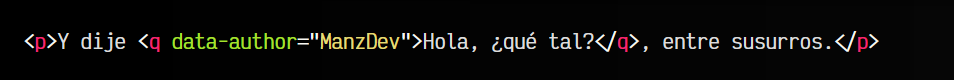

vista:
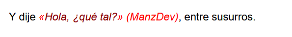

En este ejemplo, añadimos el contenido del atributo data-author de las etiquetas "q" para mostrarlo en la página entre paréntesis. Observa que la concatenación (unión) de los carácteres en CSS se hace simplemente con espacios, abriendo y cerrando las comillas para indicar los textos. Esto puede realizarse con cualquier etiqueta y atributo que desees.

El uso de la función attr() podría ser muy útil en ciertos casos, como por ejemplo, en una página que muestra enlaces y el usuario va a imprimir. Podríamos utilizar medios de impresión que apliquen un CSS especial, donde el contenido de los atributos href en las etiquetas "a" sean mostrados, ya que en una impresión no podemos hacer doble clic en los textos subrayados (con enlace):

css:
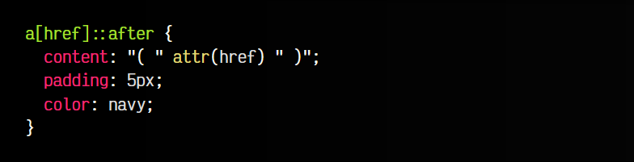

html:
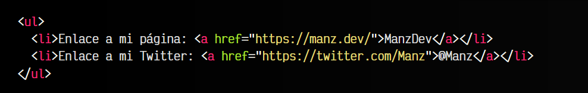

vista:
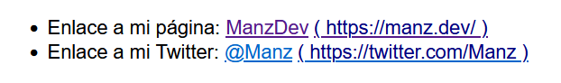

Truco: También se puede utilizar la función url() para añadir una imagen al contenido generado, tal y como lo hacemos en la propiedad background, por ejemplo.

