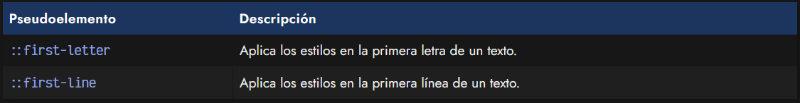
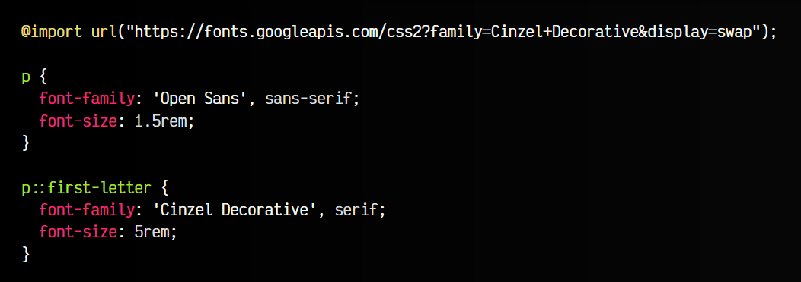
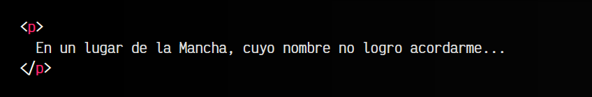
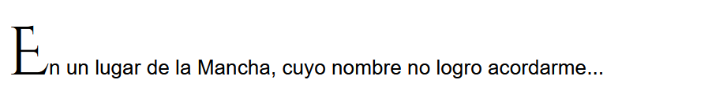
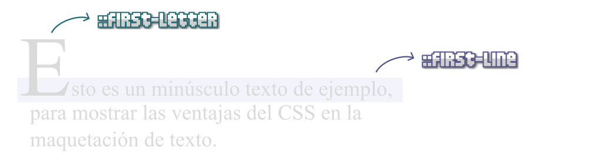
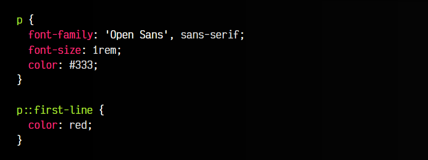
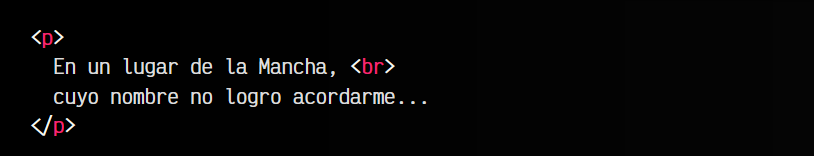
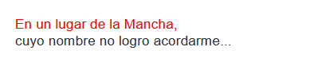

# 
Pseudoelementos tipográficos

Aunque ::before y ::after suelen ser los ejemplos de pseudoelementos más frecuentes, existen muchos otros pseudoelementos. Por ejemplo, dentro de una categoría de pseudoelementos tipográficos, podemos encontrar los pseudoelementos ::first-letter o ::first-line:

## El pseudoelemento ::first-letter
El pseudoelemento ::first-letter, como su propio nombre indica, permite seleccionar y dar estilo a la primera letra del texto indicado. Así podremos recrear el efecto clásico de cuentos infantiles o algunas otras obras, donde la primera letra se establece mucho más grande que el resto del texto y con una tipografía decorativa mucho más llamativa.

css:

html:

vista:

En el caso del pseudoelemento ::first-letter, le damos estilo a la primera letra del texto, a la cuál le colocamos una tipografía (que cargamos de Google Fonts) y le establecemos un tamaño de texto mayor.

Existe otro pseudoelemento denominado ::first-line, que explicamos a continuación.

## El pseudoelemento ::first-line
Por otro lado, el pseudoelemento ::first-line es muy útil para aplicar un estilo solamente a la primera línea del texto indicado. Puede ser interesante si queremos cambiar algún detalle, pero que afecte exclusivamente a la primera línea, independientemente del tamaño que tenga (lo calcula el navegador).

css:

html:

vista:

Obviamente, se puede aplicar a otros elementos o clases en el selector de CSS, en este caso lo hemos hecho a un elemento de párrafo "p", ya que se trata de un párrafo de texto.