# 
CSS Nesting nativo

CSS es un lenguaje maravilloso, expresivo y muy fácil de entender y aprender. Sin embargo, a la misma vez, es un lenguaje díficil de dominar y muy complejo de organizar. Si llevas algo de tiempo escribiendo código CSS, te habrás dado cuenta que es muy fácil que el código de CSS crezca mucho y muy rápidamente.

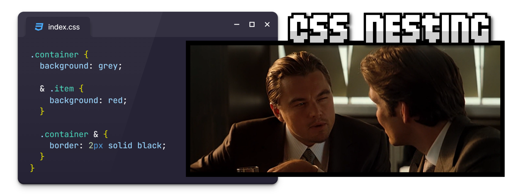

Si no eres organizado y cuidadoso, el código CSS que estás escribiendo puede descontrolarse muy fácilmente. De hecho, aunque seas organizado y tengas destreza con CSS, si necesitas dar estilo a una página o sitio muy grande, es muy sencillo que el código se vuelva muy difícil de mantener.

## ¿Qué es CSS Nesting?
Tradicionalmente, el código CSS se ha trabajado siempre mediante selectores CSS. Sin embargo, la idea detrás del concepto de CSS Nesting (código CSS anidado) es tener fragmentos o bloques de código uno dentro de otros, haciendo que estos selectores sean mucho más intuitivos para el programador, y por lo tanto, mucho más fáciles de mantener.

Veamos un ejemplo muy sencillo. Con CSS tradicional, utilizando selectores CSS nuestro código se vería así:

css:
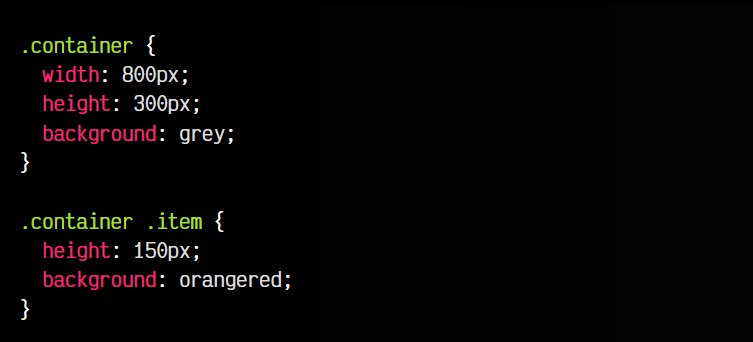

html:
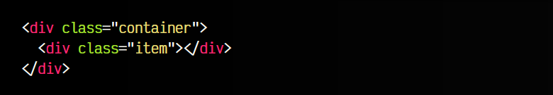

vista:

En este código hay que comprender bien como funcionan los selectores de CSS. Cuando son fragmentos de código cortos o breves, no suele haber mucho problema, sin embargo, cuando el código crece (o no está bien organizado), la cosa se puede complicar. Además, si existen «colisiones» de nombres de selectores, la cosa empeora.

Utilizando CSS Nesting, sin embargo, conseguimos que sólo mirando el código se haga evidente cuando un elemento está dentro de otro, aislando código, haciendo mucho más fácil de mantener y modularizar nuestros estilos:

css:
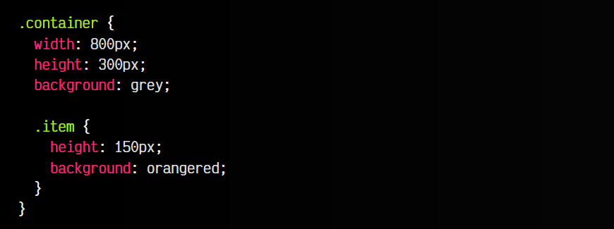

html:
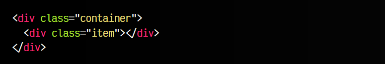

vista:

Observa que en este caso, el elemento .item está en el interior de la clase .container, por lo que queda implicitamente más claro, y mucho más organizado y fácil de gestionar a medida que el código crece.

## Sintaxis de anidamiento
A lo largo del tiempo, el CSS Nesting se ha implementado con diferentes sintaxis (Sass, LESS, stylus, PostCSS, etc...), pero todas ellas se podían utilizar sólo mediante herramientas que convertían el código anidado en código estándar de CSS sin anidado, ya que no estaba soportado en navegadores.

Linea de tiempo del soporte Nesting CSS

Sin embargo, finalmente, se ha implementado de forma nativa en la mayoría de navegadores en dos formatos: una, mediante el uso del símbolo & para indicar el elemento padre y otra, simplificada, omitiendo el uso de dicho símbolo. Veamos cada una de ellas.

## Sintaxis simple (relaxed)
La sintaxis más sencilla que podemos utilizar es la que mostramos en el ejemplo anterior. Simplemente, dentro de un elemento, podemos volver a mencionar otro. Sin embargo, aunque es más sencilla y sirve para casos simples, esta sintaxis puede tener ciertas limitaciones.

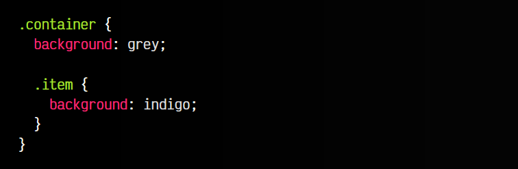

El anidamiento de .item corresponde al selector .container .item. Sin embargo, hay varios casos donde este anidamiento no funcionaría y tendríamos que utilizar el selector &.

Safari, en el motor WebKit ha establecido que el [máximo de niveles de anidamiento](https://github.com/WebKit/WebKit/commit/c9ac90f8cbfa0ae54a296168fe0c517826ff6757) sea 128. Sin embargo, aunque no tenemos un valor estricto, deberíamos intentar mantenernos como máximo en 4-5 níveles de anidamiento apróximadamente, y sólo superarlos si está bien justificado.

## Sintaxis avanzada
Dentro del CSS Nesting tenemos el operador &, que nos permite hacer referencia al selector inmediatamente padre dentro del anidamiento. Esto puede resultarnos muy útil en algunos casos diferentes al anterior. Observa el siguiente ejemplo, donde en lugar de la clase .item seleccionamos cualquier elemento div que esté dentro de .container:

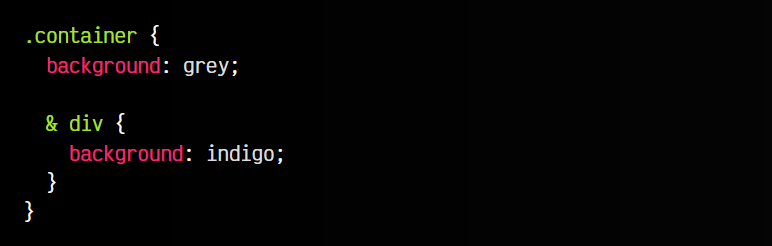

El ejemplo anterior, sin el selector & es imposible de realizar con CSS Nesting, puesto que la sintaxis simple no permite colocar elementos directos que no sean clases, id, combinadores, etc.

Otra situación problemática podría ser el caso en el que queramos darle estilo a la clase .container cuando tenemos el ratón encima de ella. Observa el siguiente fragmento de código donde conseguimos un selector equivalente a .container:hover:

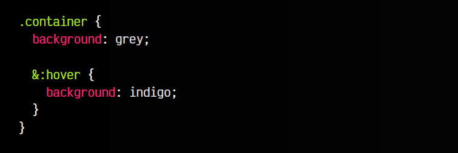

Si omitimos el selector & en este ejemplo anterior, el código CSS será válido, pero no equivalente. Omitiendo el selector & estaríamos obteniendo el selector equivalente .container :hover en lugar de .container:hover. Es decir, estaríamos aplicando estilos :hover a los elementos dentro de .container en lugar de al propio .container.

## Anidamiento sobre el padre
En los casos anteriores siempre hemos colocado el selector & al principio. Sin embargo, puede darse el caso que queramos anidar de una forma diferente. En el siguiente ejemplo, el selector equivalente sería .item .container, es decir, elementos .item que contengan al padre:

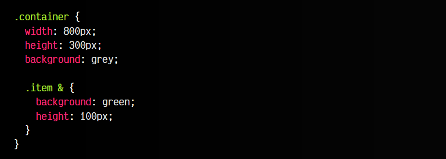

Aunque en principio pueda parecer poco lógico, puede tener sentido en casos donde queremos incluir un elemento anidado porque tiene cierta relación en este contexto de anidación y quedará mejor organizado.

Además, también nos permite hacer anidaciones menos directas pero que pueden ser muy interesantes por su relación con el elemento contenedor. Observa los siguientes ejemplos:

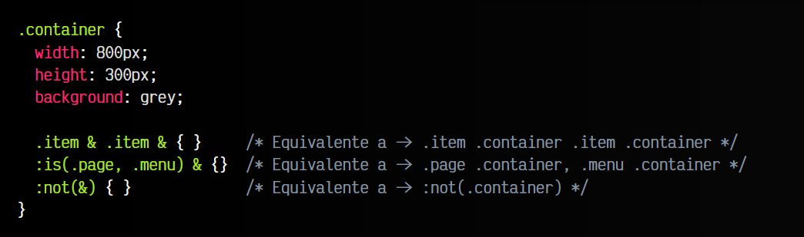

Esto nos permitirá organizar y mantener mejor nuestro código.

## Anidamiento de reglas
Es posible anidar [reglas CSS](https://lenguajecss.com/css/reglas-css/que-son-reglas-css/) en el interior de bloques de código CSS donde se aplica CSS Nesting. Concretamente, es posible hacerlo si se trata de reglas @media, @supports, @layer, @scope o @container. De esta forma, podemos organizar, por ejemplo, código responsive de un fragmento de código de forma muy compacta:

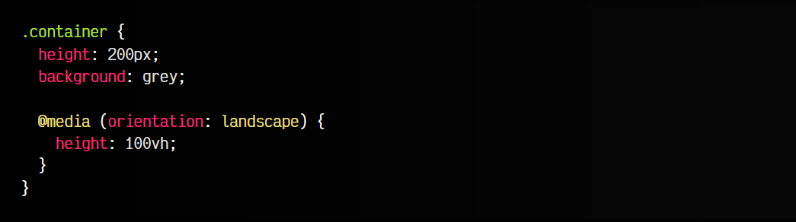

En este caso, el código del interior de la regla @media se le aplica al elemento .container, simplificando mucho la sintaxis y haciéndolo más fácil de organizar.

## Soporte y compatibilidad
La característica de CSS Nesting es un cambio grande en la forma de escribir código CSS y se lleva esperando durante mucho tiempo. Recuerda que es sólo un mecanismo más (muy aconsejable) para trabajar con CSS, pero no es estrictamente obligatorio utilizarlo.

En algunos casos, puedes querer utilizar CSS Nesting en tu código pero buscar que se «traduzca» a código sin CSS nesting. Para ello puedes considerar utilizar [CSS Nesting con PostCSS](https://lenguajecss.com/postcss/plugins/css-nesting/), Sass, Lightning CSS o herramientas similares.
