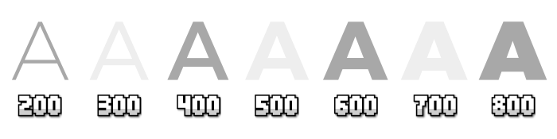

# 
¿Qué son las tipografías?

Las tipografías (también denominadas fuentes) son una parte muy importante del mundo de CSS. De hecho, son uno de los pilares del diseño web. La elección de una tipografía adecuada, su tamaño, color, espacio entre letras, interlineado y otras características pueden dotar de una parte fundamental, de forma consciente o inconsciente, en la percepción en la que una persona interpreta o accede a los contenidos de una página.

## Conceptos de tipografías
Existen multitud de características interesantes sobre tipografías que convendría conocer antes de continuar, ya que nos ayudarán a la hora de elegir una buena tipografía para nuestra web. Antes de aprender a cargar tipografías en nuestra página web, deberíamos tener claros los siguientes conceptos.

## Serifas o sin serifas (decoraciones)
Las fuentes o tipografías que utilizan serifa o gracia, son aquellas que incorporan unos pequeños adornos o remates en los extremos de los bordes de las letras. Muchas de estas tipografías suelen terminar su nombre en «Serif» (con serifa).

Por otro lado, las fuentes o tipografías de paloseco son las opuestas a la anterior: unas tipografías lisas, sin adornos o remates en los extremos de los bordes de las letras. Muchas de estas tipografías suelen terminar su nombre en «Sans Serif» (sin serifa).

Tradicionalmente, se han utilizado tipografías con serifa en medios impresos argumentando que dichos bordes ofrecen una mayor legibilidad que las tipografías de paloseco, ya que ayudan a reconocer más rápidamente las letras. En medios digitales, las tipografías de paloseco suelen ser más comunes puesto que dan un aspecto más limpio y ayudan a que se canse menos la vista del usuario. No obstante, todo esto puede ser muy subjetivo y está sujeto a diferentes interpretaciones.

## Tipografías monoespaciadas
Existe un estilo de tipografía denominada monoespaciada (mismo tamaño de espacio). Se basa en que cada una de sus letras tienen exactamente el mismo ancho. Se suelen utilizar para tareas de programación donde se muestra código o en emuladores de terminal, donde se lee mejor líneas con estas características, ya que queremos que ocupe el mismo espacio que la línea anterior, para que sea más fácil de leer y ubicar.

## Elección de tipografías
Debemos saber que las tipografías se almacenan en unos ficheros con formatos especiales, como por ejemplo .ttf o .woff2 (hablaremos de ellos más adelante). En una página web, salvo casos muy particulares, lo recomendable es que existan entre una y cuatro tipografías diferentes. Por ejemplo, una tipografía para encabezados o titulares, una para párrafos o textos extensos, una para código (si existe), y alguna que otra alternativa o similar.

Para ver las tipografías correctamente en un navegador, dichas tipografías deben estar instaladas en el sistema. Si no lo están, la tipografía no se verá y el sistema elegirá otra tipografía «suplente». Más adelante veremos cómo se pueden «precargar tipografías externas» en el navegador mediante CSS sin necesidad de tenerlas instaladas.

## Peso o grosor de tipografía
En algunos casos, nos interesará mostrar tipografías con diferentes grosores, ya sea porque ciertos fragmentos de texto queremos que aparezcan en negrita o porque simplemente se ve visualmente mejor. En CSS, esto se conoce como peso de una tipografía, y hablamos de una cantidad numérica (generalmente valores entre 100 y 900) que determina el grosor de la tipografía:

No todas las tipografías tienen todos los grosores de la imagen. Generalmente, se considera que el peso 400 es el normal, y luego algunas tipografías tienen versiones más delgadas y versiones más gruesas. En las tipografías estáticas que veremos al principio, cada peso equivale a un fichero tipográfico diferente, mientras que las tipografías variables que veremos más adelante incorporan ya los diferentes pesos en un sólo fichero.

## Interlineado de texto
Otro detalle importante a la hora de utilizar una tipografía, es buscar y comprobar el tamaño perfecto de interlineado (espacio entre líneas del párrafo). Una tipografía se lee mejor si no está lo suficientemente junta, ni lo suficientemente separada. De la misma forma ocurre con el interletraje, es decir, el espacio entre letras:

En los siguientes artículos de este sitio, nos vamos a enfocarnos en las siguientes temáticas, relacionadas con las tipografías en una web mediante CSS:

En la página [FontJoy](https://fontjoy.com/) puedes hacer font pairing e ir revisando diferentes parejas de tipografías y comprobar cuales quedan mejor juntas.

