# 
Bases de fuentes y tipografías

Existe un amplio abanico de propiedades CSS para modificar las características básicas de las tipografías a utilizar. Aunque existen muchas más, a continuación, veremos las propiedades CSS principales y más básicas para establecer en un texto:

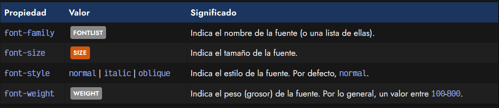

Con ellas podemos seleccionar tipografías concretas, específicar su tamaño, estilo o grosor.

## La propiedad font-family
Empezaremos por la más lógica y básica, la propiedad CSS para seleccionar una familia tipográfica concreta. Con esta propiedad, denominada font-family , podemos seleccionar una tipografía específica simplemente escribiendo su nombre:

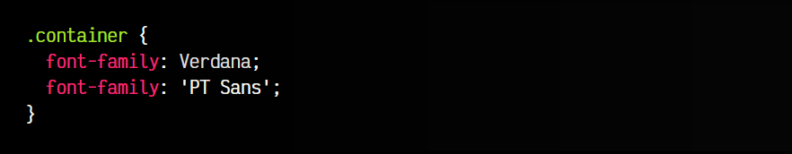

Si dicho nombre está compuesto por varias palabras separadas por un espacio, se aconseja utilizar comillas simples para indicarla, como se ve en el ejemplo anterior.

## Tipografías desconocidas
Hay que aclarar un detalle muy importante: los navegadores sólo son capaces de dibujar tipografías que reconoce el sistema o el navegador, es decir, que estén instaladas en el sistema o precargadas por el navegador. En el caso de no cumplir uno de estos casos, el texto se mostrará con otra tipografía «suplente» del sistema, pero que en muchos casos será considerablemente diferente y probablemente no quede igual.

Esto convierte una tarea a priori simple, en algo muy complejo, puesto que los sistemas operativos (Windows, Mac, GNU/Linux) tienen diferentes tipografías instaladas por defecto y no coinciden. Si además entramos en temas de licencias y tipografías propietarias, la cosa se se vuelve aún más compleja.

En el próximo artículo veremos la regla @font-face de CSS, que permite solucionar este problema precargando tipografías en el navegador. Es lo que utiliza «por debajo» Google Fonts.

## Alternativas y fuentes seguras
Aunque en el ejemplo anterior hemos utilizado sólo una tipografía, lo recomendable es establecer una lista de tipografías. Un primer y sencillo paso para paliar (en parte) el problema anterior, es añadir varias tipografías separadas por comas, lo que además se considera una buena práctica de CSS:

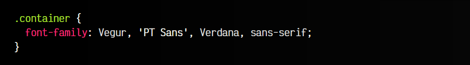

De esta forma, el navegador busca la fuente Vegur en nuestro sistema. En el caso de no estar instalada ni precargada, pasa a buscar la siguiente (PT Sans), y así sucesivamente. Se recomienda especificar al menos 2 ó 3 tipografías alternativas.

La última opción de font-family no suele ser una tipografía, sino las denominadas «web-safe fonts» (fuente segura). Esto no es una tipografía específica, sino una palabra clave con la que se designa una categoría de tipografías. Esto indica al navegador que debe buscar una tipografía instalada en el sistema que entre dentro de esa categoría.

Las palabras clave de fuentes seguras son las siguientes:

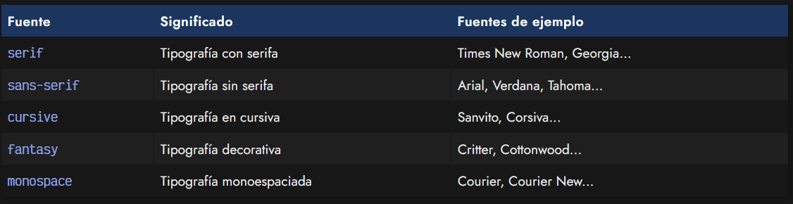

Existen algunas otras fuentes seguras menos conocidas, más relacionadas con la configuración del sistema:

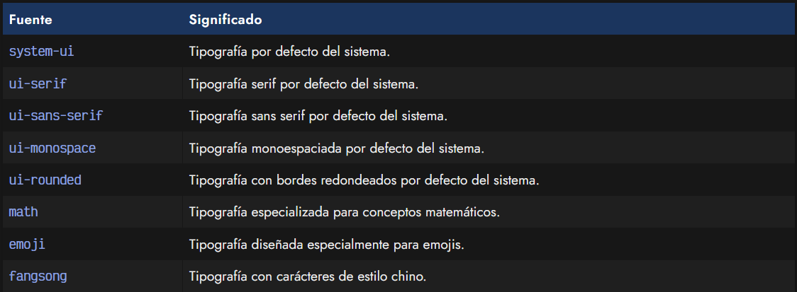

## La propiedad font-size
Otra de las propiedades más utilizadas con las tipografías es font-size, una tipografía que permite indicar el tamaño que tendrá la fuente que vamos a utilizar. El tamaño puede indicarse de 3 formas diferentes:

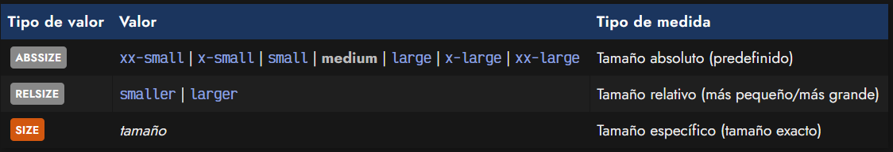

Estos tres tipos de valores son los siguientes:

   - 1️⃣ Medidas absolutas: Son palabras clave como medium (tamaño medio), small (tamaño pequeño) o x-large (tamaño muy grade), entre otros.

   - 2️⃣ Medidas relativas: Palabras clave como smaller o larger, que representan un tamaño un poco más pequeño o grande que el actual.

   - 3️⃣ Medida específica: Simplemente, indicar un tamaño exacto con una unidad determinada como px (píxeles), rem (root em) u otras [unidades disponibles en CSS](https://lenguajecss.com/css/unidades-css/que-son/).

Cuando comenzamos a escribir código CSS, recomiendo utilizar medidas basadas en px (muy fáciles de aprender). A medida que tengamos más soltura, recomiendo usar medidas como em o rem (muy prácticas y fáciles de mantener).

## La propiedad font-style
Quizás recuerdes los botones para dar estilo de los procesadores de texto como Word o Google Docs. Estos botones permiten aplicar estilos como negrita o cursiva. Justamente esto es lo que realiza la propiedad font-style, que puede tomar los siguientes valores:

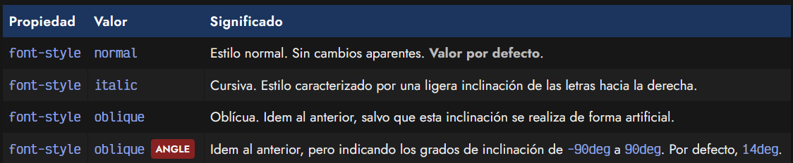

En la mayoría de los casos, se aprecia el mismo efecto con los valores italic y oblique, no obstante, italic muestra la versión cursiva de la fuente, específicamente creada por el diseñador de la tipografía. Por otro lado, oblique es una representación forzosa de una tipografía que no tiene cursiva, generándola artificialmente.

## La propiedad font-weight
Por otro lado, tenemos el peso de la tipografía, que no es más que el grosor de la misma. No todas las tipografías soportan todos los tipos de grosor. Hay tres formas de definir grosor de una tipografía:

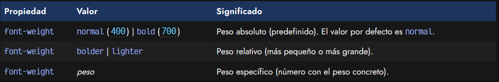

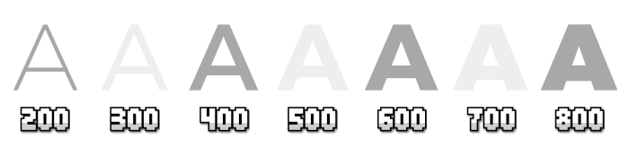

   - 1️⃣ Valores absolutos: Palabras claves para indicar el peso de la fuente: normal y bold.
   - 2️⃣ Valores relativos: bolder (más gruesa) o ligther (más delgada).
   - 3️⃣ Valor numérico: Un número del 100 (menos gruesa) al 1000 (mas gruesa). Saltos de 100 en 100.

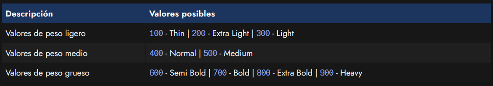

Algunas tipografías carecen de determinados pesos y sólo tienen ciertos pesos específicos. Esto es muy sencillo de ver en Google Fonts (al seleccionar una tipografía).

## Atajo: la propiedad font
Todas las tipografías vistas en este artículo, y algunas otras que aún no hemos visto se pueden resumir en la siguiente tipografía de atajo:

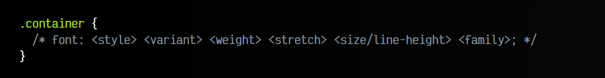

Ten en cuenta que los parámetros stretch y line-height son opcionales y pueden omitirse. Por ejemplo, utilizar la tipografía Arial, con la fuente alternativa Verdana o una fuente segura sin serifa, a un tamaño de 16px, un peso de 400, sin utilizar versalitas y con estilo cursiva:

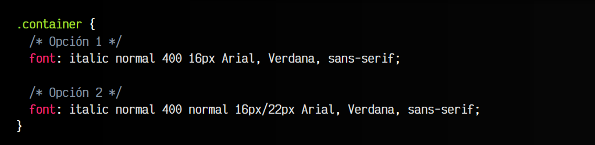

En la segunda opción, observa que añadimos el valor normal de font-stretch (justo antes del tamaño de fuente) y el valor 22px de line-height (justo después del tamaño de fuente).

