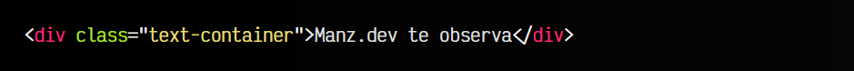

# 
Decoraciones de texto

Mediante las propiedades que veremos en este artículos podemos decorar o transformar nuestros textos. Se han dividido en 3 apartados:

   - 1️⃣ Decoraciones: Añadir trazos para decorar el texto
   - 2️⃣ Transformaciones: Realizar modificaciones a mayúsculas, minúsculas, etc...
   - 3️⃣ Énfasis: Añadir carácteres para enfatizar el texto

## Decoraciones de texto
Para establecer decoraciones en ciertos fragmentos de texto podemos utilizar las propiedades de la familia text-decoration-*. Normalmente, esta propiedad se suele utilizar sobre los elementos <a> para modificar el subrayado por defecto que se establece en los enlaces.

    Antes de hacer esto, recuerda que los enlaces suelen tener el subrayado para que el usuario lo identifique como un enlace, por lo que puede ser contraproducente eliminarlo.

Las propiedades de decoración de texto son las siguientes:

Observa que existen dos propiedades relacionadas con la familia text-decoration, pero sólo aplican cuando se establece un valor underline, hablaremos de ellas en este artículo, un poco más adelante.

## La propiedad text-decoration-line
La propiedad text-decoration-line permite establecer o cambiar el tipo de decoración de texto, entre los que se encuentran los siguientes valores:

Esta propiedad se utiliza junto a otras propiedades para modificar el trazo de la decoración. Por ejemplo, la propiedad text-decoration-style permite establecer el tipo de trazo, donde hay ciertos estilos similares a los que se aplican en los [bordes CSS](https://lenguajecss.com/css/modelo-de-cajas/bordes/). Los valores son los siguientes:

La propiedad text-decoration-color permite indicar el color del trazo, independientemente del color del texto. Por defecto, el valor utilizado es currentcolor, que es el color actual del texto. Por otro lado, la propiedad text-decoration-thickness permite establecer el grosor del trazo.

Por último, la propiedad text-decoration es la propiedad de atajo que podemos utilizar para aplicar todas las propiedades anteriores en una sola:

css:

html:

vista:

Antiguamente, la propiedad text-decoration tenía una sintaxis limitada con el valor de text-decoration-line, sin embargo, actualmente funciona como propiedad de atajo donde podemos establecer los valores de las 4 propiedades anteriores.

## Distancia del trazo de decoración
Mediante las propiedades text-underline-position y text-underline-offset podemos establecer la distancia del trazo del subrayado respecto al texto, algo que podría ser interesante si el trazo está molestando o demasiado cerca del texto, dependiendo de la tipografía que se use.

css:

html:

vista:

Por ejemplo, en el ejemplo anterior, text-underline-position establece que el trazo debe aparecer por debajo del trazo habitual. Además, con la propiedad text-underline-offset puedes establecer una distancia de separación específica, que con valores negativo, puede incluso invertirse y dirigirse en dirección contraria.

Para que estas propiedades funcionen, la propiedad text-decoration-line (o su atajo) debe estar fijada al valor underline.

## Transformaciones de texto
En CSS es posible realizar transformaciones a ciertos textos, donde a pesar de tener un texto original en el HTML, queremos mediante CSS realizar una transformación y ponerlo todo en mayúsculas, todo en minúsculas o transformaciones similares sin tener que modificar el contenido HTML.

Para ello, mediante esta propiedad text-transform se pueden indicar varios valores:

Todos estos valores están muy bien soportados en navegadores actuales, sin embargo, el valor full-width es muy reciente por lo que debes tener cuidado al usarlo, ya que puede no tener soporte.

## Énfasis de texto
En ciertos idiomas, se suelen utilizar ciertos carácteres para enfatizar textos, generalmente colocados sobre las palabras. Las propiedades de la familia text-emphasis-* sirven para este propósito:

La propiedad text-emphasis-style permite establecer unos carácteres para enfatizar los textos, que por defecto se establecen sobre los mismos. Se pueden indicar los valores dot, circle, double-circle, triangle o sesame, los cuales pueden combinarse con las palabras clave open y filled si queremos que sean signos huecos o rellenos, respectivamente:

css:

html:

vista:

Por otro lado, la propiedad text-emphasis-color nos permite elegir un color para estos carácteres, y la propiedad text-emphasis-position indicar en que lugar deben aparecer los carácteres. Asegúrate de marcar dos opciones para incluir idiomas con diferentes direccionalidades.

También puede indicarse un STRING en la propiedad text-emphasis-style para personalizarlo con carácteres concretos, e incluso emojis (lo cual aunque llamativo, podría no ser una muy buena idea):

css:

html:

vista:

Recuerda que tienes una propiedad text-emphasis de atajo que nos permite resumir las dos primeras propiedades text-emphasis-style y text-emphasis-color en una sola.