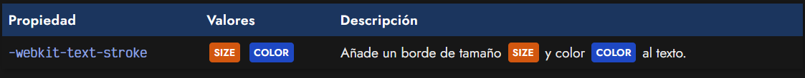
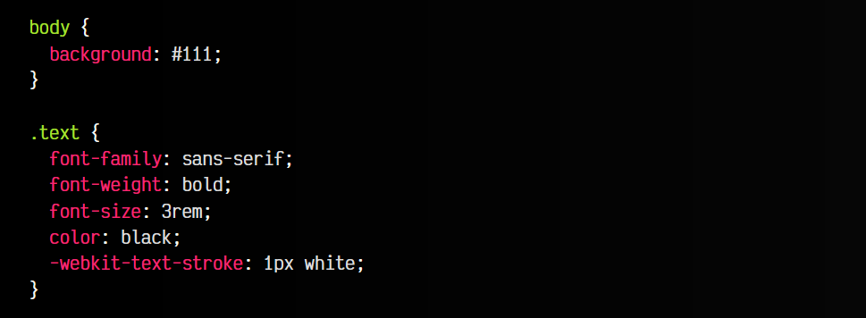
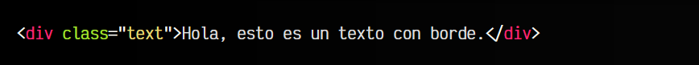
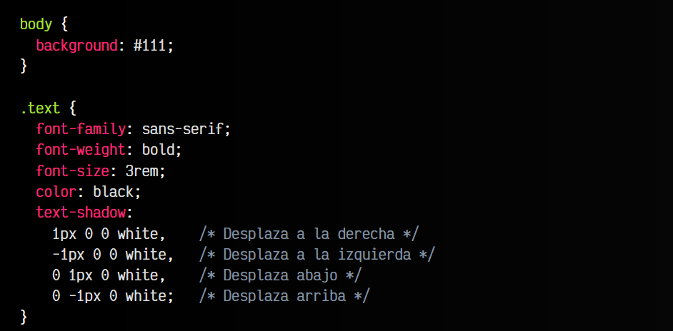
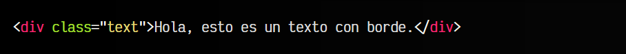
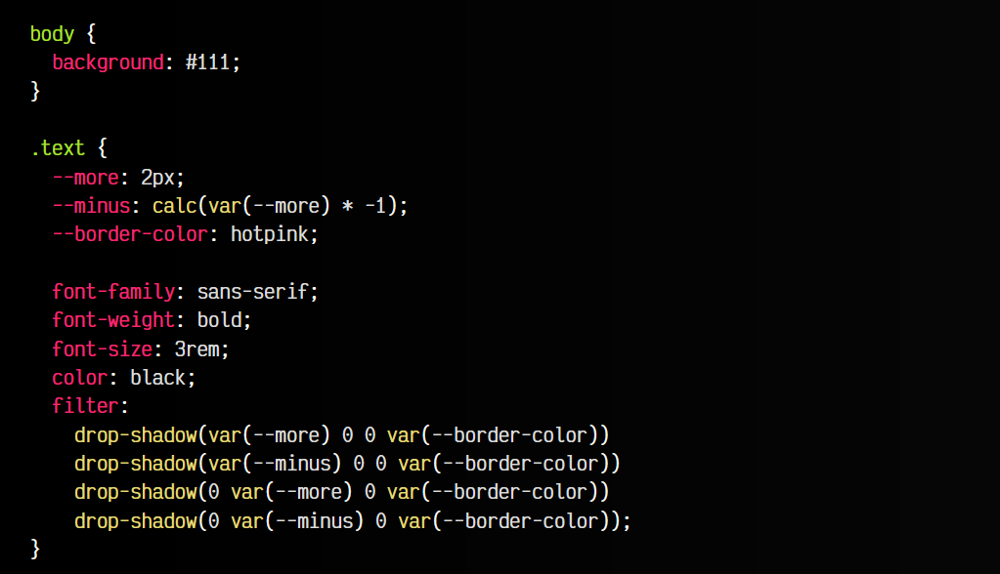
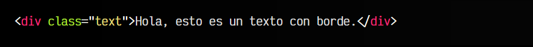
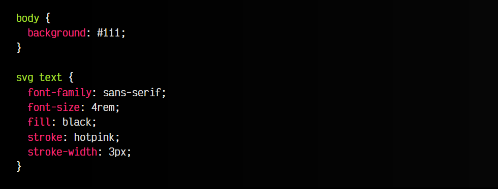
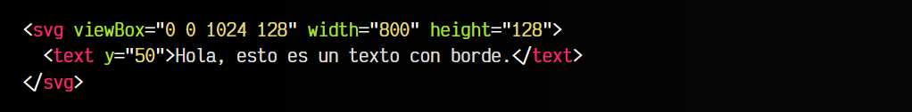

# 
Contorno en tipografías

Puede que en ciertas ocasiones nos interese colocar un borde o contorno a los textos de nuestra página, ya sea por motivos estéticos o simplemente por mejorar legibilidad. Sin embargo, esta es una cuestión que en CSS no está clara aún y que, aunque hay formas de conseguirlo, todas tienen sus ventajas y desventajas.

## La propiedad -webkit-text-stroke
Quizás, la forma ideal sería utilizar la propiedad text-stroke, que literalmente significa «trazo de texto», haciendo referencia al trazo del borde de la tipografía. Sin embargo, esta propiedad ha seguido un camino poco común, ya que no está estandarizada, sin embargo, está implementada en la mayoría de los navegadores, sólo que necesita el prefijo -webkit para utilizarse.

Observa que en el ejemplo, he añadido un font-weight para hacer el texto más grueso y se note mejor el grosor. Ten en cuenta que en algunas tipografías, o a ciertos tamaños, dicho borde podría no verse bien del todo.

css:

html:

vista:

Un detalle interesante a tener en cuenta, es que puedes observar que el borde o contorno se crea hacia el interior del texto, y no hacia el borde exterior, lo que en algunos casos quizás no es lo más apropiado.

¡Ojo!: A pesar de ser una propiedad no estándar que requiere el uso del prefijo -webkit, está muy bien soportada en todos los navegadores, incluso aquellos que no tienen motor webkit.

## La propiedad text-shadow
Otra forma interesante que podríamos utilizar para crear un borde o contorno en un texto es la propiedad text-shadow, que se utiliza para sombras de texto. Podemos utilizar un truco, que es crear múltiples sombras (concretamente, cuatro sombras) y desplazarlas ligeramente hacia un lado, de modo que en conjunto creen una sombra exterior.

css:

html:

vista:

Ten en cuenta que el tercer parámetro de las sombras, debe ser 0 para que esté totalmente definida. Si aumentamos ese parámetro, la sombra comenzará a difuminarse. Desgraciadamente, la propiedad text-shadow aún no tiene un cuarto parámetro para darle un factor de crecimiento como ocurre en box-shadow.

► Aprender más sobre [la propiedad text-shadow](https://lenguajecss.com/css/sombras/text-shadow/).

## La función drop-shadow()
De forma muy similar a la anterior, puede servirnos también la función drop-shadow() de la propiedad filter, con la que también podemos crear múltiples sombras. Como hacerlo con un desplazamiento de 1px, el resultado sería exactamente igual al anterior, en este caso, vamos a aumentar un poco el desplazamiento de las mismas y a separarlo en variables CSS para que sea más fácil de modificar y mantener (aunque sea un poco más complejo de leer):

css:

html:

vista:

► Aprender más sobre la [función drop-shadow()](https://lenguajecss.com/css/sombras/drop-shadow/)

## Otras alternativas
Otras alternativas podrían ser utilizar SVG para renderizar el texto y añadir contorno. SVG tiene mecanismos más adecuados, ya que tiene las propiedades stroke (color del trazo) y stroke-width (ancho del trazo), sin embargo, puede ser más complejo la colocación o redimensión del texto, ya que generalmente hay que lidiar con los tamaños, posiciones y el viewBox del SVG.

No obstante, puede ser otra opción interesante a utilizar:

css:

html:

vista:

► Aprende más sobre[ textos en SVG](https://lenguajehtml.com/svg/textos/text/).