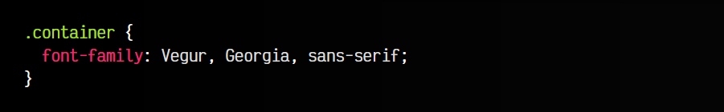
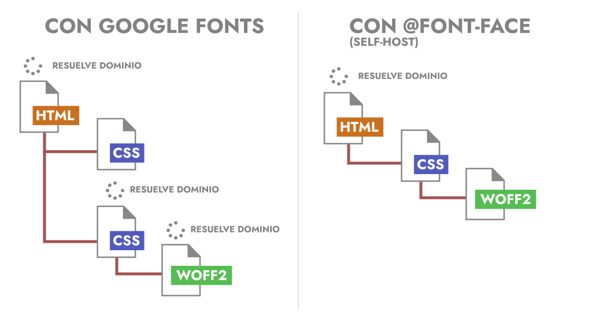
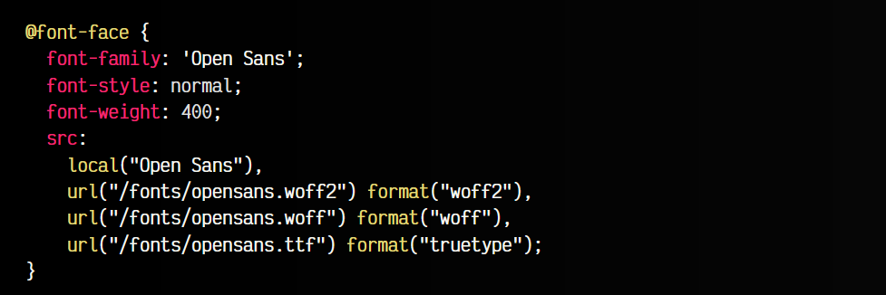
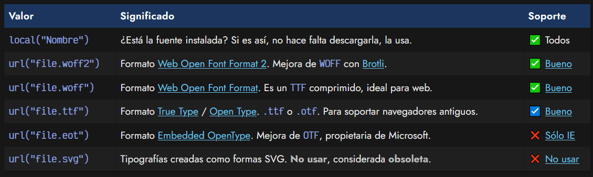
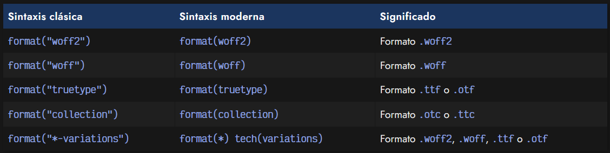

# 
La regla @font-face

Utilizar tipografías en CSS es maravilloso. Permite personalizar nuestra página web con fuentes elegantes y atractivas. Sin embargo, este sistema tenía originalmente un problema: dependen de que la tipografía esté instalada en el sistema. Si utilizamos la propiedad font-family y especificamos una tipografía que no está instalada en el sistema, pasará a utilizar otra tipografía alternativa.

Sin embargo, que el usuario tenga que instalar la tipografía antes de visitar una web no es algo práctico. Por lo tanto, se ideó una forma para que los navegadores puedan precargar tipografías sin que el usuario tenga que instalar dichas tipografías.

## Tipografías no instaladas
Imaginemos que tenemos el siguiente fragmento de código CSS:

   - Un usuario con la tipografía Vegur instalada, vería sin problemas el diseño ideal.
   - Si no tiene la tipografía Vegur instalada en el sistema, la vería con la segunda tipografía: Georgia.
   - Si tampoco tiene la tipografía Georgia instalada, buscará una tipografía de sistema «sin serifa».

Muchas tipografías tienen derechos de autor y no se deberían utilizar en nuestra página web si no hemos pagado su licencia. Antes de utilizar una tipografía, investiga que tipo de licencia tiene o si puedes utilizarla. Si tienes dudas, busca tipografías de dominio púbico o CC0.

## ¿Por qué no usar Google Fonts?
Aunque utilizar tipografías de [Google Fonts](https://lenguajecss.com/css/fuentes-y-tipografias/tipografias-google-fonts/) con el código que nos proporciona Google es una opción viable, en temas de rendimiento web suele ser mucho peor.

Cuando utilizamos el código que nos proporciona Google Fonts, realmente, también usamos la regla @font-face, lo que ocurre es que el camino es «más largo» por lo que nuestro navegador tiene que hacer varias cosas:

   - 1️⃣ Buscar (resolver) el dominio fonts.googleapis.com
   - 2️⃣ Descargar y procesar el CSS desde fonts.googleapis.com
   - 3️⃣ Buscar (resolver) el dominio fonts.gstatic.com (donde están las fuentes alojadas)
   - 4️⃣ Descargar y procesar las fuentes de dicho dominio

Sin embargo, si descargamos la tipografía a nuestro sitio web, no tendrá que gastar tiempo y recursos en resolver esos dominios (el nuestro ya lo conoce), el CSS no se descarga desde otra URL porque ya está en nuestro código CSS principal, y descargará las tipografías desde nuestro sitio, algo que puede llegar a optimizarse si utilizas protocolos modernos como HTTP2 o superior.

Google fonts incorpora unas [etiquetas de precarga](https://lenguajehtml.com/html/cabecera/etiquetas-precarga-html/) para anticipar lo máximo posible la resolución del dominio, pero aún en ese caso, estamos realizando tareas extra que no se realizarían si alojaramos las tipografías en nuestra propia web.

## La regla @font-face
Para solucionar el problema de utilizar una tipografía que el usuario no tiene instalada en su sistema, utilizaremos la regla @font-face de CSS. Dicha regla nos permite descargar en el navegador una tipografía desde una página y utilizarla aunque no esté instalada en el sistema. Todo ello de forma transparente al usuario.

Observa el siguiente ejemplo de código donde precargamos la tipografía Open Sans, utilizando la regla CSS @font-face. Esta regla suele colocarse al principio del fichero CSS para avisar al navegador que vamos a utilizar una tipografía que es muy posible que no se encuentre instalada.

En el ejemplo siguiente, lo hemos hecho con la tipografía [Open Sans](https://fonts.google.com/specimen/Open+Sans), una fuente libre creada por Steve Matteson para Google:

Basicamente, abrimos un bloque @font-face, establecemos su nombre mediante font-family y, opcionalmente, definimos sus características mediante propiedades como font-style o font-weight.

El factor clave viene a la hora de indicar la tipografía a utilizar, que se hace mediante la propiedad src:

Es buena práctica usar la expresión local() seguida de los formatos WOFF2 y WOFF (en dicho orden), dando así soporte a la mayoría de navegadores, ya que WOFF tiene muy buen soporte. Para dar soporte a navegadores muy antiguos quizás podría ser necesario incluir también el formato TTF.

Observa que tras indicar la url() con el archivo con la tipografía, una buena práctica es indicar el formato de la tipografía, para que el navegador lo conozca antes de descargar la tipografía y anticiparse al soporte que podría tener ese navegador. La sintaxis a utilizar sería la siguiente:

La nueva sintaxis tech() aún no está soportada ampliamente en navegadores:

La regla @font-face permite cargar cualquier tipografía que queramos. A continuación, en el siguiente artículo, vamos a ver como cargar tipografías desde Google Fonts, que aunque es mucho más sencillo para el programador, sólo permite cargar tipografías que existan en dicho repositorio. Piensa que si la tipografía que quieres usar no está en Google Fonts, necesitarás usar @font-face.

