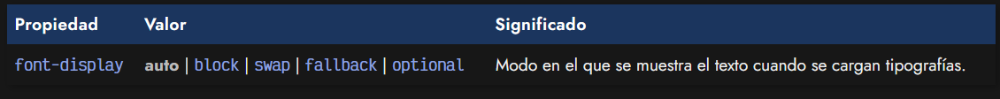
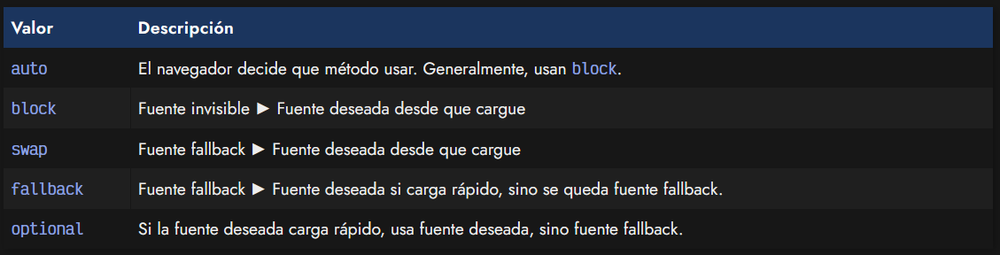
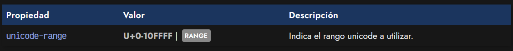
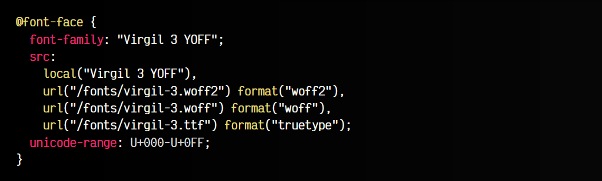

# 
Modo de carga de tipografías

Las tipografías que veremos en esta sección tratan de formas específicas de controlar la forma en la que se cargan y se ven o aparecen las tipografías en la página. Y para ello, hay que entender una serie de conceptos previos.

## Modo de aparición
La propiedad font-display nos brinda un mecanismo muy interesante para determinar como queremos que se comporte la tipografía al cargar la página. Cuando cargamos una página con una tipografía que no se encuentra instalada, el navegador debe descargar la tipografía y activarla, tarea que no ocurre instantáneamente, ya que depende de nuestra conexión, del tamaño de la fuente y del sistema utilizado.

En el instante anterior a descargar la tipografía pueden ocurrir varias cosas:

   - 1️⃣ FOIT (Flash of Invisible Text): El texto permanece oculto (invisible) al usuario hasta que la tipografía deseada se ha descargado y puede visualizarse.
   - 2️⃣ FOUT (Flash of Unstyled Text): El texto permanece sin estilo (con otra tipografía diferente) hasta que la tipografía deseada se ha descargado y puede visualizarse.

## La propiedad font-display
Dependiendo del valor de la propiedad font-display podemos modificar dicho comportamiento:

Como podemos ver, esta propiedad tienen varios valores que modifican su comportamiento. Cada uno de ellos, va a indicarle al navegador como tiene que comportarse al cargar una tipografía externa, mediante la regla @font-face, y que tiene que hacer durante el tiempo que la tipografía no está disponible.

Veamos que ocurre con cada uno de los valores posibles a indicar a la propiedad font-display (en el momento que la tipografía no está descargada):

Estos valores son difíciles de resumir en una tabla, así que vamos a definirlos uno por uno, profundizando en sus características:

   - auto: Es el valor por defecto de la propiedad. El navegador decide que comportamiento aplicar, que suele ser FOIT (el texto aparece invisible). En algunos navegadores o situaciones, el tiempo de FOIT puede llegar a ser considerablemente alto, y bastante molesto.

   - block: El navegador mantiene el texto invisible (FOIT) durante un corto periodo de tiempo (~3seg), mostrando la tipografía deseada desde que esté cargada. Este valor es ideal para pequeños fragmentos de texto como titulares, que no interesa que se vean con otra tipografía diferente.

   - swap: El navegador muestra inmediatamente el texto con la siguiente tipografía de la lista de alternativas durante un cortísimo periodo de tiempo (~100ms), mostrando la tipografía deseada desde que está cargada. Ideal para pequeños fragmentos de texto como titulares.

  

   - fallback: El navegador muestra el texto con la siguiente        tipografía    de la lista de alternativas de font-family durante un cortísimo periodo de tiempo (~100ms), mostrando la tipografía deseada desde que está cargada. Como se puede ver, es idéntico al valor swap. La diferencia es que si pasa demasiado tiempo sin que la tipografía se cargue, se utiliza de forma definitiva la alternativa que se estaba usando y no se utiliza la tipografía deseada. Puede ser apropiada para usar en fragmentos largos de texto.

   - optional: El navegador considera opcional el uso de la tipografía deseada si tarda demasiado o cree que hay algún problema en la descarga, utilizando la siguiente alternativa en la lista de tipografías de font-family. Ideal para textos largos que no produzcan saltos.

## La propiedad unicode-range
Cuando cargamos tipografías con la regla @font-face, es una buena práctica utilizar la propiedad unicode-range para indicar cuales son los carácteres que utilizaremos de la tipografía.

Una tipografía cuenta con multitud de carácteres o glifos: carácteres alfanuméricos, carácteres básicos ASCII, carácteres hebreos, carácteres japoneses, carácteres especiales, etc... Sin embargo, hay ciertos carácteres que al menos en algunas situaciones no vamos a utilizar, por lo que sería un desperdicio descargarse la tipografía para luego no utilizarla.

La propiedad unicode-range nos permite indicar el rango que vamos a utilizar con una tipografía, y en el caso de que la página o documento no necesite ningún carácter de ese rango, la tipografía no se descargará.

Los rangos unicode se definen utilizando el prefijo U+ o u+, seguido del número del rango en hexadecimal. Los rangos con esta propiedad se pueden indicar de la siguiente forma:

   - 1️⃣ Un carácter individual: Indicamos sólo un carácter concreto. Por ejemplo U+0042 o U+01FF.
   - 2️⃣ Un rango: Indicamos un rango de carácteres. Por ejemplo U+0042-U+01FF, que son los carácteres desde 42 hasta 1FF.
   - 3️⃣ Un rango con comodines: Indicamos un rango con comodines. Por ejemplo U+00??, que abarcaría todos los carácteres desde 00 hasta FF.

Veamos un fragmento de código donde tenemos un ejemplo de uso de esta propiedad:

La herramienta [FontForge](https://fontforge.org/en-US/) es capaz de cargar tipografías y mostrarnos los diferentes rangos unicode de cada tipografía y que elementos se usan en cada uno de ellos, por si queremos examinar detalladamente. En [SYMBL](https://symbl.cc/en/unicode/blocks/) o la aplicación Mapa de carácteres de Windows, también tienes los bloques que se suelen utilizar.

