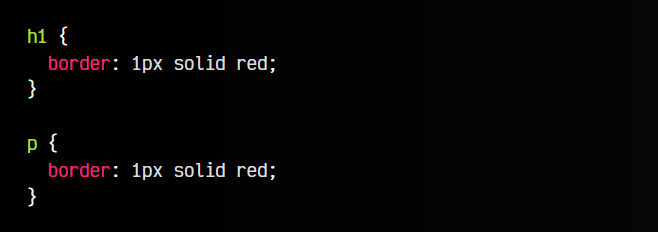
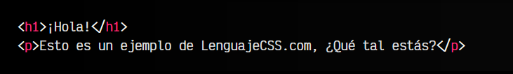
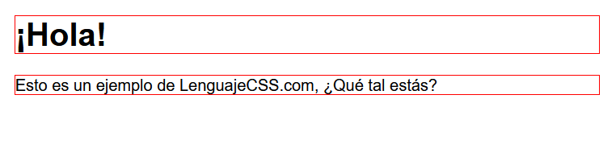
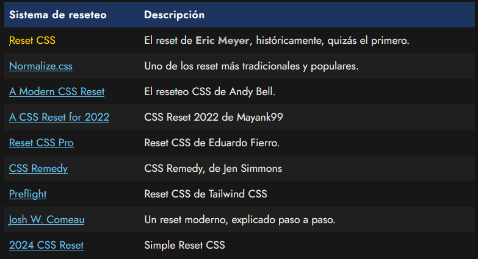

# 
Reset CSS

Quizás habrás observado que los navegadores insertan ciertos estilos por defecto. Esto es fácil de comprobar, si sólo escribes HTML sin indicar ningún estilo CSS. Comprobarás que la página muestra algunos elementos con cierto estilo, como por ejemplo, que los body tienen márgenes o que los h1 tienen tamaño y margen:

css:

html:

vista:

Observa que entre las cajas que he definido con borde rojo hay cierta cantidad de espacio. Esto ocurre porque los navegadores tienen un margen por defecto en los elementos p y h1.

No obstante, hay muchos otros estilos no relacionados con los márgenes que también aparecen en muchos navegadores y que puede que nos compliquen el trabajo de diseño, ya que no los teníamos previstos.

## ¿Qué es un Reset CSS?.
Aunque cada vez es menos necesario, muchos programadores prefieren resetear los estilos del navegador para que sea mucho más sencilla e intuitiva la tarea de dar estilos a los diferentes elementos HTML. Además, algunos navegadores resetean elementos de forma diferente respecto a otros navegadores, por lo que los estilos por defecto del navegador pueden ser diferentes dependiendo del sistema operativo o navegador.

Resetear márgenes con margin: 0 o utilizar propiedades como box-sizing son algunas de las tareas de reseteo más frecuentes. Sin embargo, existen muchas más. Para hacer más sencilla esta tarea, muchos diseñadores han creado su propio «pack» de reseteos, donde contienen múltiples reseteos que eliminan estas particularidades de todos los navegadores, de forma que sea mucho más fácil escribir CSS sin cambios imprevistos.

## ¿Qué Reseteos CSS existen?.
Tradicionalmente, han habido muchos sistemas de reset en CSS, pero sólo algunos se han quedado hasta estos días. Citaré los que creo que son más conocidos y relevantes:

- [Reset CSS](https://meyerweb.com/eric/tools/css/reset/)
- [Normalize.css](https://necolas.github.io/normalize.css/)
- [A Modern CSS Reset](https://andy-bell.co.uk/a-modern-css-reset/)
- [A CSS Reset for 2022](https://github.com/mayank99/reset.css)
- [Reset CSS pro](https://github.com/eduardofierropro/Reset-CSS)
- [CSS Remedy](https://github.com/jensimmons/cssremedy)
- [Preflight](https://tailwindcss.com/docs/preflight)
- [Josh W.comeau](https://www.joshwcomeau.com/css/custom-css-reset/)
- [2024 CSS Reset](https://twitter.com/souporserious/status/1746311121949356469)

Utilizar un sistema de reset CSS es decisión del desarrollador y no es algo obligatorio. En algunos casos, quizás pueda ayudar a que el desarrollador realice pasos en sus diseños de forma mucho más intuitiva.
