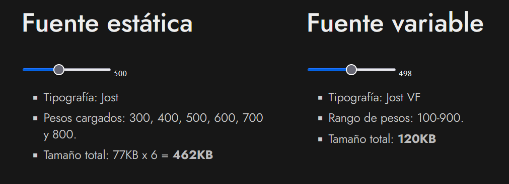

# 
Fuentes variables CSS

Hasta ahora, es posible que sólo hayas utilizado fuentes estáticas (tipografías que tienen un peso y un estilo concreto), ya que son las que tradicionalmente se han utilizado en CSS. Sin embargo, existe también una categoría alternativa llamada fuentes variables, que posee ciertas diferencias y son mucho más prácticas e interesantes en ciertos casos. Veamos las características de cada uno de estos grupos para aclarar conceptos.

## Fuentes estáticas
Las fuentes estáticas se dividen en diferentes ficheros según sus pesos y/o estilos. Por ejemplo, la tipografía Open Sans dispone de 10 ficheros con diferentes pesos: 300, 400, 600, 700 y 800 (para el estilo normal) y otros 5 ficheros con los mismos pesos mencionados pero para los estilos en cursiva (italic). En las fuentes estáticas los pesos suelen variar de 100 en 100.

Si en una web utilizamos fuentes estáticas, lo habituales es escoger los pesos concretos que vamos a utilizar. Por ejemplo, cargar en la web los ficheros open-sans-300.woff2, open-sans-300-italic.woff2 y open-sans-400.woff2. Con esto podríamos utilizar Open Sans con los pesos 300, 300 en cursiva y 400, concretamente. El tamaño aproximado de las 3 tipografías podría ser unos 150KB (50KB cada fichero).

## Fuentes variables
Por contraposición, las fuentes variables se aglutinan generalmente en un solo fichero, conteniendo estilos y diferentes pesos, pudiendo variarlos dinámicamente y con gran precisión a través de propiedades de CSS. El fichero será más pesado que uno de los anteriores, pero muy probablemente más ligero que 3 o 4 ficheros (combinación más que habitual cuando trabajamos con fuentes estáticas).

Si utilizamos fuentes variables en una web, podríamos cargar la tipografía open-sans-vf.woff2. Con esta tipografía podríamos usar Open Sans con pesos entre el rango 100 y 900 (incluyendo valores específicos como 105 o 112). El fichero de la tipografía podría ocupar unos 130KB.

Esto hace que, si queremos utilizar una tipografía con diferentes pesos específicos (titular, párrafos, botones, etc...), sea mucho más práctico utilizar una tipografía variable que una tipografía estática, además de tener mucha más flexibilidad y variedad de pesos.

A continuación puedes observar un ejemplo de cada una, utilizando la tipografía Jost, tanto en su versión estática como en su versión variable:

## Propiedades de fuentes variables
Al utilizar tipografías o fuentes variables podemos seguir trabajando con la mayoría de las propiedades CSS de fuentes que usamos habitualmente, sin embargo, algunas cosas cambian ligeramente. Veamos que propiedades pueden ser necesarias para trabajar fuentes variables:

Las propiedades CSS anteriores (salvo la última) son las propiedades CSS que se suelen utilizar para ajustar temas relacionados con los estilos y características de las tipografías. Sin embargo, cuando trabajamos con fuentes variables, muchos navegadores puede que no soporten adecuadamente estas propiedades o características relacionadas con fuentes variables. En ese caso, podemos recurrir a una propiedad a bajo nivel llamada font-variation-settings, la cuál funcionará si las anteriores no son soportadas.

## Cargar fuentes variables
Para cargar tipografías variables personalizadas, podemos utilizar la regla @font-face como aprendimos en temas anteriores. Sin embargo, existen algunas diferencias al utilizar tipografías variables:

En primer lugar, observa que indicamos la tipografía variable (montserrat-vf.woff2), indicando el formato woff2 y una función tech() con el valor variations. Esta es una sintaxis moderna que puede que los navegadores aún no soporten. La segunda, por su parte, es una sintaxis anterior que probablemente soporten todos los navegadores de momento.

Un poco más abajo, observamos que utilizamos las propiedades font-weight y font-stretch, pero con dos valores en lugar de uno. En las tipografías variables, en lugar de utilizar un valor establecemos un rango. De esta forma, estamos permitiendo pesos entre 100 y 900 y ancho de letra entre 50% y 200%. Los valores fuera de estos rangos, se establecerán en el valor más cercano permitido.

## Cargar fuentes variables con fallbacks
Podría interesar hacer una carga mixta, en la que se cargue una tipografía variable sólo si la soporta el navegador (si conoce la propiedad font-variation-settings), y en caso contrario, una tipografía estática normal. Si eso es lo que queremos, podemos utilizar el siguiente fragmento de código, donde se utiliza la regla @supports para ello:

Observa que lo que hemos hecho es establecer una tipografía estática en el CSS común superior, que inmediatamente será reemplazada por el que está contenido en la regla @supports si el navegador soporta tipografías variables. De esta forma no habrá conflicto con las propiedades font-weight o similares, que toman dos parámetros en el caso de fuentes variables.

## Propiedades específicas
Podemos utilizar las siguientes propiedades para modificar el peso de la tipografía, el ancho de la letra, la modalidad de cursiva o slant o el ajuste óptico, que es un modo de ciertas tipografías en el que si estableces tamaños muy pequeños, los trazos y serifas de la tipografía se muestran de forma más gruesa para que se puedan ver correctamente.

Pero como comentabamos antes, es posible que algunas de estas propiedades CSS no funcionen correctamente aún en navegadores, por lo que podemos utilizar la propiedad de bajo nivel font-variation-settings, la cuál nos permite configurar a nuestro gusto una o todas las opciones anteriores de una sola vez.

## Usando font-variation-settings
Esta propiedad de bajo nivel permite indicar una o varias características especiales de una tipografía variable. La sintaxis que se utiliza se basa en indicar la característica a configurar (una cadena de texto de 4 letras), seguida de un valor asociado a dicha característica:

Este ejemplo se traduciría a código como veremos a continuación, utilizando la característica wght (weight) con peso 500:

Puedes utilizar la página [Wakamai Fondue](https://wakamaifondue.com/) para arrastrar una tipografía y examinar de que características dispone. Por ejemplo, si arrastramos la tipografía [Montserrat VF](https://github.com/cosmicmocha/Montserrat/tree/master/fonts/variable) vemos que nos da datos como los siguientes:

   - Carácteres: 967
   - Glifos: 1944
   - Layout features: 24 [Más info sobre layout font features](https://lenguajecss.com/css/fuentes-y-tipografias/caracteristicas-personalizadas/#caracter%C3%ADsticas-a-bajo-nivel)
   - Tamaño: 120KB
   - Autora: [Julieta Ulanovsky](https://twitter.com/julietulanovsky)
   - Version: 8.000

Si nos fijamos un poco más abajo, hay un apartado llamado Variable donde aparecen las características que posee la tipografía. Depende de cada tipografía que características tenga. A continuación podemos ver una tabla con algunas de las características que podemos encontrar y cuál es su nombre de 4 letras para indicar en la propiedad font-variation-settings:

Observa que las caracteristicas a bajo nivel se identifican siempre con una palabra clave de 4 letras (wght, wdth, etc...) que generalmente es una abreviatura de la característica en sí. Luego, se le asocia un valor que depende de la característica. Pueden ser valores como tamaños, porcentajes, unidades o valores 1 o 0 para activar o desactivar respectivamente.

Ten en cuenta que la propiedad font-variation-settings establece todas las características de una sola vez. Si volvemos a escribir la propiedad con otra característica, sobreescribirá la anterior. Para evitar esto, podemos utilizar [CSS Custom Properties](https://lenguajecss.com/css/cascada-css/css-custom-properties/) separando por comas múltiples características:

En este ejemplo establecemos las «variables» --font-weight y --font-stretch en la propiedad font-variation-settings. Si en algún momento queremos modificarlas, no hace falta modificar la propiedad, sino directamente la variable CSS.

En las páginas [V-Fonts](https://v-fonts.com/), [Axis Praxis](https://www.axis-praxis.org/) y en [GitHub](https://github.com/search?q=variable+fonts) puedes encontrar multitud de fuentes variables para utilizar en tus diseños. Recuerda investigar bien la tipografía en la página del autor, ya que muchas tipografías son gratuitas, pero muchas otras son de pago y debes tener una licencia.

