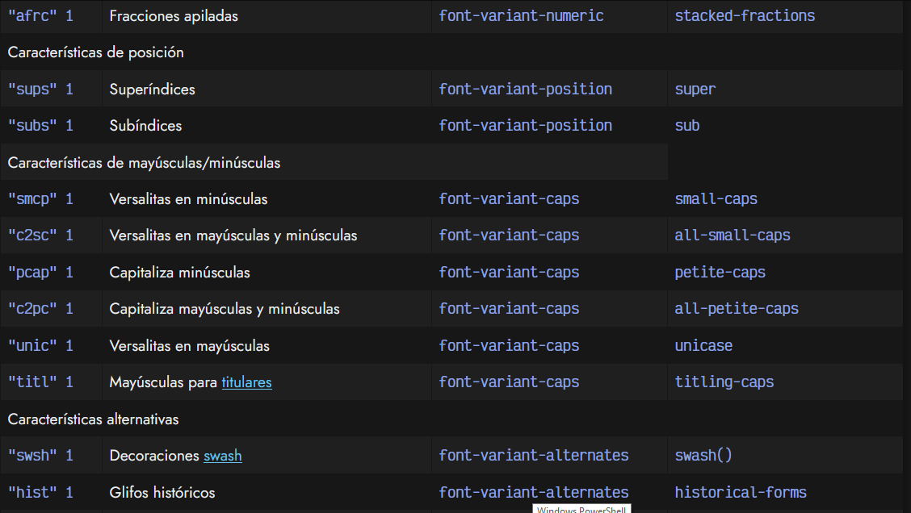
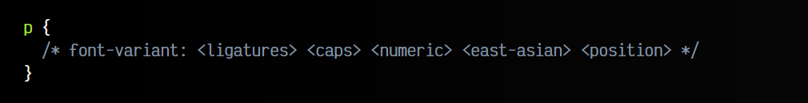

# 
Características personalizadas

Ciertas tipografías tienen una serie de características avanzadas que pueden existir o no, dependiendo de la tipografía. Dichas características permiten realizar variaciones en las tipografías como las siguientes:

Veamos detalladamente cada una de estas características:

   - Ligaduras: Es posible activar una características llamada ligadura que no es más que la unión de ciertos carácteres cambiando su aspecto visual. Esto se puede hacer con la propiedad font-variant-ligatures , y dependiendo del valor específico, activaremos uno u otro tipo de ligadura. Existen las siguientes:
       - Ligaduras normales: Se indica con el valor common-ligatures . Se suele observar en valores como fi , fl , ff ...
       - Ligaduras discrecionales: Se indica con el valor discretionary-ligatures . Se suele observar en valores como ch , sp , st ...
       - Ligaduras históricas: Se indica con el valor historical-ligatures . Se aplican para mostrar ligaduras heredadas de escritura manual.

   - Posicionamiento de carácteres: Es posible activar una variación para indicar texto como subíndice o superíndice, similar a como se hace con las etiquetas HTML "sub" y "super" .

   - Mayúsculas y minúsculas: Es posible realizar ciertas variaciones como versalitas o similares, aplicadas sólo a minúsculas, sólo a mayúsculas o a ambas.

   - Variaciones numéricas: Con la propiedad font-variant-numeric podemos establecer ciertas variaciones como representar números con estilo antiguo, diferentes proporciones, como fracciones "gráficas" o incluso indicar que el cero tenga una raya o no.

   - Variaciones alternativas: Con la propiedad font-variant-alternates se pueden indicar una o múltiples variaciones visuales, donde se pueden mencionar las siguientes:
       - historical-forms: Muestra glifos históricos (heredados de épocas pasadas)
       - stylistic(id): Muesta características de estilo alternativas de forma individual.
        styleset(id): Muestra un conjunto de características de estilo alternativas (creados para trabajar juntos).
       - character-variant(id): Muestra ciertas variaciones en carácteres concretos.
       - swash(id): Muestra decoraciones artísticas en los carácteres como adornos tipográficos.
       - ornaments(id): Muestra glifos con adornos en lugar del caracter predeterminado.
       - anotation(id): Muestra formas notacionales de glifos (glifos abiertos, cajas redondeadas, etc...)

## Variaciones en tipografías
Estas características pueden ser activadas o desactivadas desde CSS, por medio de una de las siguientes propiedades (o de forma alternativa, utilizando una propiedad a bajo nivel que veremos más adelante):

Ten en cuenta que en la mayoría de ellas, se puede utilizar la regla @font-feature-values para personalizar como utilizar la característica en cuestión (la cuál debe existir y estar definida en la tipografía). Veamos un ejemplo:

## Características a bajo nivel
La propiedad font-feature-settings es una propiedad a bajo nivel para indicar como debe comportarse una tipografía respecto a sus características especiales. Sólo debe usarse cuando no nos sirva otra propiedad con la que modificar dicha característica, la cuál normalmente se encuentra en la lista del apartado anterior.

La sintaxis de esta propiedad es la que podemos ver a continuación (se pueden combinar varias características separando por comas):

Sin embargo, la característica «feat» no existe, es sólo un ejemplo teórico. Cada tipografía tiene un cierto número de características especiales (hay tipografías que tienen varias, y tipografías que no tienen ninguna). Veamos una lista de las características que existen:

Para saber si la tipografía que estamos utilizando posee alguna de estas características especiales, podemos utilizar el comando de terminal font, que lee dicha información de formatos WOFF2, WOFF, TTF u OTF. Dicho comando está programado en el lenguaje de programación Go, por lo que instalarlo es tan fácil como escribir desde una terminal lo siguiente:

Este comando nos mostrará los metadatos de la tipografía, incluyendo los flags de las features (liga, tnum, frac, etc...) que existen y están definidas en la tipografía en cuestión.

## Atajo de características
Tradicionalmente, la propiedad font-variant sólo permitía los valores normal o small-caps . Sin embargo, las nuevas propuestas de CSS permiten utilizar esta propiedad como propiedad de atajo para todas las características que hemos visto en el apartado anterior. Por lo tanto, pasamos de este esquema antiguo (soportado en la mayoría de los navegadores):

Al esquema moderno, que es el siguiente:

En él podemos utilizar los valores de cada propiedad individual: font-variant-ligatures , font-variant-caps , etc... en forma de atajo.

