# Contadores CSS

Si conocemos los estilos que es posible darle a una lista con CSS es posible que nos interese conocer la posibilidad de crear contadores personalizados con CSS y utilizarlos en nuestras páginas para contar diferentes elementos de la misma, además de crear sistemas de numeración personalizados y adaptados a nuestros criterios.

## Propiedades de contador
Para empezar, en CSS podemos crear un contador CSS. Básicamente, lo único que tenemos que hacer es asignarle un id o nombre, que nos permitirá hacer referencia a él posteriormente. Veamos que propiedades podemos utilizar para esto:

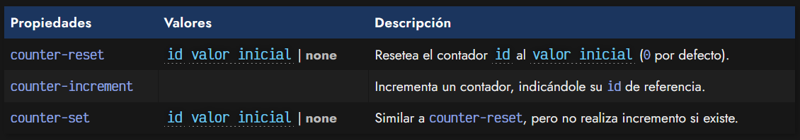

En primer lugar, tenemos las propiedades counter-reset y counter-increment que no hacen otra cosa más que resetear a cero o incrementar un contador CSS, indicándole el nombre o id del mismo.

## La función counter()
Sin embargo, necesitamos mostrarlo de alguna forma o sería inútil. Para ello, podemos utilizar la función CSS counter(), que se suele utilizar junto a la propiedad content en pseudoelementos ::before o ::after.

A dicha función, se le debe pasar de forma obligatoria el id del contador, y de forma opcional el tipo de contador que queremos utilizar, que de no hacerlo, tomará por defecto el tipo decimal:

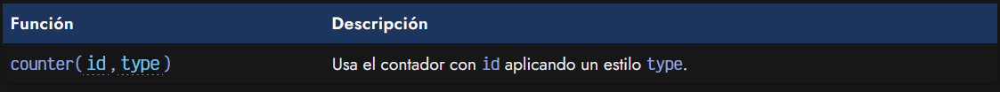

Así pues, veamos un ejemplo en acción con lo que hemos visto hasta ahora. El siguiente ejemplo incorpora 3 elementos con clase item que queremos contabilizar, a pesar de no ser una lista y, además, teniendo contenido de por medio.

css:
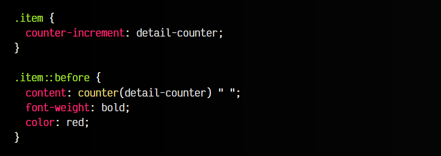

html:
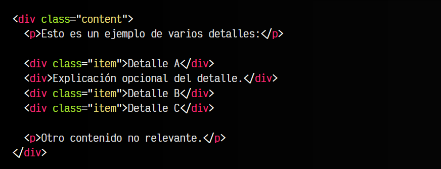

vista:
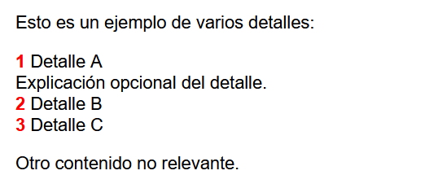

Para ello, establecemos un incremento en cada elemento con clase .item y además, inmediatamente antes de ese elemento, colocamos visualmente el contador, en rojo y negrita, seguido de un espacio en blanco. Observa que el contador lo hemos llamado detail-counter, aunque se podría llamar de cualquier otra forma.

Aunque no se muestre explícitamente, es como si tuvieramos un counter-reset: detail-counter 0 en el elemento .content, que es el que inicializa todo a 0. El contador se inicializa en 0 pero realiza el primer incremento antes de mostrar el valor, por lo que los números contarán a partir del 1.

En la función counter() no indicamos tipo, por lo tanto usará el tipo decimal por defecto. Si quieres saber que otros tipos existen, echa un vistazo al artículo de [Listas CSS](https://lenguajecss.com/css/representacion-datos/listas-css/).

## Creación de contadores
Si necesitamos algún tipo de contador personalizado y no nos bastan con los que incorpora CSS, es posible crearlo y customizarlo a nuestro gusto, mediante la regla @counter-style. Básicamente, te permite crear un tipo de contador, y decirle los símbolos que vamos a utilizar.

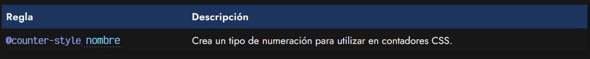

Dentro de la regla @counter-style, en la que debemos especificar un nombre para hacer referencia, podemos utilizar varias propiedades. Veamos un ejemplo sencillo, en el que creamos un sistema de numeración llamado spanish que cuenta los números del uno al tres, colocándole a cada uno el sufijo »:

css:
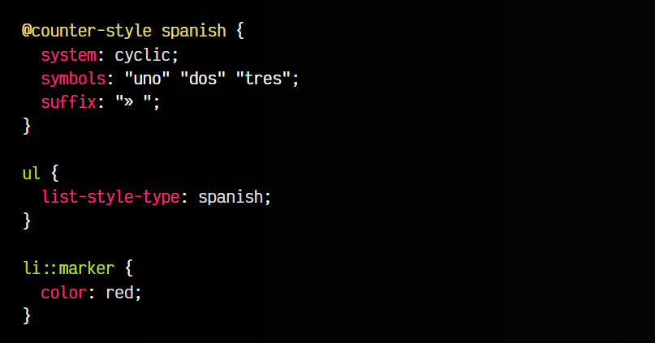

html:
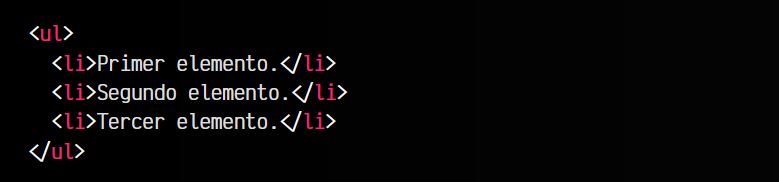

vista:
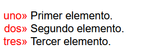

Observa que al establecer un sistema cíclico, una vez terminamos el tres, volvemos a empezar en uno. Además de system, symbols y suffix existen otras propiedades que se pueden utilizar en las reglas @counter-style, echemos un vistazo y expliquemos para que funcionan y que valores pueden tomar:

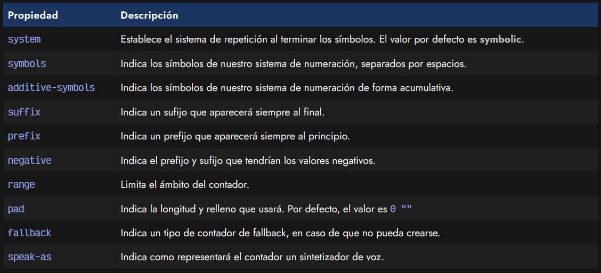

Vayamos una por una y veamos que valores pueden tomar.

## La propiedad system
Un sistema de numeración puede comportarse de varias formas. Tenemos una propiedad denominada system que permite indicar uno de los siguientes valores y determinar su comportamiento:

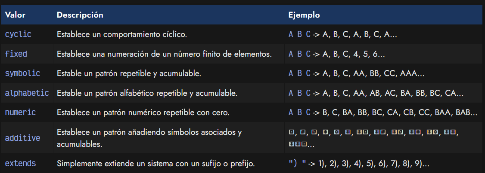

A continuación, observa la combinación de un system: additive junto a la propiedad additive-symbols para crear combinaciones de símbolos, ya que es ligeramente diferente a las anteriores:

css:
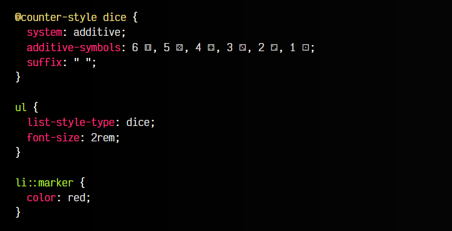

html:
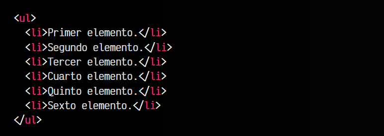

vista:
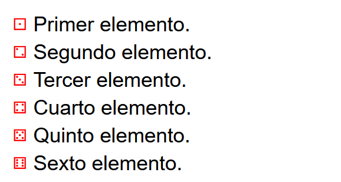

## La propiedad symbols
Mediante la propiedad symbols, o la propiedad additive-symbols, podemos establecer una lista de símbolos para crear nuestro sistema de numeración. Además de establecer una lista de símbolos, también es posible añadir una lista de imágenes, mediante la función url(imagen.png), por ejemplo.

## La propiedad negative
La propiedad negative espera dos parámetros. El primero de esos parámetros será el STRING que se añadirá justo ante de un símbolo negativo. Por otro lado, el segundo parámetro será el STRING que se añadirá justo después de un símbolo negativo. Veamos dos ejemplos:

css:
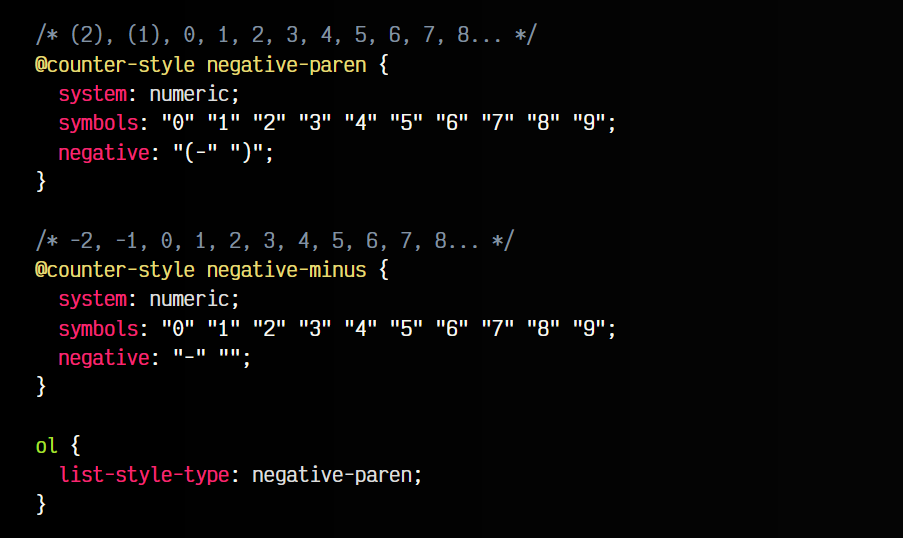

html:
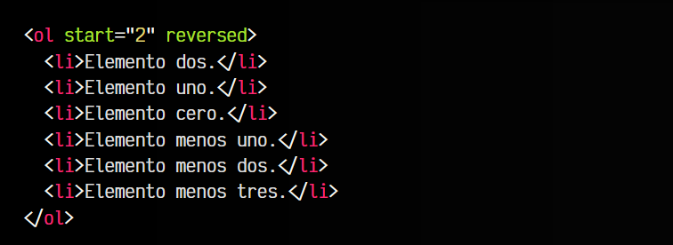

vista:
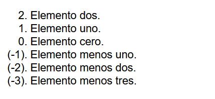

## La propiedad range
Con la propiedad range podemos utilizar el valor auto o uno personalizado. De indicar el valor auto, se establecerá un rango dependiendo del valor indicado en la propiedad system. Por lo tanto:

   - Para sistemas cyclic, numeric o fixed, el rango va desde -∞ a ∞.
   - Para sistemas alphabetic o symbolic, el rango va desde 1 a ∞.
   - Para sistemas additive, el rango va desde 0 a ∞.
   - Para sistemas extends, se adapta al estilo extendido.

## La propiedad pad
Mediante la propiedad pad se puede rellenar con ceros (o con otros carácteres) el sistema de numeración que queramos utilizar. Por ejemplo, para extender el sistema decimal y obtener los siguientes valores: 001, 002, 003, 004, 005, 006, etc... necesitaremos hacer lo siguiente:

css:
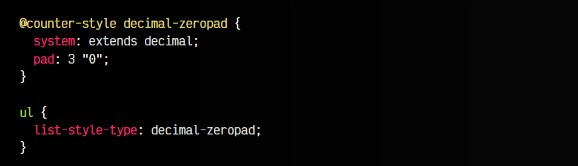

html:
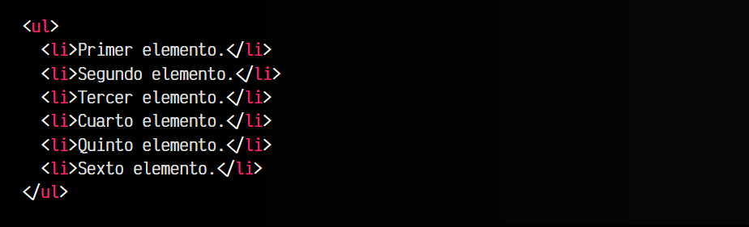

vista:
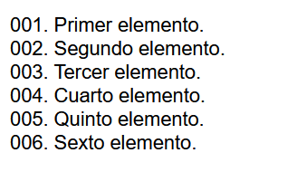

Ten en cuenta que la propiedad pad permite definir un primer parámetro que será el número de dígitos que debe tener el número del contador, mientras que el segundo parámetro será el relleno que utilizará a la izquierda hasta llegar a ese número de dígitos indicado anteriormente.

## La propiedad fallback
La propiedad fallback simplemente determina el tipo de sistema que va a utilizarse en el caso de que no se pueda usar algún otro que haya sido indicado. Por defecto, si no se especifica, utilizará decimal.

## La propiedad speak-as
La propiedad speak-as intenta garantizar que los contadores se puedan no solo ver visualmente a través de un navegador, sino reproducir a través de sintetizadores de voz y sistemas equivalentes. Con esta propiedad puedes determinar como se comportará al leerlo, indicando uno de los siguientes valores:

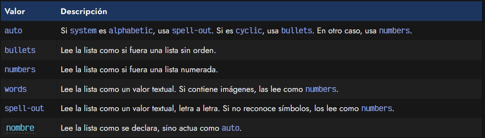

Esto proporcionará una mejor accesibilidad a nuestras listas o contadores de cara a sintentizadores de voz o lectores de accesibilidad.