# 
Guía de Introducción a Flex

En CSS, inicialmente se utilizaba el posicionamiento (static, relative, absolute...), los elementos en línea o en bloque (y derivados) o la propiedad float para realizar maquetaciones, lo que a grandes rasgos no dejaba de ser un sistema de creación de diseños bastante tosco que no encajaba con los retos que tenemos en la actualidad: sistemas de escritorio, dispositivos móviles, múltiples resoluciones, etc...

Flex (también llamado flexbox) es un sistema de elementos flexibles que llega con la idea de olvidar estos mecanismos y acostumbrarnos a una mecánica más potente, limpia y personalizable, en la que los elementos HTML se adaptan y colocan automáticamente y es más fácil personalizar los diseños de una página web.

Flex está especialmente diseñado para crear, mediante CSS, estructuras de una sóla dimensión.

## Conceptos
Para empezar a utilizar flex lo primero que debemos hacer es conocer algunos de los elementos básicos de este nuevo esquema, que son los siguientes:

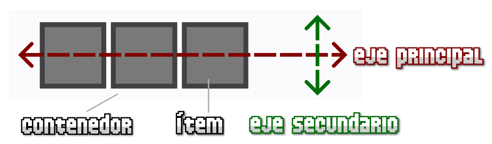

Flex CSS: ¿Cómo funciona?

    Contenedor: Es el elemento padre que tendrá en su interior cada uno de los ítems flexibles. Observa que al contrario que muchas otras estructuras CSS, por norma general, en Flex establecemos las propiedades al elemento padre.

       - Eje principal: Los contenedores flexibles tendrán una orientación principal específica. Por defecto, el eje principal del contenedor flex es en horizontal (en fila).

       - Eje secundario: De la misma forma, los contenedores flexibles tendrán una orientación secundaria, perpendicular a la principal. Si la principal es en horizontal, la secundaria será en vertical (y viceversa).

    Ítem: Cada uno de los hijos que tendrá el contenedor en su interior.

## Modalidades de flex
Una vez tenemos claro esto, imaginemos el siguiente escenario:

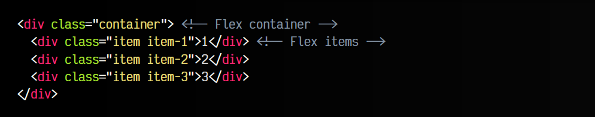

Para activar el modo flex, utilizaremos sobre el elemento contenedor la propiedad display, y especificaremos el valor flex o inline-flex (dependiendo de como queramos que se comporte el contenedor):

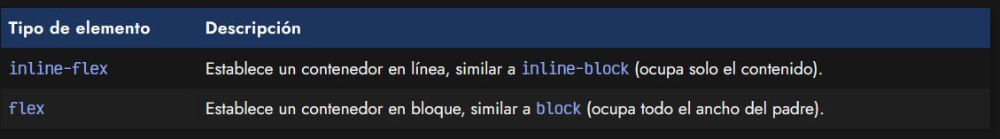

Por defecto, y sólo con esto, observaremos que los elementos se disponen todos sobre una misma línea. Esto ocurre porque estamos utilizando el modo flex y estaremos trabajando con ítems flexibles básicos, garantizando que no se desbordarán ni mostrarán los problemas que, por ejemplo, tienen los porcentajes sobre elementos que no utilizan flex.

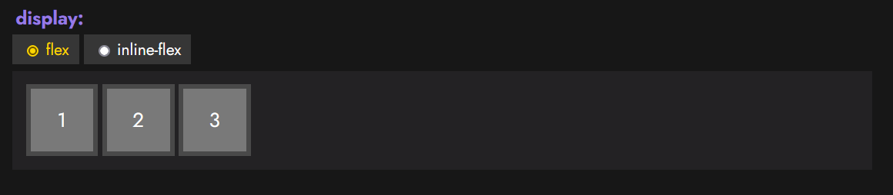
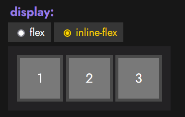

## Dirección de los ejes
Existen dos propiedades principales para manipular la dirección y comportamiento de los ítems a lo largo del eje principal del contenedor. Son las que veremos a continuación:

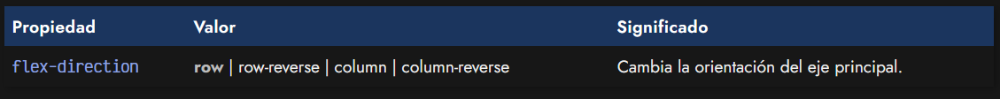

Mediante la propiedad flex-direction podemos modificar la dirección del eje principal del contenedor para que se oriente en horizontal (valor por defecto) o en vertical. Además, también podemos incluir el sufijo -reverse para indicar que coloque los ítems en orden inverso.

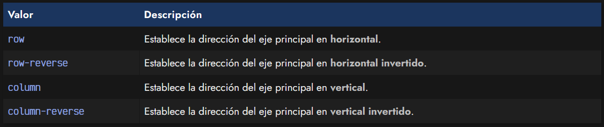

Esto nos permite tener un control muy alto sobre el orden de los elementos en una página. Veamos la aplicación de estas propiedades sobre el ejemplo anterior, para modificar el flujo del eje principal del contenedor:

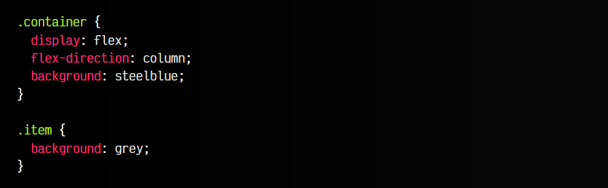

A continuación podemos ver un ejemplo interactivo:

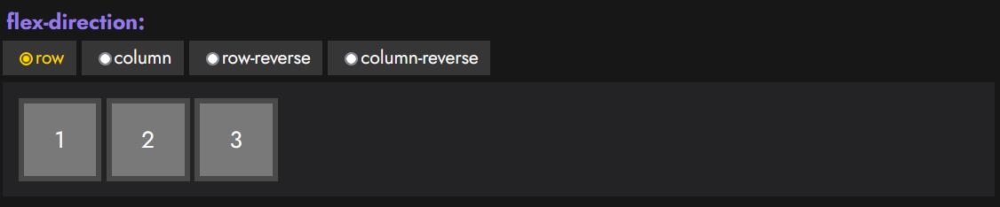
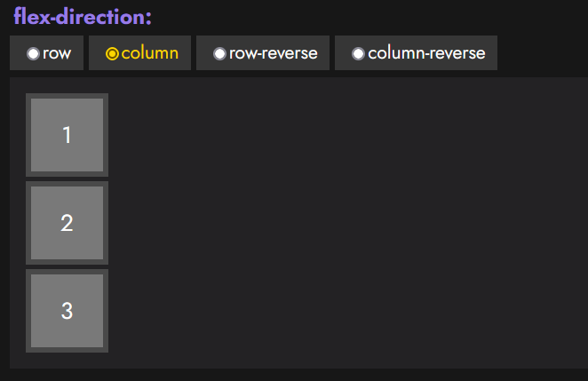
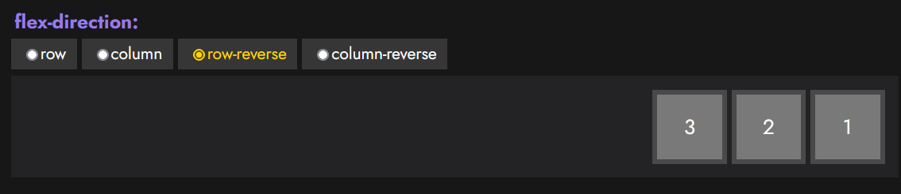
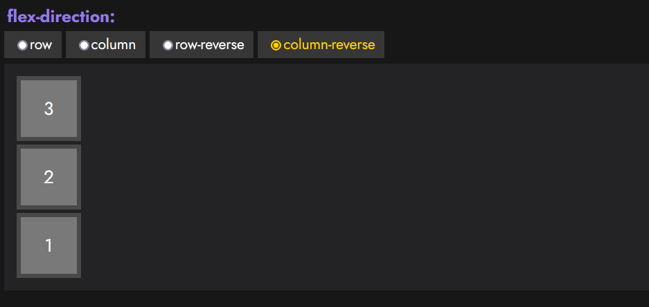

## Contenedor flex multilínea
En general, flex se suele utilizar para estructuras de una sola dimensión, es decir, contenedores que sólo van en una dirección. Sin embargo, existe una propiedad denominada flex-wrap con la que podemos especificar un comportamiento especial del contenedor.

Por defecto, si un elemento no cabe dentro de nuestro contenedor flex, los elementos se harán más pequeños (son flexibles) para ajustarlos al contenedor. Este es el comportamiento por defecto de un contenedor flex. Sin embargo, con la propiedad flex-wrap podemos cambiar este comportamiento y permitir que nuestro contenedor flex se desborde, convirtiéndose en un contenedor flex multilínea.

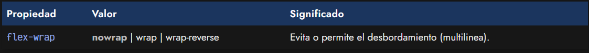

Los valores que puede tomar esta propiedad, son las siguientes:

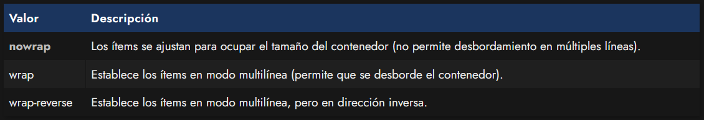

Teniendo en cuenta estos valores de la propiedad flex-wrap, podemos conseguir cosas como la siguiente:

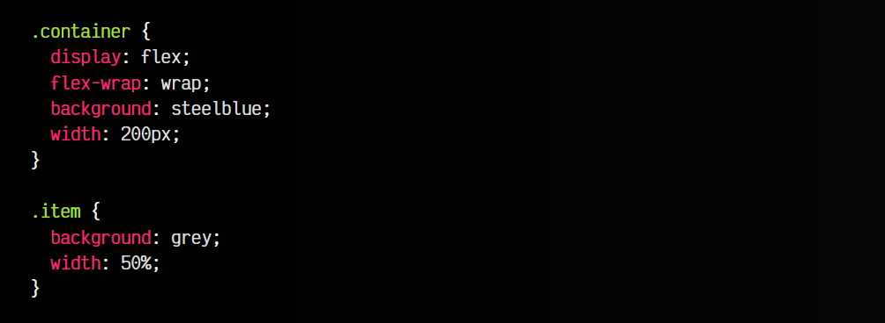

En el caso de especificar nowrap (u omitir la propiedad flex-wrap) en el contenedor, los 3 ítems se mostrarían en una misma línea del contenedor (que es el comportamiento por defecto). En ese caso, si tenemos 3 ítems, cada uno debería tener aproximadamente 66px de ancho. Un tamaño de 100px por ítem, sumaría un total de 300px, que no cabrían en el contenedor de 200px, por lo que flex reajusta los ítems flexibles para que quepan todos en la misma línea, manteniendo las mismas proporciones.

Sin embargo, si especificamos wrap en la propiedad flex-wrap, lo que permitimos es que el contenedor se pueda desbordar, pasando a ser un contenedor multilínea, que mostraría los ítems que quepan en la primera linea y el resto en las líneas siguientes. El valor wrap-reverse haría exactamente lo mismo, pero con el orden inverso.

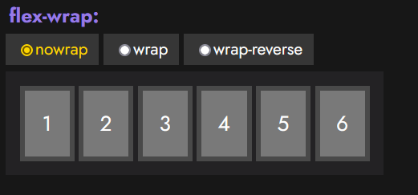
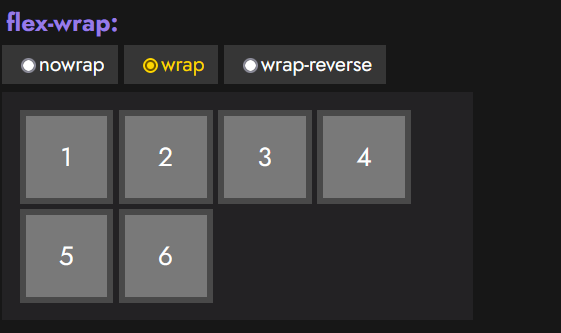
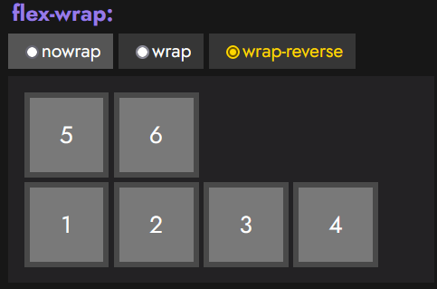

## Atajo: Dirección de los ejes
Recuerda que existe una propiedad de atajo (short-hand) llamada flex-flow, con la que podemos resumir los valores de las propiedades flex-direction y flex-wrap, especificándolas en una sola propiedad y ahorrándonos utilizar las propiedades concretas:

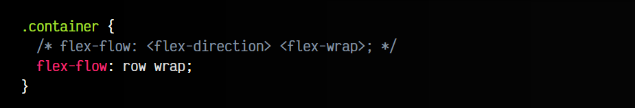

## Huecos (gaps)
Existen dos propiedades de flexbox que han surgido recientemente: row-gap y column-gap. Dichas propiedades, permiten establecer el tamaño de un «hueco» entre ítems desde el elemento padre contenedor, y que eliminan la necesidad de estar utilizando padding o margin en los elementos hijos, con las complicaciones que ello suele conllevar:

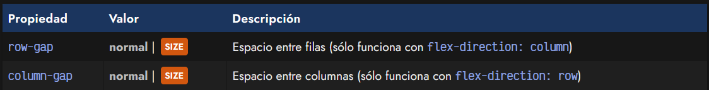

Ten en cuenta que, como flex es un sistema para diseños de una sola dimensión, sólo una de las dos propiedades tendrá efecto. Si la propiedad flex-direction está establecida en column, podrás utilizar row-gap, y en el caso de que la propiedad flex-direction se encuentre en row, podrás utilizar el column-gap.

Eso sí, es posible usar ambas si tenemos la propiedad flex-wrap definida a wrap y, por lo tanto, disponemos de multicolumnas flexbox, ya que en este caso si podemos separar elementos por filas y por columnas.

Ten en cuenta que los huecos sólo se aplican entre elementos, y no entre un elemento hijo y su contenedor padre.

## Atajo: Huecos
En Flex CSS existe una propiedad de atajo para los huecos, denominada gap. Con esta propiedad podemos indicar de una sola vez valores para las propiedades row-gap y column-gap, de forma que escribimos menos y es más cómodo en ciertas situaciones:

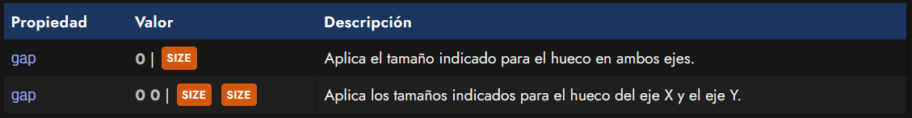

Como se puede ver, por defecto, el tamaño de los huecos es de 0, sin embargo, podemos utilizar tanto las propiedades individuales como la propiedad de atajo gap para modificar estos tamaños.

A continuación, podemos ver un ejemplo de su utilización en este fragmento de código:

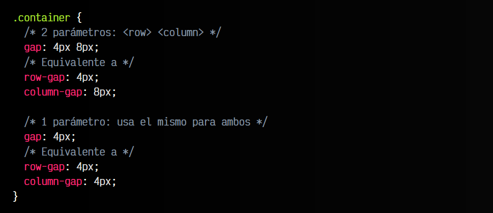

