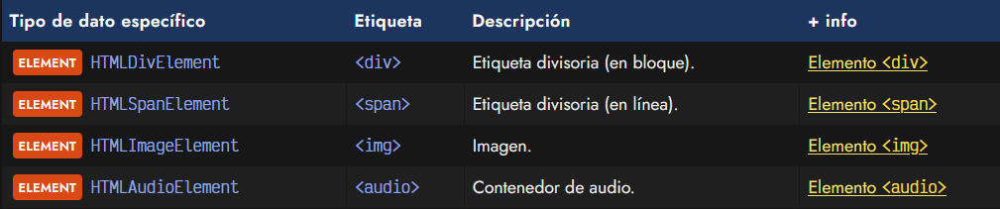
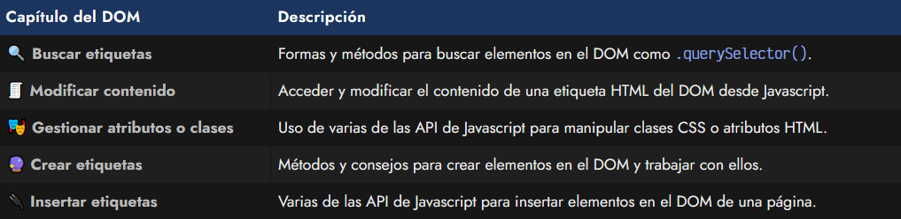

# 
¿Qué es el DOM?

Cuando comenzamos en el mundo del desarrollo web, normalmente comenzamos por aprender a escribir etiquetado o marcado HTML y además, añadir estilos CSS para darle color, forma y algo de interacción. Sin embargo, a medida que avanzamos, nos damos cuenta que en cierta forma podemos estar bastante limitados.

Si únicamente utilizamos HTML/CSS, sólo podremos crear páginas «estáticas», es decir, páginas que no pueden realizar tareas dinámicas y personalizadas dependiendo de acciones concretas del usuario o su entorno. Sin embargo, si añadimos Javascript, podremos crear dichas páginas «dinámicas», y aprovechar la potencia y flexibilidad que nos da un lenguaje de programación como Javascript para crear documentos y páginas mucho más ricas, con una experiencia más completa.

## ¿Qué es el DOM?.
Las siglas DOM significan Document Object Model, o lo que es lo mismo, la estructura de un documento HTML. Una página HTML está formada por múltiples etiquetas HTML, anidadas una dentro de otra, formando un árbol de etiquetas relacionadas entre sí, que se denomina árbol DOM (o simplemente DOM).

Observa que como la etiqueta < head > está dentro de < html > se dibuja como hija de < html >. La etiqueta < title > está dentro de < head >, por lo que será hija de esta y así sucesivamente.

En Javascript, cuando nos referimos al DOM nos referimos a esta estructura de árbol, mediante la cuál podemos acceder a ella y modificar los elementos del HTML desde Javascript, añadiendo nuevas etiquetas, modificando o eliminando otras, cambiando sus atributos HTML, añadiendo clases, cambiando el contenido de texto, etc...

Al estar controlado por un lenguaje de programación, todas estas tareas se pueden automatizar, incluso indicando que se realicen cuando el usuario haga acciones determinadas, como por ejemplo: pulsar un botón, mover el ratón, hacer click en una parte del documento, escribir un texto, etc...

Desde el navegador, la forma de acceder al DOM es a través de un objeto Javascript llamado document, que representa el árbol DOM de la página o, más concretamente, la página de la pestaña del navegador donde nos encontramos. En su interior pueden existir varios tipos de elementos, pero principalmente serán objetos de tipo ELEMENT o NODE :

   - Un ELEMENT no es más que la representación genérica de una etiqueta: HTMLElement.
   - Un NODE es una unidad más básica, la cuál puede ser ELEMENT o un nodo de texto.

Todos los elementos HTML, dependiendo del elemento que sean, tendrán un tipo de dato específico asociado. Veamos algunos ejemplos:

Existen muchos tipos de datos específicos, prácticamente uno por cada etiqueta HTML.

## API nativa de Javascript.
En los siguientes capítulos de este curso veremos que Javascript nos proporciona un conjunto de herramientas para trabajar de forma nativa con el DOM de la página. Las categorías importantes que deberíamos tener en cuenta son las siguientes:

Veremos cada una de ellas y las explicaremos detalladamente, con ejemplos.

## ¿Usar o no utilizar el DOM?.
En la industria de la programación web, se suele optar por evitar la manipulación del DOM de forma directa. Esto es así porque trabajar con el DOM requiere destreza, conocimiento y es un proceso lento que necesita experiencia para que no resulte incómodo o se realicen acciones contraproducentes.

Por esta razón, habitualmente, se delega la tarea de la manipulación del DOM a una librería o framework de terceros (generalmente a frameworks como React o Vue, por ejemplo). El uso de estos frameworks nos simplifica el trabajo a cambio de dos cosas:

   - Aprender otras estrategias propias del framework (habitualmente más sencillas y cómodas)
   - Perder un poco de rendimiento y control sobre el DOM de nuestra aplicación o web

Es importante tener en cuenta que aunque los frameworks Javascript no trabajen directamente con el DOM (crean su propio Virtual DOM, de lo que hablaremos más adelante) existe un mito que dice que «es una mala práctica trabajar directamente con el DOM». Esto no es cierto. Si utilizas un framework, deberías adaptarte a la forma de trabajar con ese framework, y si ese framework te exige no trabajar directamente con el DOM, eso es lo que podría ser una mala práctica.

Sin embargo, saber trabajar con el DOM es un skill muy importante que te dotará de habilidades para ser mucho más eficiente a la hora de pensar y resolver problemas relacionados con la estructura de una página. Personalmente, mi consejo es que si estás empezando con HTML/CSS, te enfoques primero en aprender esa parte y aprender Javascript. Si ya tienes cierta soltura con Javascript, es hora de que aprendas a trabajar con el DOM.