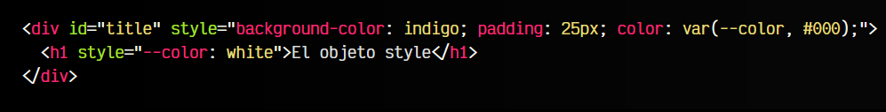
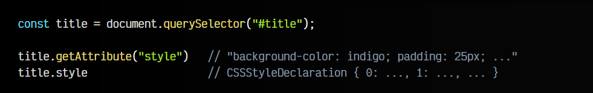
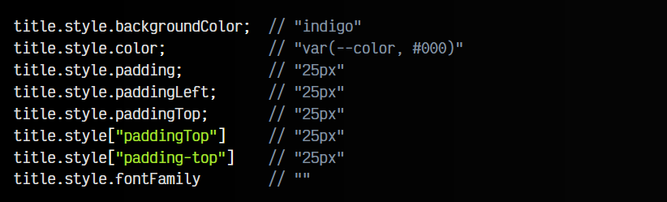
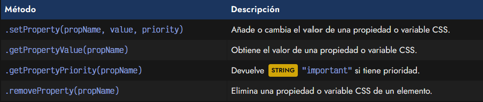
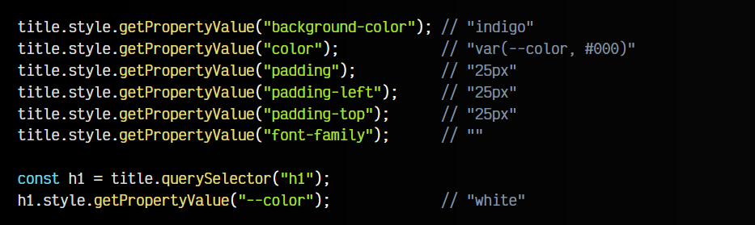
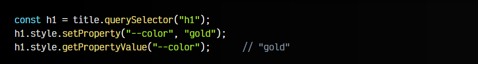
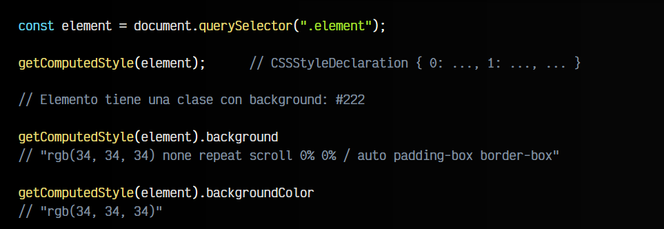
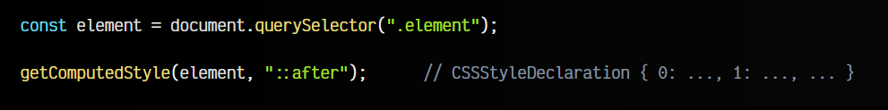

# 
Estilos CSS: El objeto style

Hay dos formas principales de que un elemento HTML tenga estilos CSS: Asociándole una clase HTML con una colección de estilos, o añadiéndole un atributo style con un conjunto de propiedades y valores.

En general, lo recomendable suele ser utilizar las clases, ya que es más organizado y fácil de mantener, pero hay algunas excepciones donde podemos utilizar los estilos CSS y pueden ser especialmente interesantes.

## Los estilos en línea de un elemento.

Antes de continuar, vamos a recordar como se añaden estilos en línea a un elemento HTML:

Observa que en el elemento < div > hemos establecido 3 estilos CSS diferentes:

   - Un background-color con el valor indigo (morado).
   - Un tamaño de padding con el valor de 25px.
   - El color de texto de la variable CSS --color, por defecto #000 (negro).

En general, es mucho mejor crear una clase con esta lista de estilos y añadirle la clase a la etiqueta HTML. Hay una excepción donde es realmente útil estos estilos en linea: con las [variables CSS](https://lenguajecss.com/css/variables-css/css-custom-properties/).

Puedes ver que el elemento < h1 > en lugar de establecerle una propiedad CSS, le hemos establecido una variable CSS. Esto suele ser muy flexible, y nos permite indicar estilos dependiendo del elemento HTML donde se encuentra.

## Acceso a los estilos CSS.
Sigamos con el ejemplo anterior. Desde Javascript, si queremos acceder a los estilos en línea definidos en este elemento, aunque podríamos hacerlo con .getAttribute('style'), lo haremos a través del objeto especial .style:

   - 1️⃣ Con .getAttribute("style") nos devuelve un STRING con el texto literal del atributo.
   - 2️⃣ Accediendo al objeto .style, nos devuelve un objeto especial CSSStyleDeclaration.

Este objeto especial contiene todas las propiedades CSS asignables en ese elemento, y podremos acceder a ellas como un objeto normal OBJECT.

## El objeto .style.
Mediante el objeto style podemos acceder a las propiedades especificas, para obtener su valor. Nos mostrará que el objeto tiene muchísimas propiedades (una por cada propiedad CSS). Sin embargo, sólo algunas propiedades tendrán valores, que son las que están definidas en los estilos en línea del elemento HTML:

Observa que si la propiedad CSS se llama padding-top, en Javascript debes acceder a ella en camelCase, es decir, como paddingTop. Si accedes mediante la nomenclatura de corchetes, puedes acceder de ambas formas. Si un valor no está definido, devuelve cadena STRING vacía.

Aunque podemos acceder de esta forma a las propiedades CSS definida en los estilos en línea, esta es una forma legacy y antigua, que aunque sigue funcionando, ofrece menos ventajas que utilizar la familia de las siguientes funciones:

Vamos a analizarlos a continuación.

## El método getPropertyValue().
Aunque como hemos comentado, se puede acceder a través de propiedades directamente. Una manera más formal es a través del método getPropertyValue(). Este método sirve tanto para propiedades CSS como para variables CSS (que no están soportadas de la forma anterior):

De esta forma eliminamos el inconveniente de tener que estar traduciendo a camelCase, además de tener soporte con variables CSS.

## El método setProperty().
De la misma forma, igual que podemos acceder a ellas, también podemos modificar las variables CSS. Recuerda que las variables CSS se pueden establecer a nivel del DOM, por lo que un elemento puede tener un valor de variable CSS y otro elemento del DOM un valor diferente (e incluso son heredables hacia hijos):

Ten en cuenta que con el .setProperty() lo que hemos hecho es añadir un estilo en línea al elemento, por lo que el elemento < h1 > debe tener ahora un style="--color: gold".

Existe un tercer parámetro opcional. Si le indicamos un STRING "important", añadirá un !important a la propiedad que estemos estableciendo.

## El método global getComputedStyle().
Al margen de todo lo anterior, existe un método global denominado getComputedStyle(). Al contrario que los anteriores, este método obtiene los estilos computados de un elemento. Se llaman estilos computados a los estilos CSS finales que ya han sido procesados y calculados por el navegador, después de aplicar herencia, cálculos, reglas, etc.

Si necesitamos obtener el valor CSS final de alguna propiedad que no ha sido definida a través de estilos en línea, utilizar getComputedStyle() puede ser una buena opción. Al igual que en el objeto style, el método getComputedStyle() devuelve un objeto CSSStyleDeclaration, que contiene propiedades con nombre de la propiedad CSS y el valor asociado:

Observa que aunque los estilos originales tengan un valor de #222, los estilos computados devuelven rgb(34, 34, 34), ya que han sido procesados por el navegador, por lo que no debes esperar que se devuelva el valor exactamente igual.

## Acceso a los pseudoelementos.
Con getComputedStyle(), también podemos acceder a los estilos CSS de los pseudoelementos, como por ejemplo ::after y ::before, los cuales no es posible recuperarlos directamente con querySelector(), por ejemplo:

Observa que en esta ocasión, estamos obteniendo los estilos definidos en el elemento con clase element, pero más concretamente en su pseudoelemento ::after.